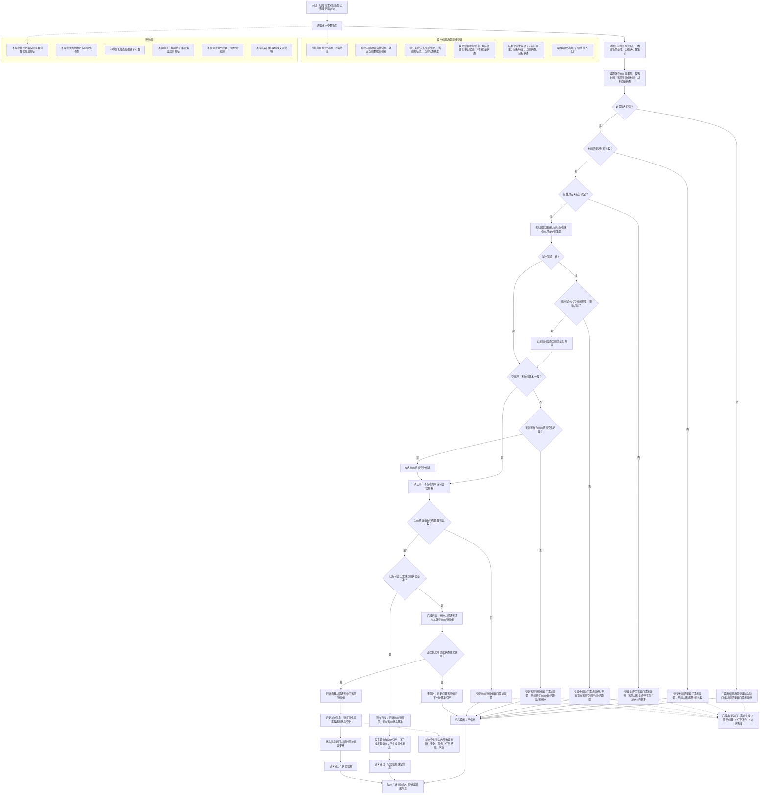

# 扫描本能方法内部流程图 v0.1

更新时间：2026-06-15

## 依据

```text
规范/禁止性规范20260611.md
规范/当前场景特征值明确标准规范20260602.md
规范/相机外设综合工作流程规范20260607.md
说明书/自我侧观察识别扫描跟踪本能方法规格说明.md
用户口径：扫描以自我内部场景指针和外设当前数据集为输入，语义输出为状态信息或空信息；比较缺口只作为需求来源进入需求-任务-方法闭环。
```

## 说明

本图只表达扫描本能方法内部流程。观察、识别、跟踪不作为扫描内部子函数；扫描比较过程中发现的缺口只写入输出结果场景或运行事实，后续由需求生成、任务创建、任务筹办和方法选择承接。

## 流程图



## 关键边界

```text
1. 扫描的语义输出只有状态信息或空信息。
2. 对应关系缺口、坐标缺口、当前特征值缺口、材料质量缺口和状态变化，只能作为结构化需求来源或状态事实记录。
3. 需求来源进入需求-任务-方法闭环后，才可能由任务筹办选择观察、识别、跟踪、扫描或其它方法。
4. 首次扫描只建立当前特征值和当前状态基准，不生成发现语义或变化动态。
5. 本图不宣称识别、扫描、跟踪边界已经全部动态闭合，也不宣称内部循环完成。
```
