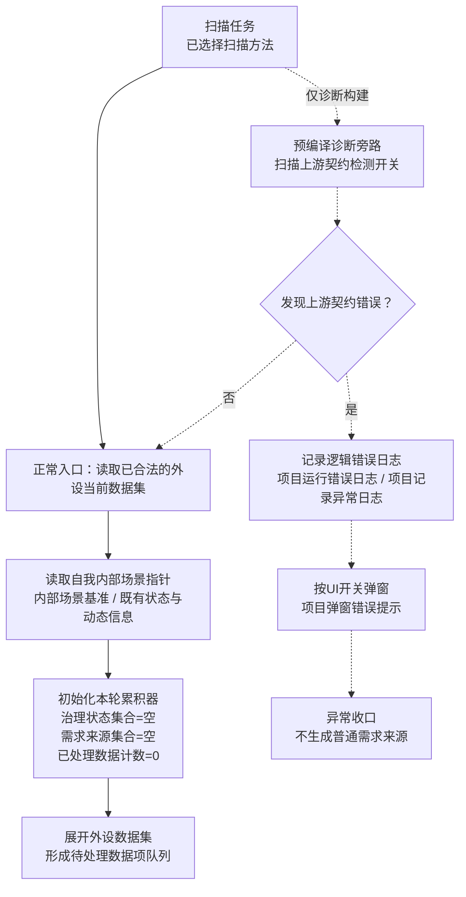
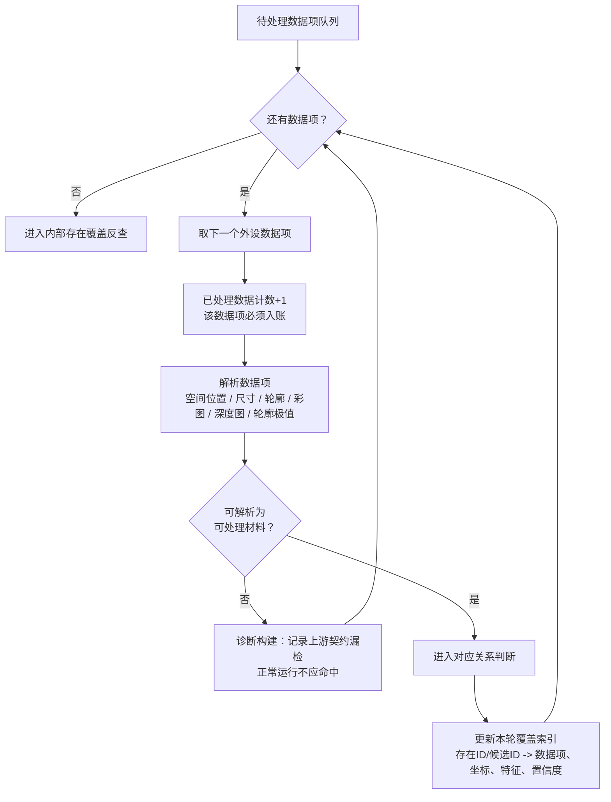
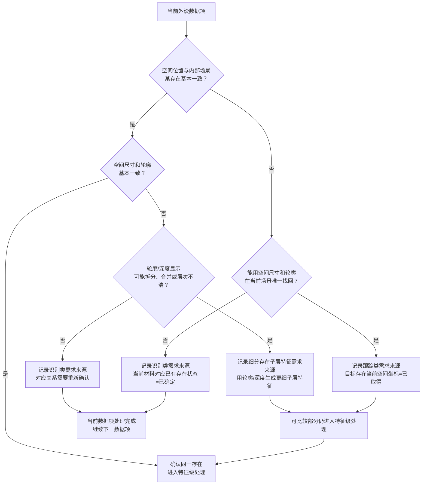
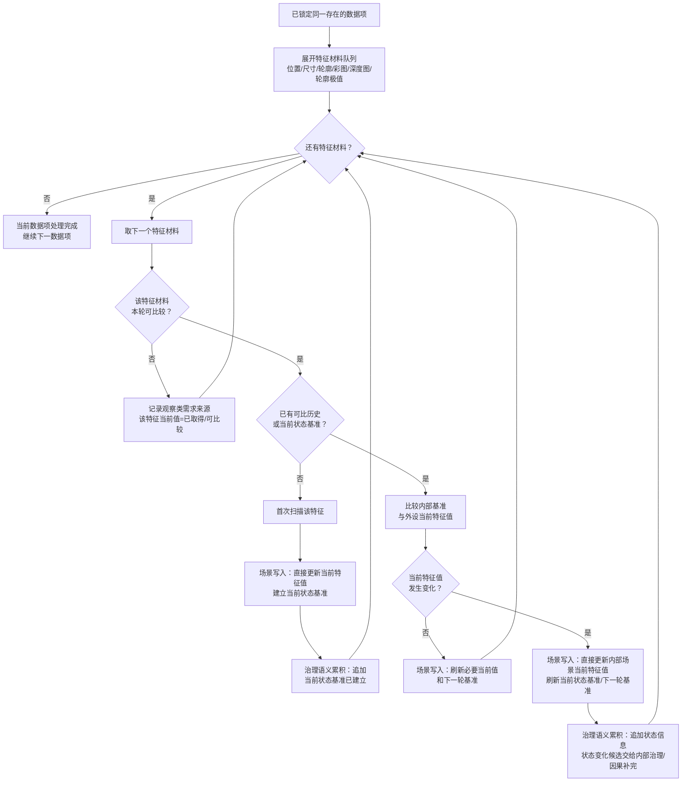
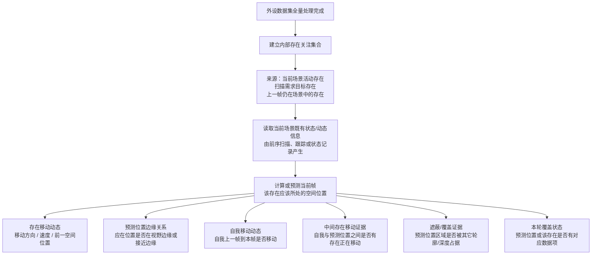
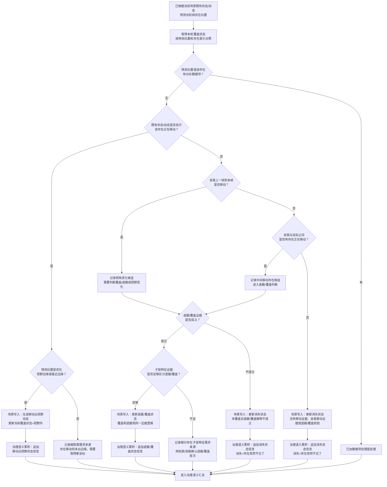
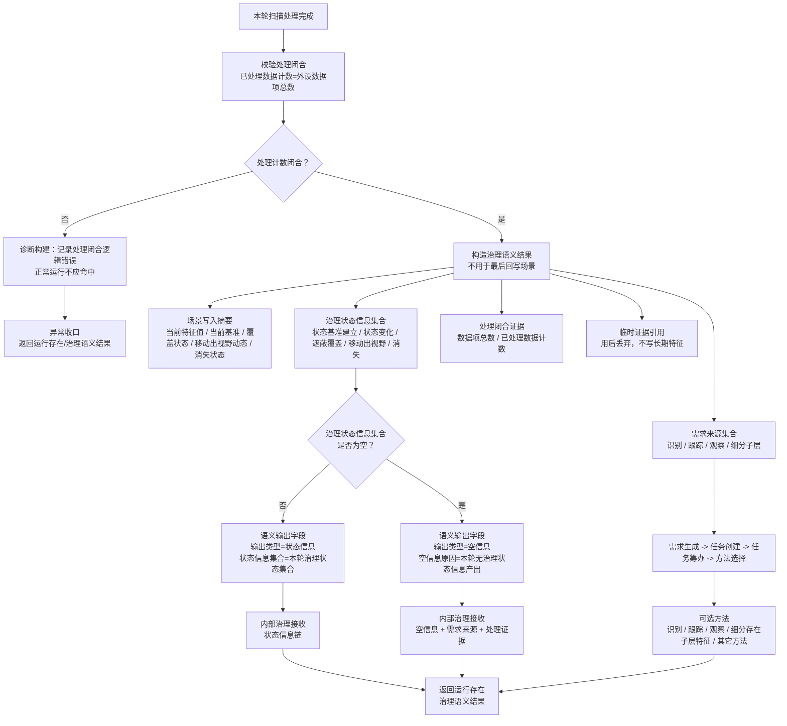
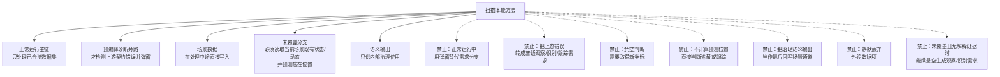

# 扫描本能方法内部流程图 v0.10

更新时间：2026-06-15

## 依据

```text
规范/禁止性规范20260611.md
规范/当前场景特征值明确标准规范20260602.md
规范/相机外设综合工作流程规范20260607.md
说明书/自我侧观察识别扫描跟踪本能方法规格说明.md
实施记录/20260612_日志输出预编译控制登记表.md
实施记录/20260613_日志输出预编译控制P4P5_Codex断点清单.md
用户口径：
    上游错误排除后正常运行不应出现弹窗报错；
    上游错误检测属于预编译诊断旁路，命中时走逻辑错误日志和弹窗，不进入普通需求分支；
    场景中的当前数据在扫描处理中途直接修改完成；
    语义输出是给内部治理用的；
    内部已有存在未被本轮数据覆盖时，读取的是当前场景中之前产生的状态信息或动态信息；
    先根据这些状态/动态计算或预测当前帧该存在应该所处的空间位置，再进行未覆盖判断；
    若上述证据都不能解释未覆盖，则直接生成消失状态；消失就是存在突然不见了。
```

## 说明

v0.10 将上游契约错误检测从正常运行主链移到预编译诊断旁路。正常扫描主链只处理已合法的外设当前数据集；真正运行时不应出现弹窗报错。未覆盖分支不直接用“上一帧状态”下结论，而是读取当前场景中已经存在的状态/动态信息，先预测当前帧该存在应在空间位置，再结合本轮覆盖索引判断存在移动出视野、跟踪需求、遮蔽/覆盖状态、细分子层特征需求来源或消失状态。

## 流程图

### 1. 正常入口与预编译诊断旁路



### 2. 外设数据集全量处理与覆盖索引



### 3. 数据项对应关系与需求来源



### 4. 特征级处理：场景直接写入，语义累积给治理



### 5. 内部已有存在未被本轮数据覆盖



### 6. 未覆盖判定：移动出视野、遮蔽覆盖、跟踪、细分或消失



### 7. 给内部治理的语义输出结构



### 8. 扫描内部硬边界



## 关键边界

```text
1. 上游错误检测属于预编译诊断旁路；正常运行主链不应出现弹窗报错。
2. 场景当前数据在扫描处理中途直接写入，不等到语义输出阶段。
3. 语义输出只给内部治理使用，表达本轮是否有治理状态信息、有哪些需求来源、有哪些处理证据。
4. 内部已有存在未被本轮数据覆盖时，必须读取当前场景中前序处理已经产生的状态信息或动态信息，先计算或预测当前帧该存在应该所处的空间位置。
5. 若既有动态显示该存在正在移动，且预测位置位于视野边缘，可生成移动出视野动态。
6. 若该存在没有移动动态，则继续判断自我是否移动，或自我与预测位置之间是否有正在移动的存在；有证据时再判断遮蔽/覆盖，覆盖和遮蔽使用同一证据链。
7. 若未覆盖且没有移动出视野、遮蔽/覆盖或可跟踪新坐标的证据，则直接写入消失状态；消失就是存在突然不见了。
8. 空信息只表示本轮没有给内部治理的状态信息产出，不抹掉需求来源、场景写入摘要和处理证据。
```
