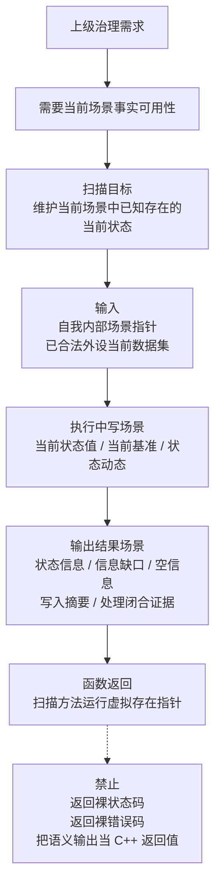
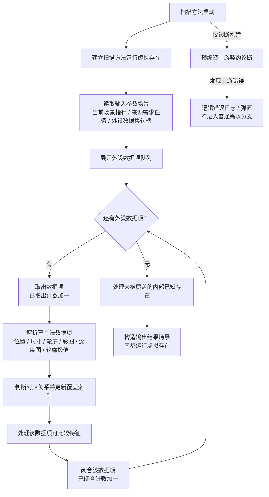
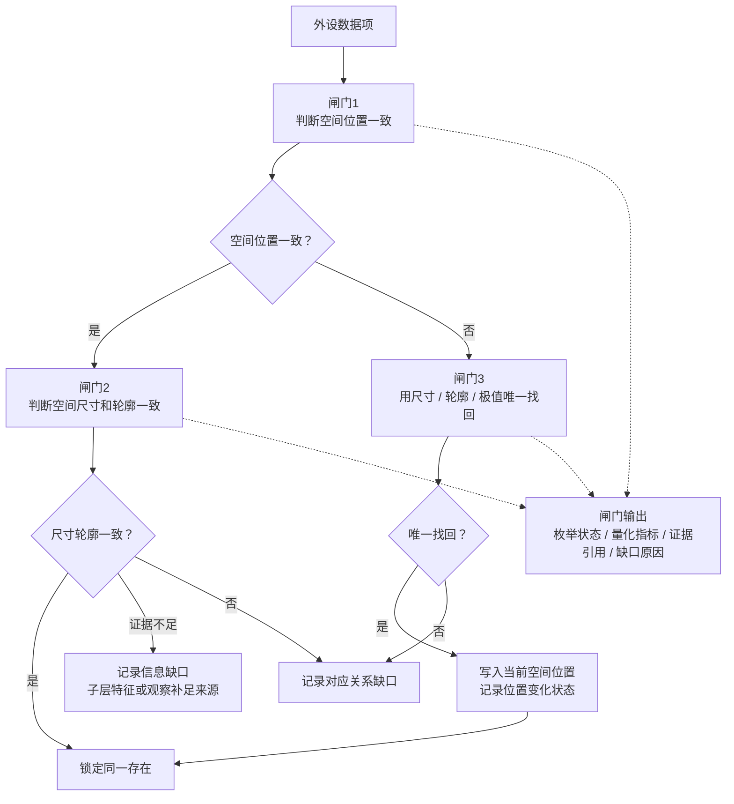
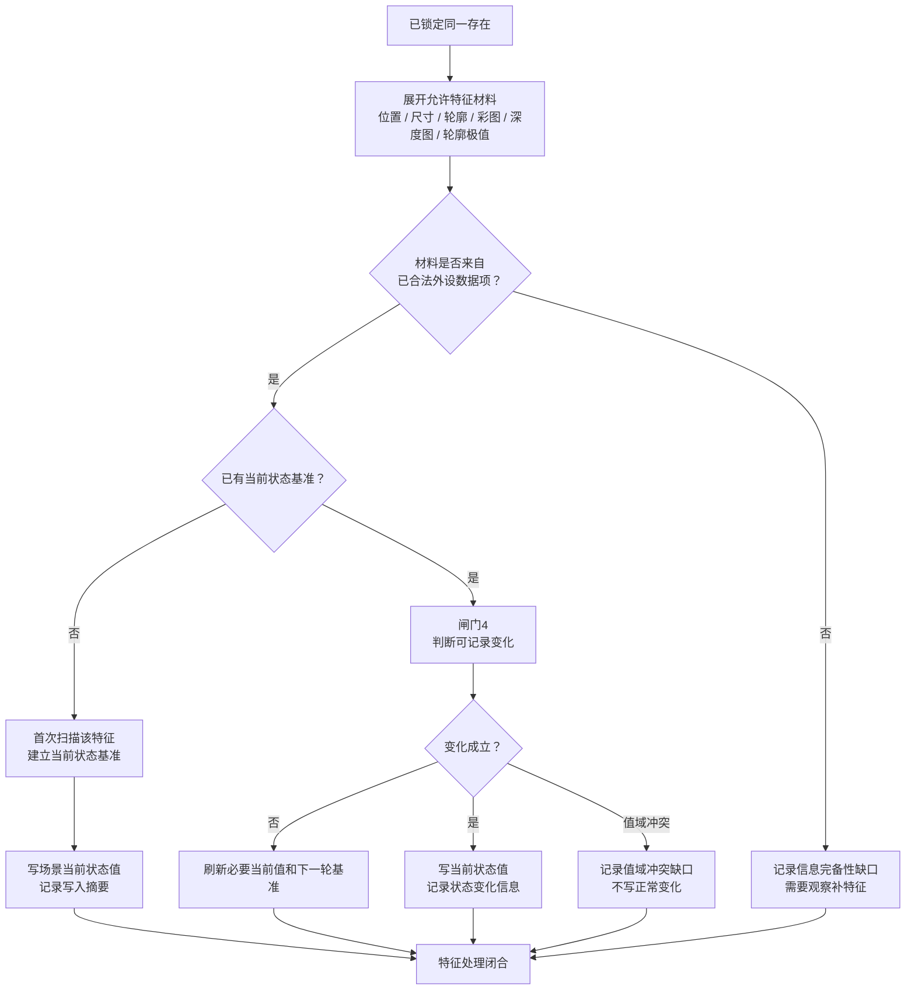
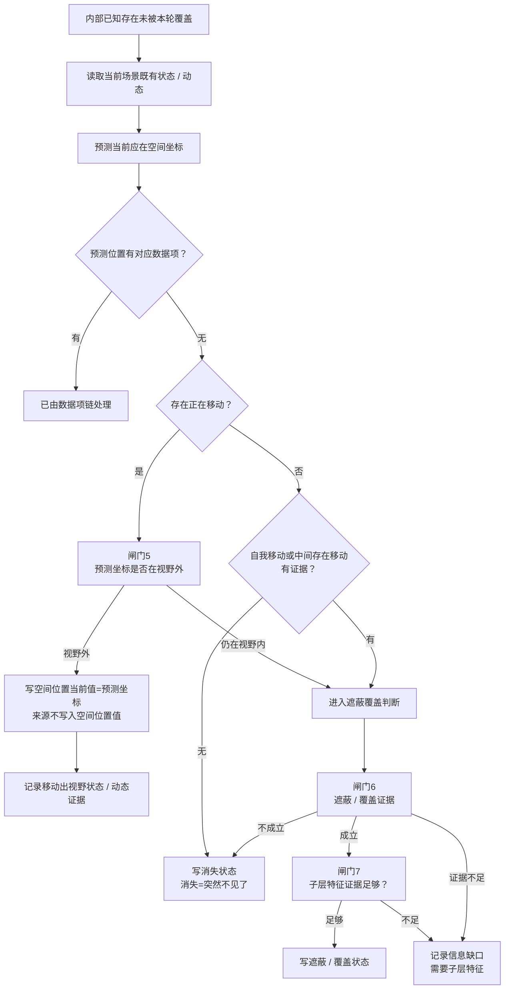
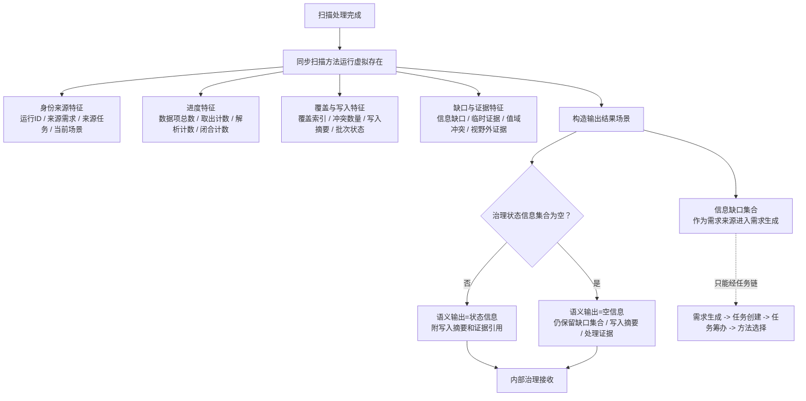

# 扫描本能方法内部流程图 v0.12

更新时间：2026-06-15

## 依据

```text
规范/禁止性规范20260611.md
规范/本能函数实现规范20260430.md
规范/外设观察特征与自我场景认知本能方法分层规范20260525.md
规范/观察像素簇与存在候选分层规范20260527.md
规范/当前场景特征值明确标准规范20260602.md
规范/相机外设综合工作流程规范20260607.md
说明书/自我侧观察识别扫描跟踪本能方法规格说明.md
用户口径：
    扫描上级需求不再写成“最新、最全”，收束为当前场景事实可用性；
    扫描消费已合法外设数据项，不能从原始材料生产新的观察特征值；
    本轮运行上下文由扫描方法运行虚拟存在承载，局部 C++ 上下文只作缓存视图；
    基本一致、唯一找回、发生变化、遮蔽覆盖成立等判断必须函数化、枚举化和证据化；
    空间位置特征值只保存坐标值，预测来源和视野外状态写入状态信息、动态证据或临时证据；
    扫描不因当前看不到目标而直接生成跟踪需求。
```

## 说明

v0.12 选择性采纳可编程化建议：采纳量化判断闸门、写入摘要、运行虚拟存在承载本轮状态；不采纳“扫描生产新特征值”和“最新、最全”表述。扫描函数返回本轮运行虚拟存在指针，功能结果写入输出结果场景；场景当前状态可在处理中途直接写入，但每次写入必须留下摘要和证据引用。

## 流程图

### 0. 定位与返回信息



### 1. 主链与诊断旁路



### 2. 对应关系与可编程闸门



### 3. 特征处理与写入边界



### 4. 未覆盖内部存在



### 5. 运行虚拟存在与治理输出



## 关键边界

```text
1. 扫描函数返回本轮运行虚拟存在指针；状态信息、缺口和空信息写入输出结果场景。
2. 扫描维护当前场景事实可用性，不再写成确认信息“最新、最全”。
3. 扫描只消费已合法外设数据项；不得从原始外设材料生产新的观察特征值。
4. 已确认存在长期特征集合仍只允许空间位置、空间尺寸、轮廓、彩图、深度图、轮廓极值。
5. 基本一致、唯一找回、发生变化、遮蔽覆盖成立、子层证据足够、消失条件成立，都必须由函数输出枚举状态、量化指标、证据引用和缺口原因。
6. 预测空间坐标可以写入空间位置当前值，但值来源和视野外状态不得塞入空间位置特征值。
7. 未覆盖且无移动出视野、遮蔽覆盖、自我移动或中间移动存在解释时，写消失状态，不删除存在。
8. 扫描不直接调用观察、识别或跟踪；缺口只能作为需求来源进入需求、任务、方法闭环。
9. 局部 C++ 上下文只能作为扫描方法运行虚拟存在特征的缓存视图，不是新的权威上下文结构。
```
