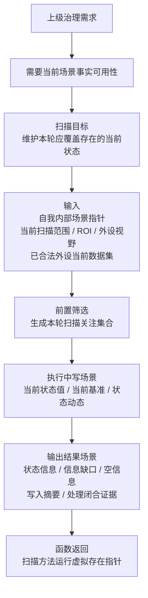
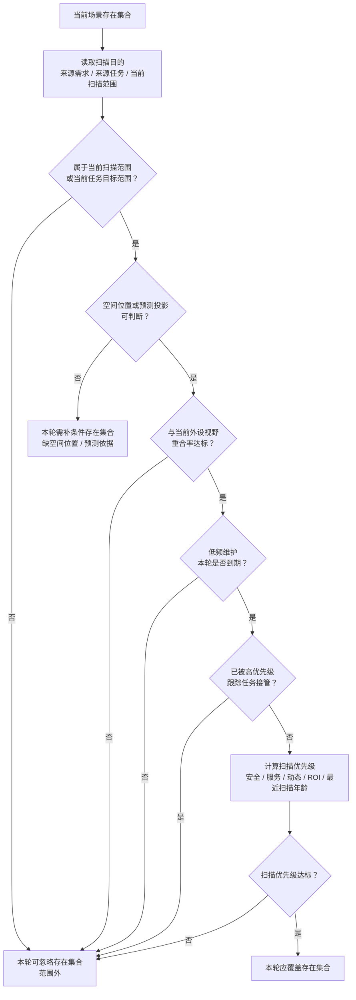
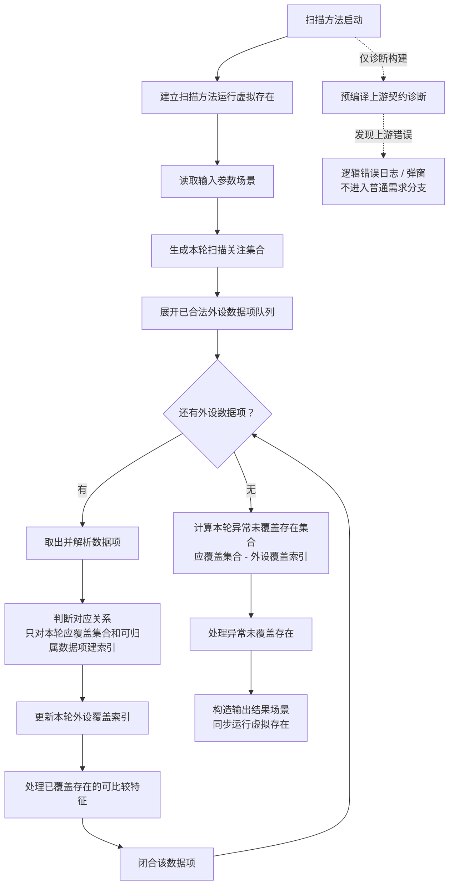
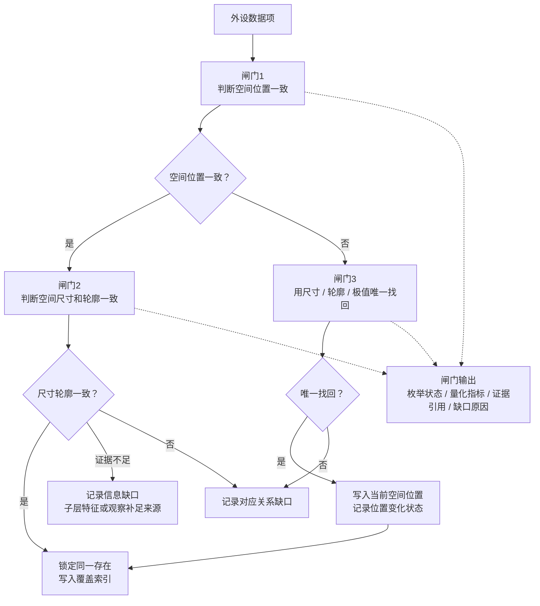
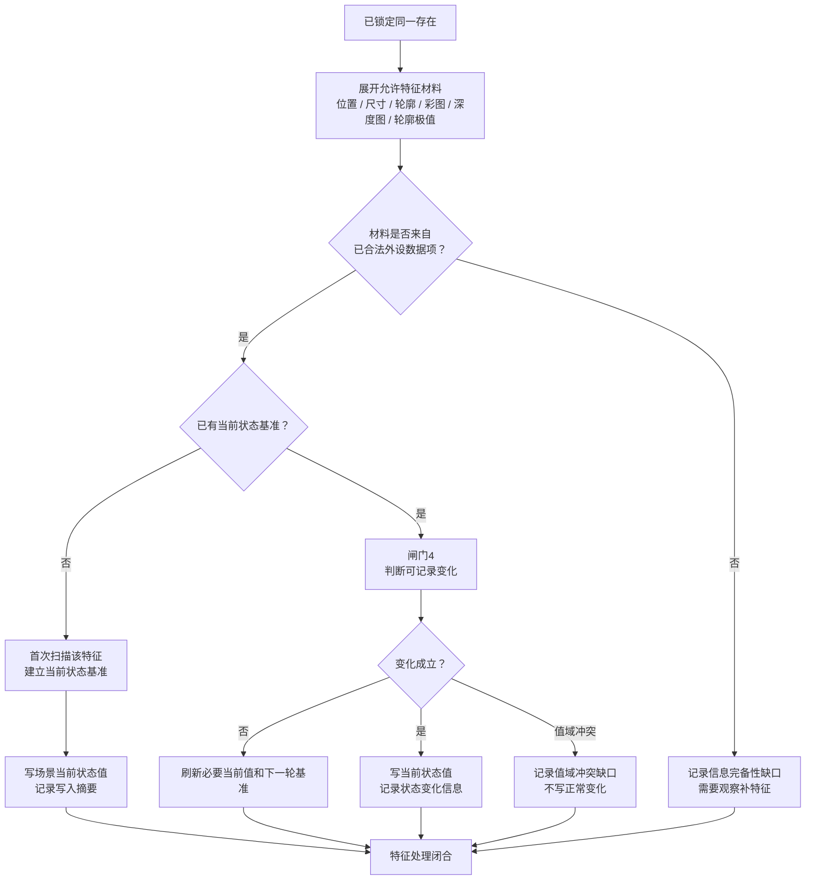
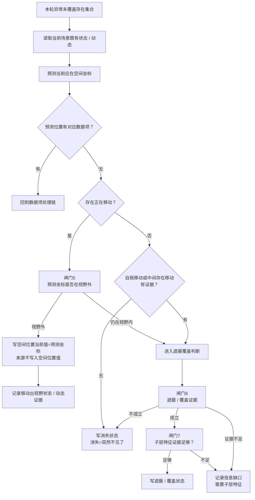
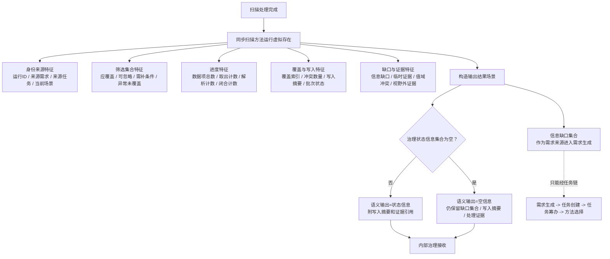

# 扫描本能方法内部流程图 v0.13

更新时间：2026-06-15

## 依据

```text
规范/禁止性规范20260611.md
规范/本能函数实现规范20260430.md
规范/外设观察特征与自我场景认知本能方法分层规范20260525.md
规范/观察像素簇与存在候选分层规范20260527.md
规范/当前场景特征值明确标准规范20260602.md
规范/相机外设综合工作流程规范20260607.md
说明书/自我侧观察识别扫描跟踪本能方法规格说明.md
用户口径：
    扫描正式核对外设数据前，先生成本轮扫描关注集合；
    扫描只拿本轮该看的存在问外设是否覆盖和是否变化；
    筛选结果写入扫描方法运行虚拟存在，不污染存在长期状态；
    未覆盖解释只能处理本轮应覆盖存在集合扣除外设覆盖索引后的异常未覆盖集合。
```

## 说明

v0.13 在 v0.12 基础上增加“当前场景存在筛选 / 本轮扫描关注集合生成”。扫描不再用当前场景全部存在参与未覆盖解释，而是先形成本轮应覆盖、本轮可忽略、本轮需补条件三类集合。只有本轮应覆盖存在未被外设覆盖时，才进入遮蔽、质量不足、预测错误或消失判断。

## 流程图

### 0. 定位与返回信息



### 1. 本轮扫描关注集合生成



### 2. 主链与覆盖索引



### 3. 对应关系与可编程闸门



### 4. 特征处理与写入边界



### 5. 异常未覆盖解释



### 6. 运行虚拟存在与治理输出



## 关键边界

```text
1. 扫描正式比对外设数据前，必须先生成本轮扫描关注集合。
2. 筛选结果只写入扫描方法运行虚拟存在，不直接写入存在长期状态。
3. 本轮应覆盖存在集合才参与普通扫描比较和异常未覆盖解释。
4. 范围外、视野外、低频跳过、跟踪排除、优先级不足的存在进入本轮可忽略集合，不写消失、不写遮蔽。
5. 缺空间位置、缺基准、缺值域、预测位置不可靠或材料不可回查的存在进入本轮需补条件集合，只记录信息缺口。
6. 未覆盖解释输入必须是：本轮应覆盖存在集合 - 本轮外设覆盖存在集合。
7. 扫描只消费已合法外设数据项；不得从原始外设材料生产新的观察特征值。
8. 扫描不直接调用观察、识别或跟踪；缺口只能作为需求来源进入需求、任务、方法闭环。
9. 预测空间坐标可以写入空间位置当前值，但值来源和视野外状态不得塞入空间位置特征值。
```
