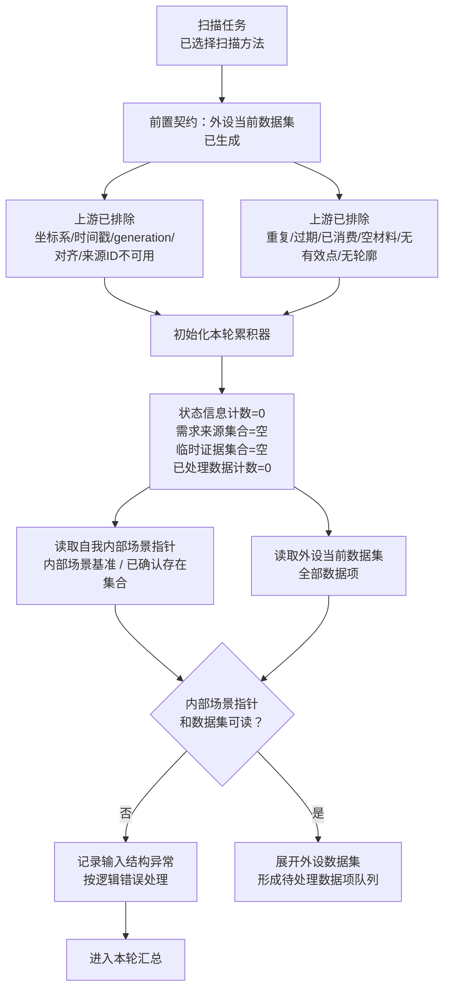
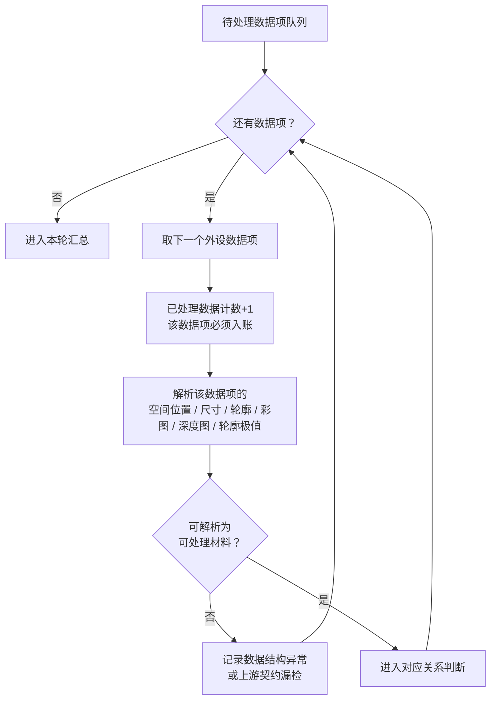
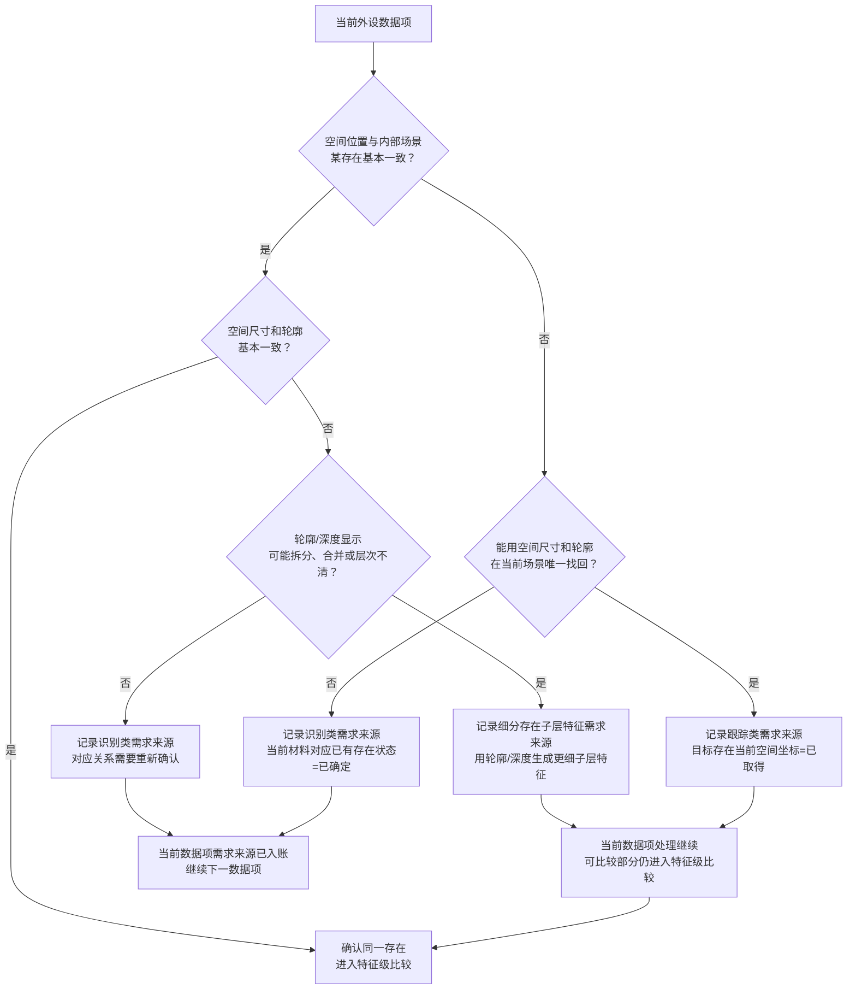
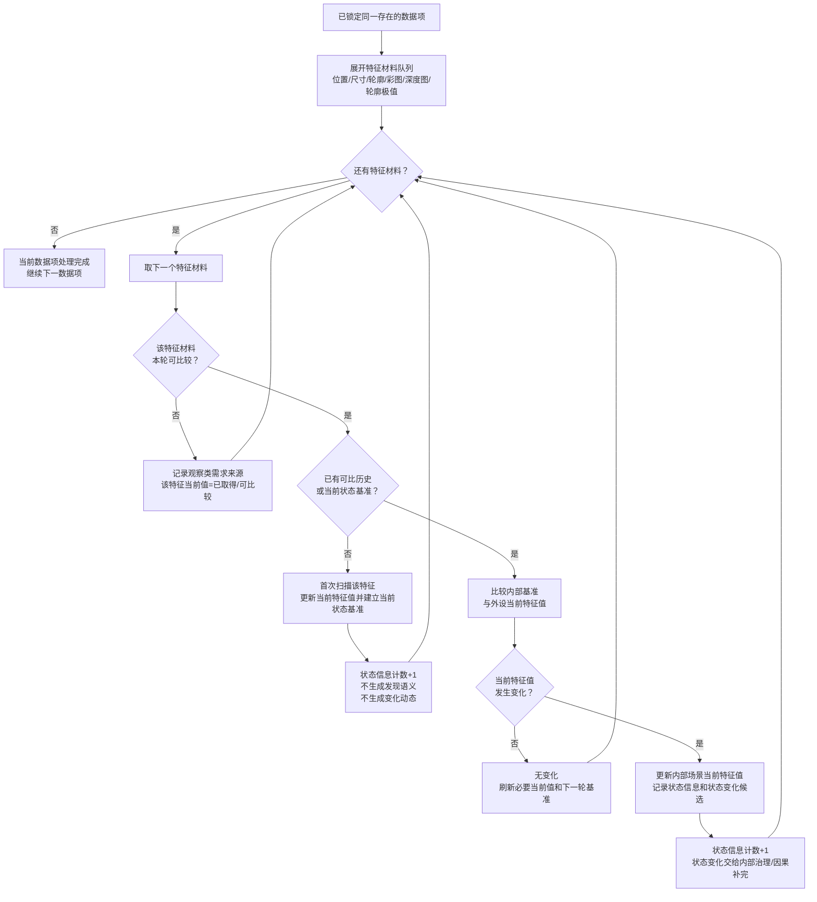
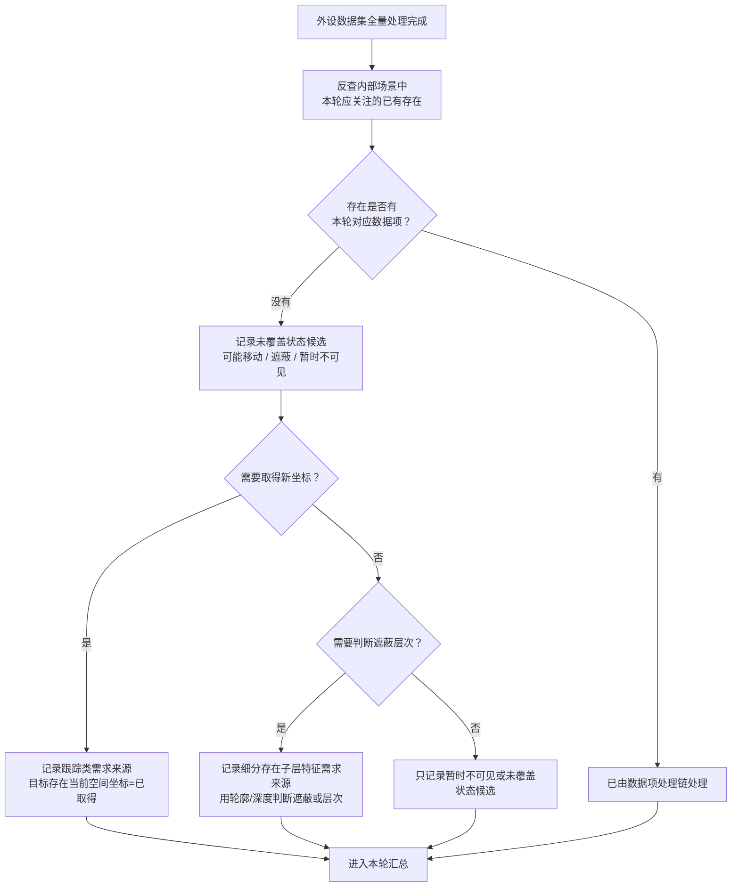
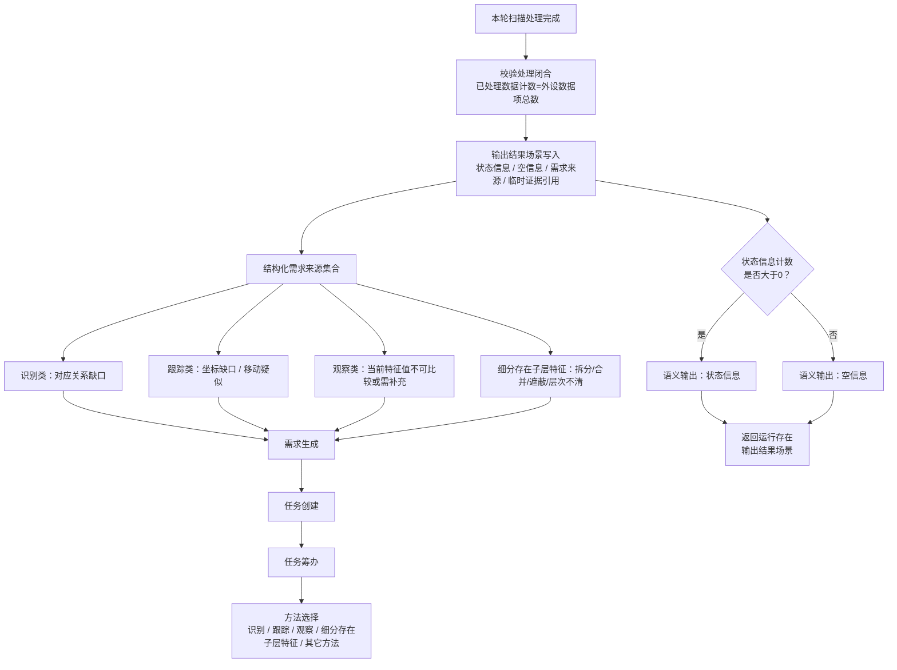
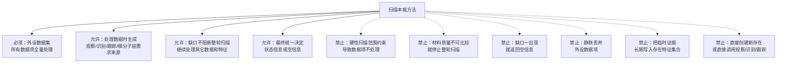

# 扫描本能方法内部流程图 v0.5

更新时间：2026-06-15

## 依据

```text
规范/禁止性规范20260611.md
规范/当前场景特征值明确标准规范20260602.md
规范/相机外设综合工作流程规范20260607.md
说明书/自我侧观察识别扫描跟踪本能方法规格说明.md
用户口径：
    外设当前数据集中的所有数据都需要处理；
    观察、跟踪、识别的需求都来自处理外设数据集时；
    对应冲突应生成细分存在子层特征需求来源；
    材料质量不是扫描全局停止条件；
    空信息只表示本轮没有状态信息产出，不表示没有处理结果。
```

## 说明

v0.5 是按最新口径重画的分段可读版。扫描内部不再把缺口直接导向空信息；它全量处理外设当前数据集，边处理边记录状态信息、需求来源和临时证据。观察、识别、跟踪以及“细分存在子层特征”的需求来源，都在处理外设数据项时形成，再进入需求-任务-方法闭环。

## 流程图

### 1. 前置契约与本轮初始化



### 2. 外设数据集全量处理



### 3. 对应关系判断与需求来源生成



### 4. 特征级处理：可比较就扫描，不可比较就生成需求来源



### 5. 内部已有存在未被本轮数据覆盖



### 6. 本轮汇总与语义输出



### 7. 扫描内部硬边界



## 关键边界

```text
1. 外设当前数据集中的所有数据都必须被处理，不能因为范围、质量或对应缺口而静默跳过。
2. 坐标系、时间戳、generation、对齐状态、外设来源ID、重复/过期/空材料等，应在生成数据集前排除；若进入扫描，按上游契约错误记录。
3. 观察、跟踪、识别的需求来源都来自处理外设数据集时形成的结构化缺口。
4. 一对多 / 多对一对应冲突优先生成“细分存在子层特征”需求来源，用轮廓和深度取得更细子层特征。
5. 内部已有存在未被本轮数据覆盖时，按移动、遮蔽或暂时不可见处理；通常先生成跟踪类需求来源，必要时生成细分子层需求来源。
6. 空信息只表示本轮没有状态信息产出，不表示本轮没有需求来源或处理结果。
```
