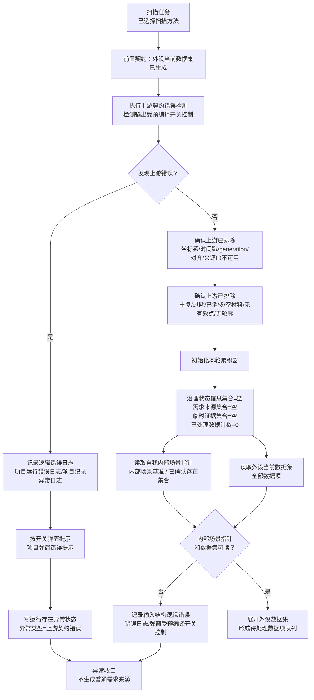
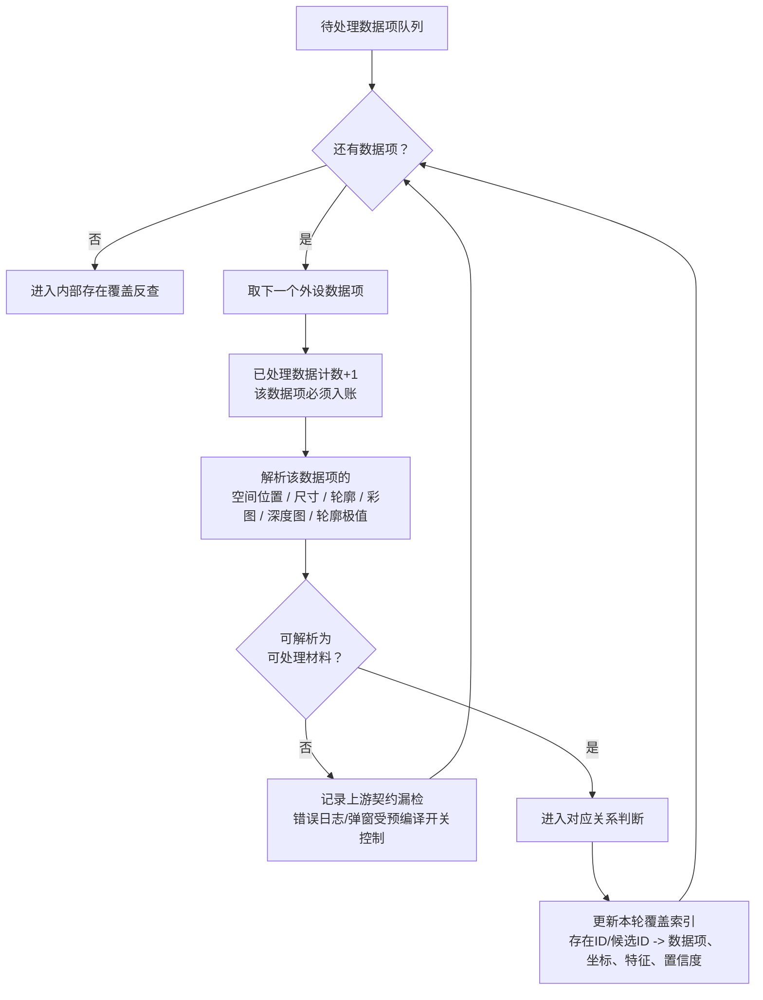
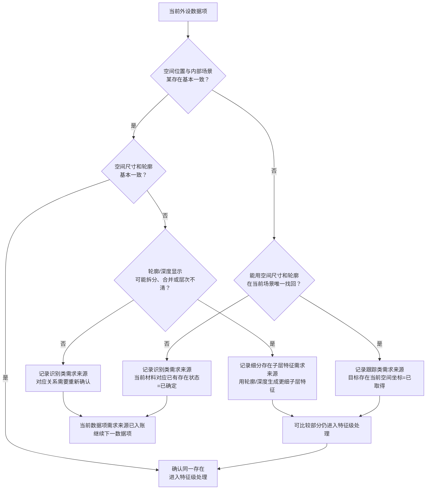
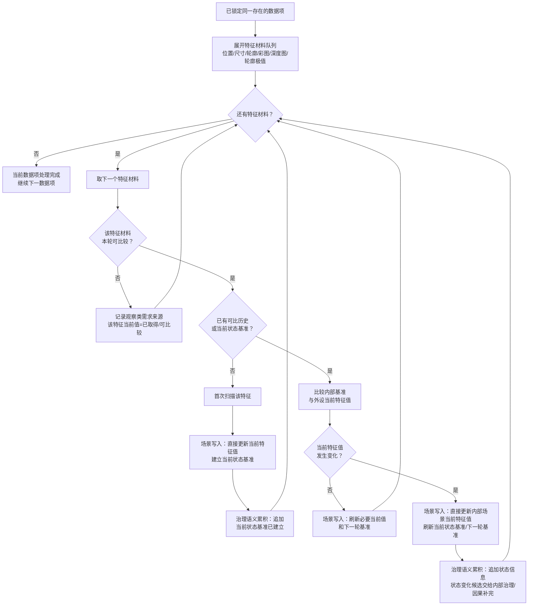
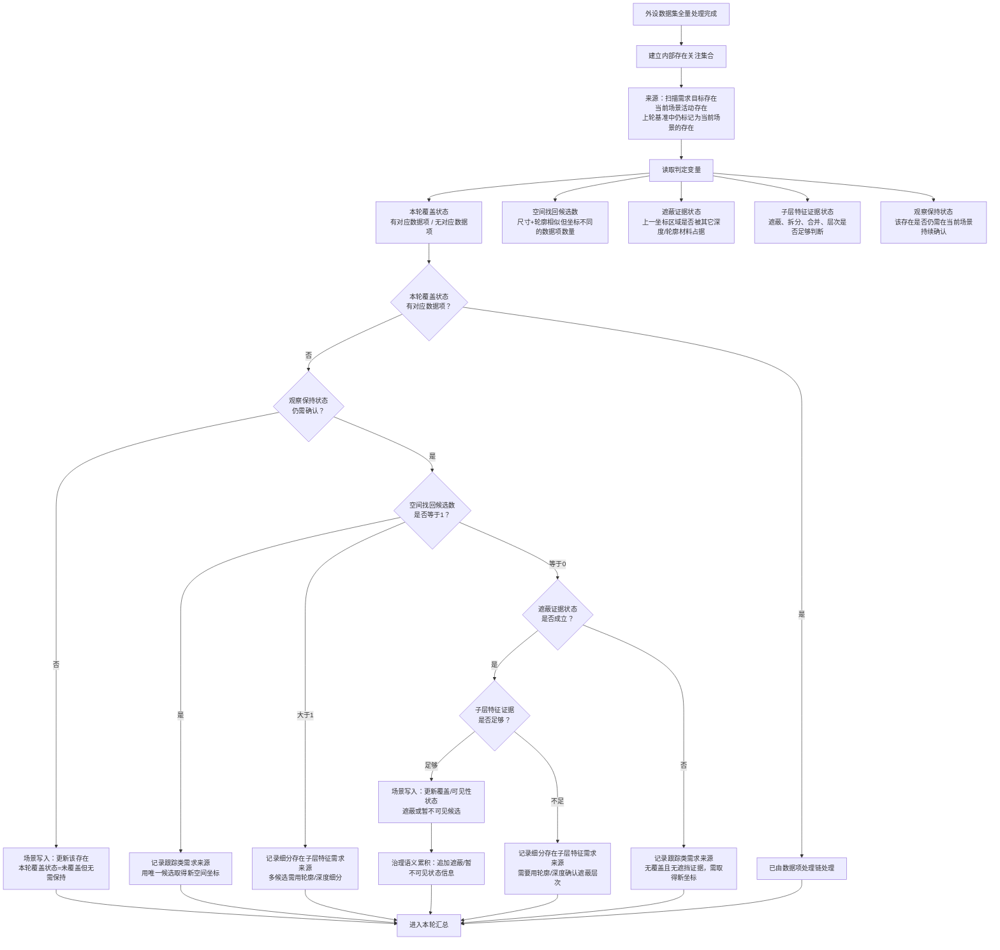
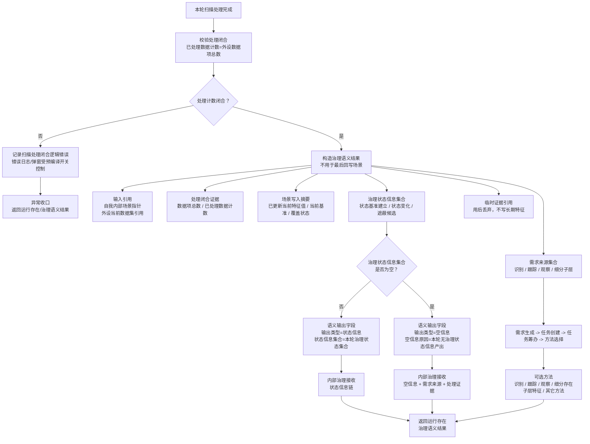
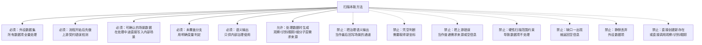

# 扫描本能方法内部流程图 v0.8

更新时间：2026-06-15

## 依据

```text
规范/禁止性规范20260611.md
规范/当前场景特征值明确标准规范20260602.md
规范/相机外设综合工作流程规范20260607.md
说明书/自我侧观察识别扫描跟踪本能方法规格说明.md
实施记录/20260612_日志输出预编译控制登记表.md
实施记录/20260613_日志输出预编译控制P4P5_Codex断点清单.md
用户口径：
    流程开始后先排除上游错误，用预编译控制的检测报错日志和弹窗实现；
    外设当前数据集中的所有数据都需要处理；
    场景中的当前数据在扫描处理中途直接修改完成；
    语义输出是给内部治理用的，不是用于最后才回写场景；
    观察、跟踪、识别的需求都来自处理外设数据集时；
    内部已有存在未被本轮数据覆盖时，必须由明确变量判断；
    空信息只表示本轮没有给内部治理的状态信息产出，不表示没有处理结果。
```

## 说明

v0.8 将扫描内部拆成两条通道：场景写入通道和治理语义通道。场景写入通道在扫描处理中途直接更新自我内部场景中的当前特征值、当前状态基准、覆盖状态和下一轮基准；治理语义通道只在最后整理给内部治理使用的输出类型、状态信息集合、需求来源集合和证据引用。

## 流程图

### 1. 上游错误检测与本轮初始化



### 2. 外设数据集全量处理与覆盖索引



### 3. 对应关系判断与需求来源生成



### 4. 特征级处理：场景直接写入，语义只累积给治理



### 5. 内部已有存在未被本轮数据覆盖：可实现判定链



### 6. 给内部治理的语义输出结构



### 7. 扫描内部硬边界



## 关键边界

```text
1. 可确认的自我内部场景数据在扫描处理中途直接写入，不等到语义输出阶段。
2. 语义输出只给内部治理使用，表达本轮是否有治理状态信息、有哪些需求来源、有哪些处理证据。
3. “内部已有存在未被本轮数据覆盖”必须引入明确变量：本轮覆盖状态、空间找回候选数、遮蔽证据状态、子层特征证据状态、观察保持状态。
4. 跟踪类需求来源的判断依据不是“感觉需要新坐标”，而是存在仍需确认且无本轮覆盖，并根据找回候选和遮蔽证据决定。
5. 语义输出字段为：输出类型=状态信息或空信息；空信息原因=本轮无治理状态信息产出。
6. 即使输出类型=空信息，需求来源集合、场景写入摘要、临时证据引用和处理闭合证据仍必须交给内部治理。
```
