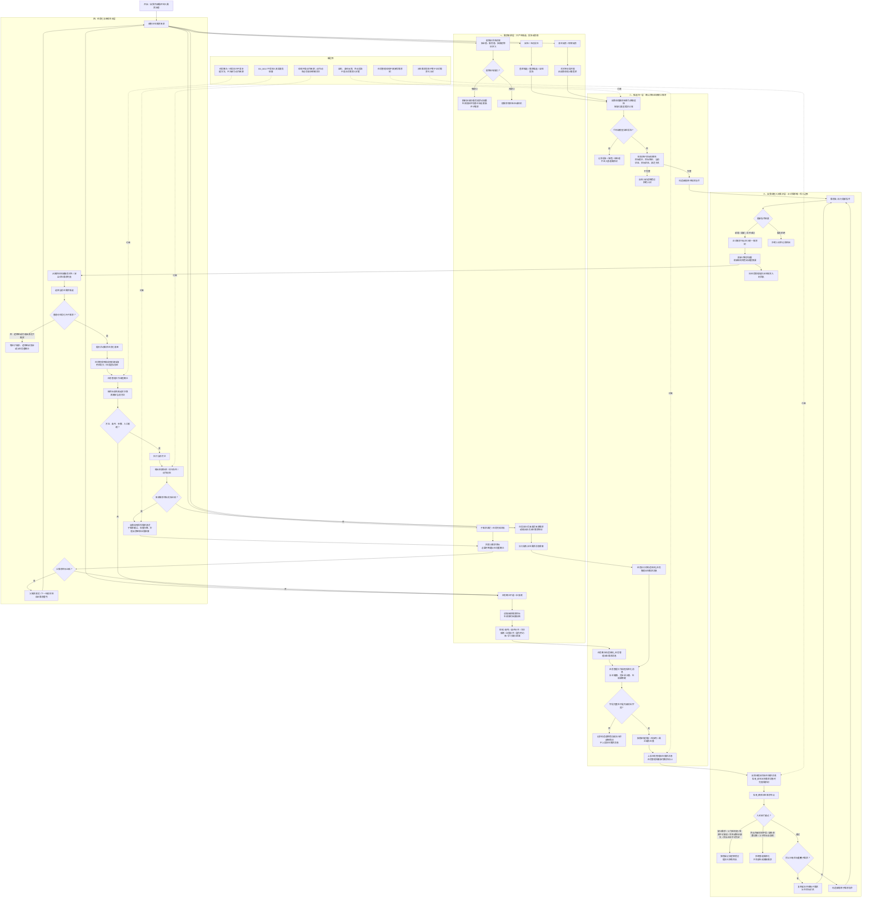

# 生成需求完整流程图

更新时间：2026-06-25

## 依据

```text
AGENTS.md
docs/00_文档总索引.md
docs/工程图谱/00_图谱总索引.md
docs/工程图谱/01_任务需求方法闭环图谱.md
docs/工程图谱/05_规则原子索引.md
规范/禁止性规范20260611.md
规范/规范目录.md
规范/需求树生长机制规范20260512.md
规范/需求信息来源自检与身体反馈规范20260515.md
规范/需求临时因果视图展开规范20260526.md
计划/计划索引.md
需求类.h
需求类.cpp
自我线程模块.impl.cpp
任务模块.筹办.ixx
任务模块.管理工作线程.ixx
任务模块.工作线程消息协议.ixx
任务模块.管理线程协议.ixx
```

## 说明

本图只梳理“生成需求”的当前权威流程：候选信息、缺口报告和派生需求消息都不是正式需求；正式需求必须由自我线程裁决，通过 `需求类::执行更新指令` 写入统一需求树。图中不宣称需求树机制整体闭合，也不宣称自我苏醒或初步成熟完成。

## 流程图



## 关键边界

```text
1. 正式需求树只通过统一更新指令生长；任务筹办、任务执行、外设线程、自检线程都不能直接写正式需求节点。
2. 生成需求前必须明确父需求、目标宿主、目标特征类型、当前状态、目标状态和满足关系；缺失时拒绝入树并记录逻辑错误。
3. 任务筹办先做路径筹办和候选方法填充；缺口只能形成回执、缺口报告或派生需求消息，不能跳过自我线程裁决。
4. 派生需求消息经字段完整性、幂等去重、同父目标重叠和父子目标自复制保护后，才可能变成正式需求。
5. 子需求完成不等于父需求满足，必须回查父需求目标特征；未达成则重筹办或继续生成更细需求。
6. 需求树生长正常只说明目标正在被拆解为可执行、可结算子目标，不等于自我苏醒完成或初步成熟完成。
```
