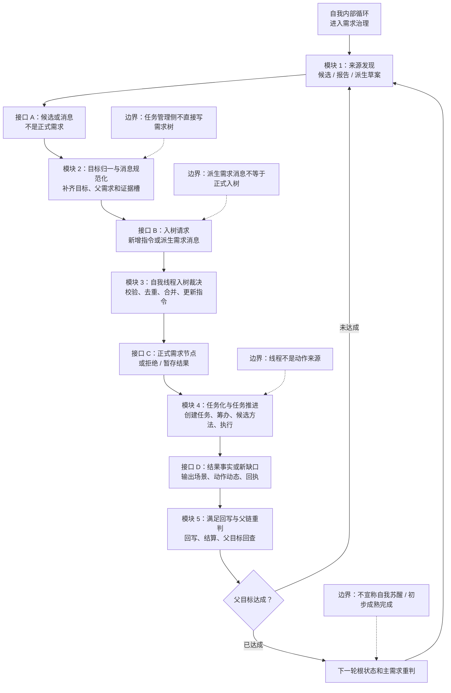
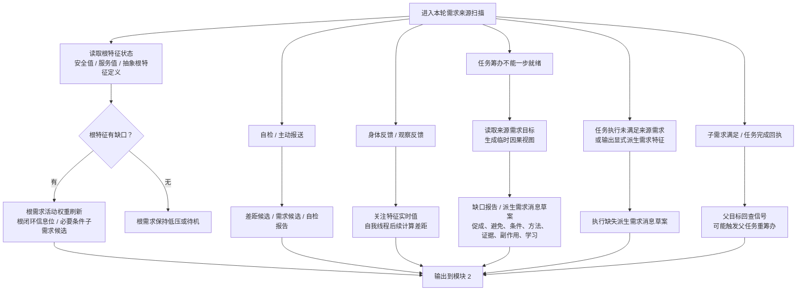
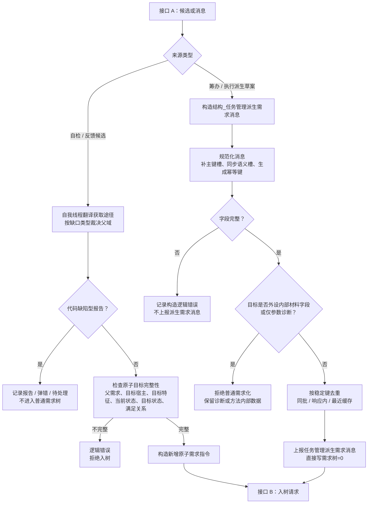
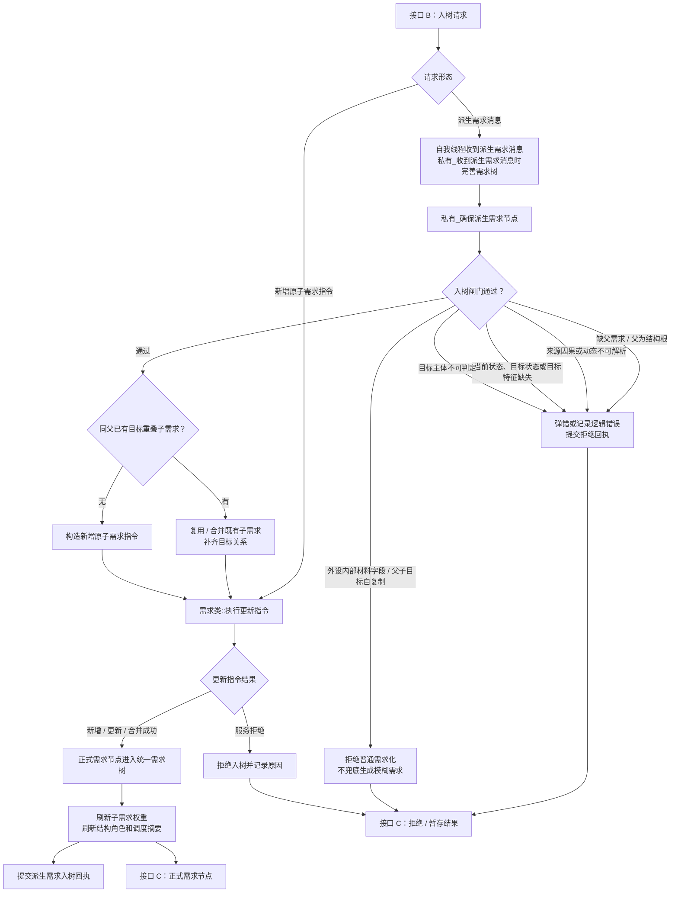
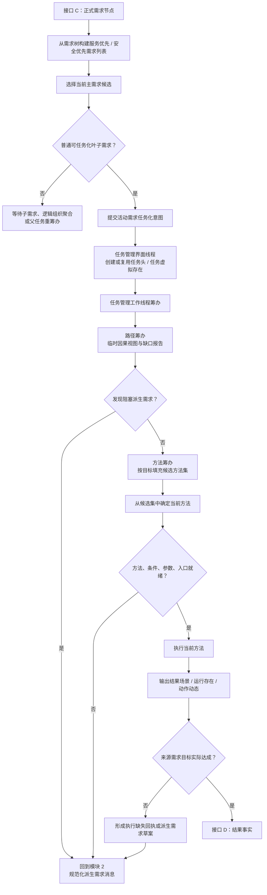
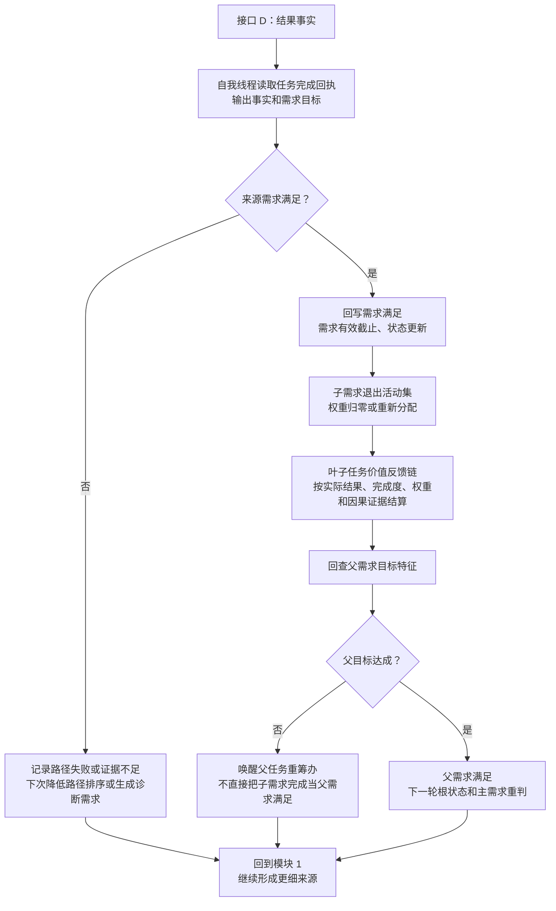

# 生成需求完整流程图 v0.2

更新时间：2026-06-25

## 依据

```text
AGENTS.md
docs/00_文档总索引.md
docs/工程图谱/00_图谱总索引.md
docs/工程图谱/01_任务需求方法闭环图谱.md
docs/工程图谱/05_规则原子索引.md
规范/禁止性规范20260611.md
规范/规范目录.md
规范/需求树生长机制规范20260512.md
规范/需求信息来源自检与身体反馈规范20260515.md
规范/需求临时因果视图展开规范20260526.md
计划/计划索引.md
需求类.h
需求类.cpp
自我线程模块.impl.cpp
任务模块.筹办.ixx
任务模块.管理工作线程.ixx
任务模块.工作线程消息协议.ixx
任务模块.管理线程协议.ixx
流程图/20260625_生成需求完整流程图_v0.1.md
```

## 说明

v0.2 将 v0.1 的单张大图拆成“总图 + 模块图”。总图只表达模块接口和主循环；模块图分别展开来源、归一、入树、任务化和回写重判。候选信息、缺口报告和派生需求消息仍然不是正式需求；正式需求必须经自我线程裁决并通过 `需求类::执行更新指令` 写入统一需求树。

## 总图



## 模块 1：来源发现



## 模块 2：目标归一与消息规范化



## 模块 3：自我线程入树裁决



## 模块 4：任务化与任务推进



## 模块 5：满足回写与父链重判



## 关键边界

```text
1. 模块 1 的输出只是候选、报告、草案或回查信号；不是正式需求节点。
2. 模块 2 的任务管理派生需求消息只是入树请求材料；任务管理侧不直接写需求树。
3. 模块 3 是正式入树边界；只有自我线程裁决并通过需求类::执行更新指令后，才形成正式需求节点。
4. 模块 4 中任务筹办 / 任务执行仍是任务管理生命周期普通函数，不作为本能方法或动作动态来源。
5. 模块 5 中子需求完成不等于父需求满足，必须回查父需求目标特征。
6. 本流程图是当前代码与规范口径的结构化梳理，不作为需求树整体闭合、自我苏醒完成或初步成熟完成证明。
```
