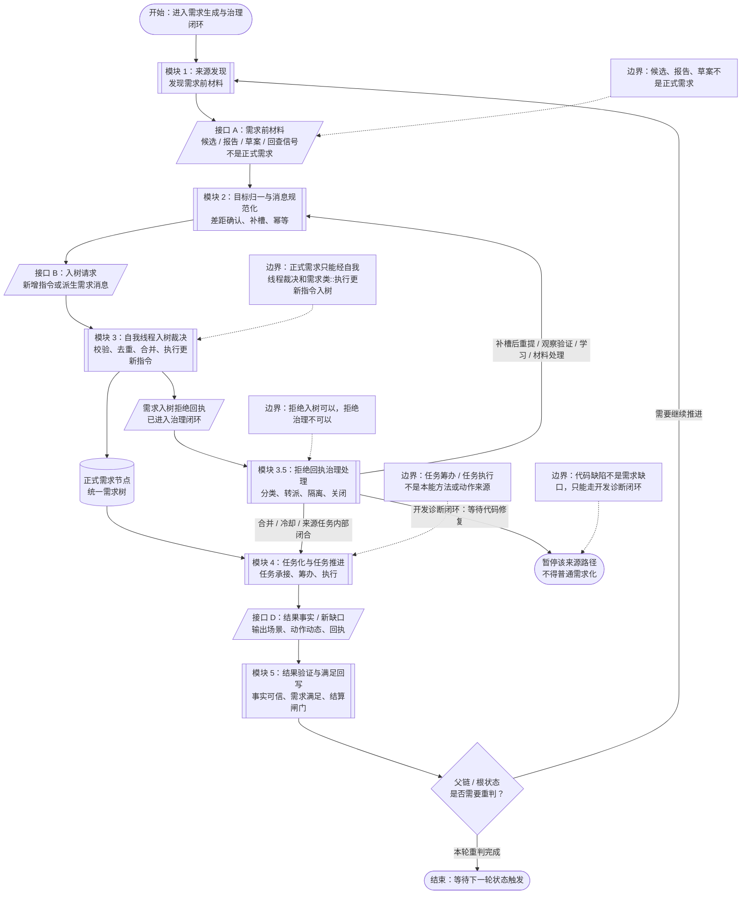
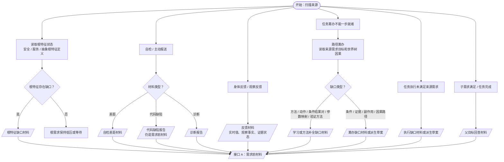
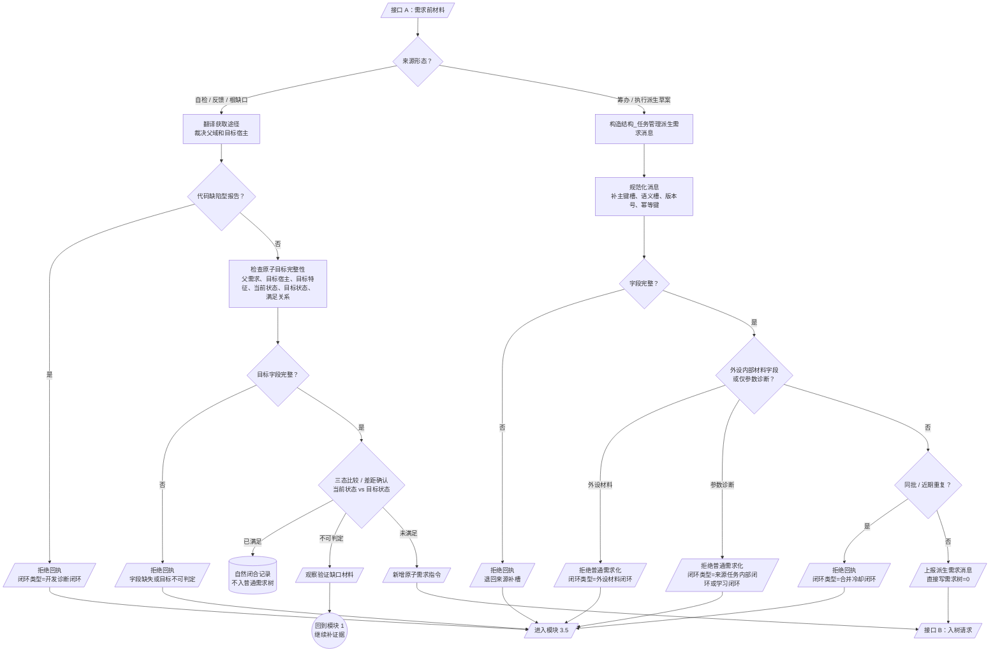
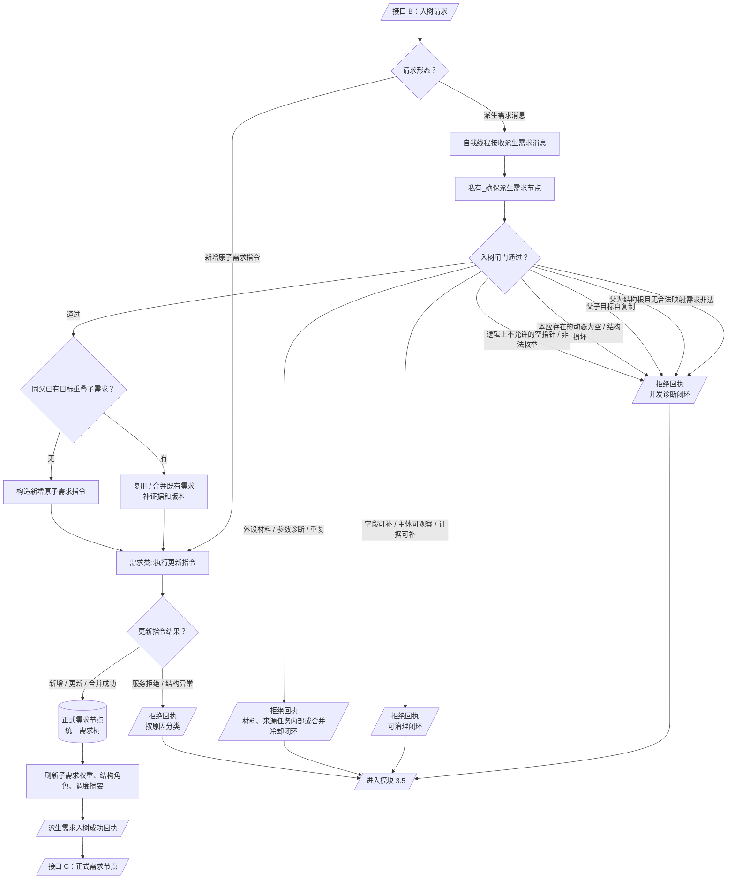
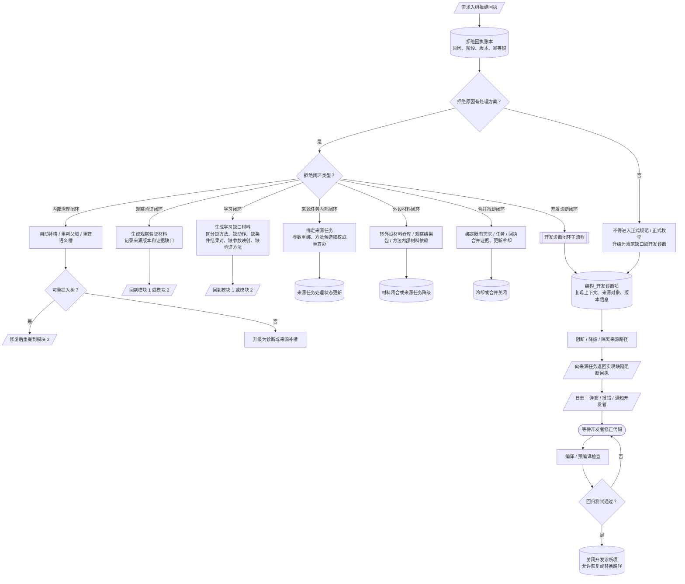
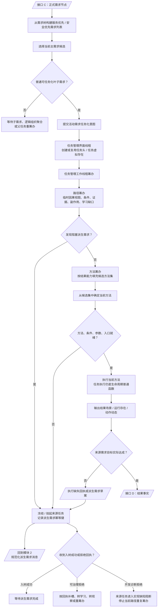
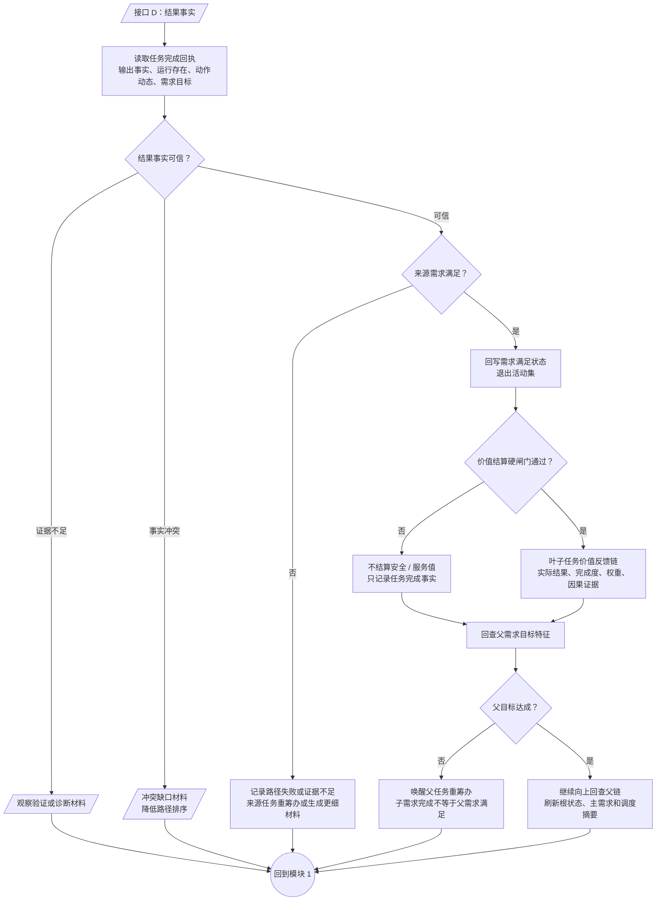
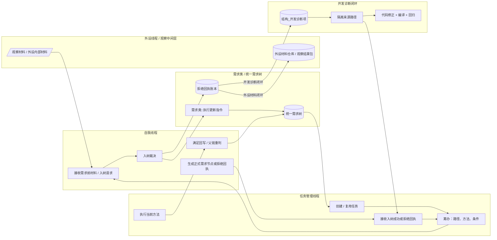

# 需求生成与治理闭环流程图 v0.3

更新时间：2026-06-25

## 依据

```text
AGENTS.md
docs/00_文档总索引.md
docs/工程图谱/00_图谱总索引.md
docs/工程图谱/01_任务需求方法闭环图谱.md
docs/工程图谱/05_规则原子索引.md
规范/禁止性规范20260611.md
规范/规范目录.md
规范/需求树生长机制规范20260512.md
规范/需求信息来源自检与身体反馈规范20260515.md
规范/需求临时因果视图展开规范20260526.md
规范/需求入树拒绝回执与开发诊断闭环规范20260625.md
规范/任务筹办与执行边界规范20260512.md
计划/计划索引.md
实施记录/20260625_需求生成治理闭环流程图v0.3待补充修订记录.md
流程图/20260625_生成需求完整流程图_v0.2.md
```

## 说明

v0.3 将图名收束为“需求生成与治理闭环流程图”，继续采用“总图 + 模块图”。本版补入：需求前材料、三态比较 / 差距确认、统一拒绝回执、模块 3.5 拒绝回执治理处理、来源任务挂起、结果事实验证、价值结算硬闸门、学习缺口分类、版本 / 幂等，以及代码缺陷固定走开发诊断闭环。

本图是规范和计划的视觉化解释，不替代规范；不能作为自我苏醒完成、初步成熟完成或代码实现已闭环的证据。

## 图形约定

```text
开始 / 结束：圆角终端
流程：矩形
判定：菱形
子流程：双边矩形
文档 / 数据：平行四边形
数据库 / 账本：圆柱
页面内引用：圆形连接点
跨页引用：双圆连接点

Mermaid 无法完全覆盖全部标准流程图符号时，使用最接近形状，并在节点文字中注明语义。
```

## 总图



## 模块 1：来源发现



## 模块 2：目标归一与消息规范化



## 模块 3：自我线程入树裁决



## 模块 3.5：拒绝回执治理处理



## 模块 4：任务化与任务推进



## 模块 5：结果验证与满足回写



## 线程泳道图



## 关键边界

```text
1. 需求前材料不是正式需求。
2. 派生需求消息不是正式需求。
3. 正式需求只能经自我线程裁决并通过 需求类::执行更新指令 入统一需求树。
4. 拒绝入树不是终态；每类拒绝原因必须有处理方案。
5. 可治理拒绝可以进入补槽、观察验证、学习、来源任务内部处理、外设材料处理或合并冷却闭环。
6. 代码缺陷型拒绝不是需求缺口，固定进入开发诊断闭环。
7. 开发诊断项建立不等于代码缺陷关闭；关闭必须依赖代码修正、编译和回归测试。
8. 来源任务必须接收入树成功或拒绝回执，并停止同一路径重复派生。
9. 子需求完成不等于父需求满足，必须回查父目标特征。
10. 任务完成不等于可以价值结算，结算必须通过硬闸门。
```
