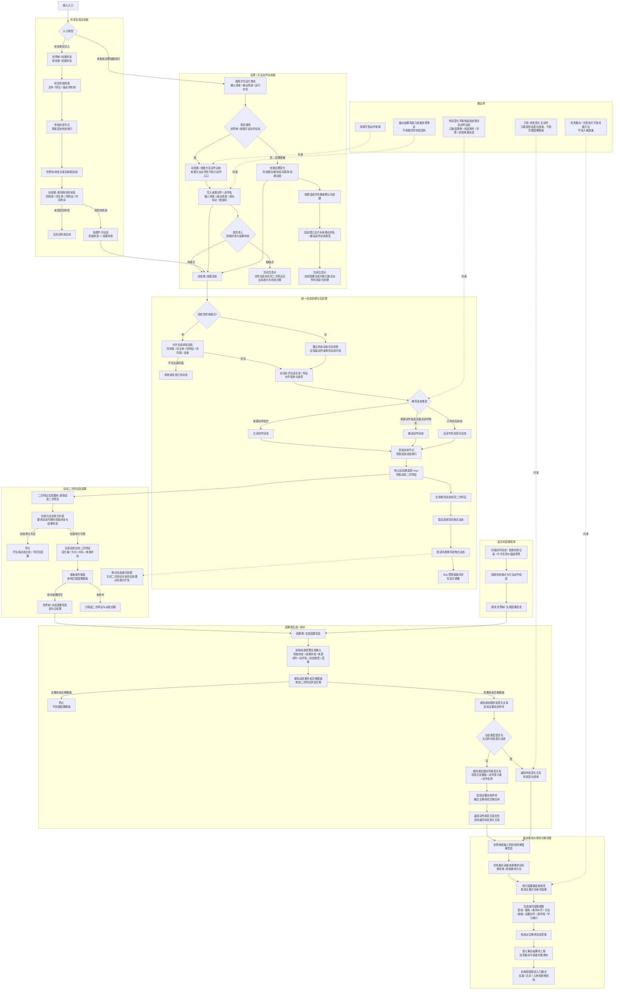

# 当前状态、动态、因果生成流程图

更新时间：2026-06-26

## 依据

```text
docs/00_文档总索引.md
规范/禁止性规范20260611.md
规范/规范目录.md
计划/计划索引.md
docs/工程图谱/00_图谱总索引.md
docs/工程图谱/01_任务需求方法闭环图谱.md
docs/工程图谱/03_安全服务结算图谱.md
docs/工程图谱/05_规则原子索引.md
docs/工程图谱/06_规范到代码映射.md
docs/工程图谱/08_事实来源与写入权限图谱.md
规范/方法动作动态硬规则规范20260512.md
规范/动作动态即因果账本规范20260512.md
规范/动态信息分层获取与聚合规范20260430.md
规范/因果补完流程规范20260516.md
规范/因果信息用途与用法规范20260516.md
规范/需求临时因果视图展开规范20260526.md

状态类.cpp:303-363
动态类.h:10-15, 69-107
动态类.cpp:125-135, 451-478, 680-868, 956-1000, 1323-1330
二次特征应用模块.ixx:958-1052, 1078-1114, 1253-1316, 1568-1604, 2770-2780
因果类.cpp:2224-2264, 2267-2568, 2572-2613
任务模块.执行.ixx:119-171
任务模块.筹办.ixx:993-1077, 1944-2230, 5603-5647
自我线程模块.impl.cpp:12941-13018
自我动作实现.扫描.ixx:1336-1374, 1597-1637
自我动作实现模块.ixx:10355-10391, 12235-12279
自我类.cpp:511-546, 591-610, 683-700, 761-778
```

## 说明

本图只画当前代码路径，不把流程图当规范或验收证据。当前代码已经存在“状态写入后自动刷新动态”和“动态创建后默认触发二次特征 / 因果后处理”的主链；但部分动作动态入口仍缺实际状态端点，或在动态后处理之后才补动作名，不能据此宣称扫描需求自然生长闭合、内部循环完成、自我苏醒完成或初步成熟完成。

## 流程图



## 关键边界

```text
1. 状态写入后的自动动态链以相邻前状态为前提；没有前状态时不会自动生成状态动态。
2. 动态创建后的默认后处理会尝试生成动态二次特征、相邻协同和聚合动态；能否生成因果取决于是否能标准化出初始状态与结果状态，以及是否存在果状态迁移模板。
3. 因果类总是先尝试状态变化关系；只有动态类型不是“无动作状态变化动态”时，才继续生成或命中动作致变关系。
4. 任务执行桥当前创建方法调用动作动态时未传状态端点，不能仅凭该动作动态形成完整状态迁移因果。
5. 自我治理动态存在“创建动态后再补动作名 / 类型”的路径，自动后处理可能已经按无动作状态变化处理。
6. 任务筹办消费因果信息只生成临时因果视图和派生需求消息草案，不直接写需求树。
7. 本图不宣称扫描需求自然生长闭合、练习链完全闭合、自我苏醒完成或初步成熟完成。
```
