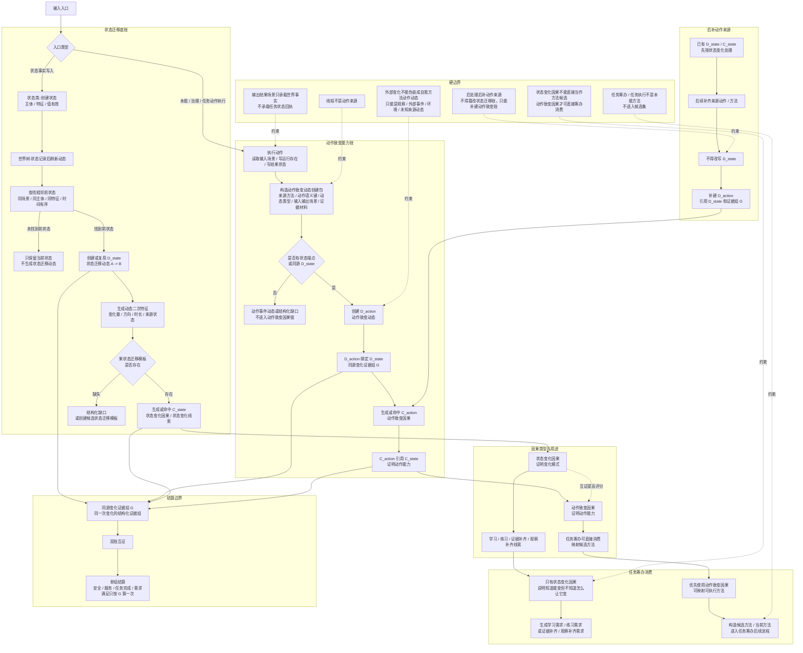

# 当前状态、动态、因果生成流程图

更新时间：2026-06-26

## 依据

```text
docs/00_文档总索引.md
规范/禁止性规范20260611.md
规范/规范目录.md
计划/计划索引.md
docs/工程图谱/05_规则原子索引.md
规范/方法动作动态硬规则规范20260512.md
规范/动作动态即因果账本规范20260512.md
规范/动态信息分层获取与聚合规范20260430.md
规范/因果补完流程规范20260516.md
规范/因果信息用途与用法规范20260516.md
规范/需求临时因果视图展开规范20260526.md

状态类.cpp:303-363
动态类.h:10-15, 69-107
动态类.cpp:125-135, 451-478, 680-868, 956-1000, 1323-1330
二次特征应用模块.ixx:958-1052, 1078-1114, 1253-1316, 1568-1604, 2770-2780
因果类.cpp:2224-2264, 2267-2568, 2572-2613
任务模块.执行.ixx:119-171
任务模块.筹办.ixx:993-1077, 1944-2230, 5603-5647
自我线程模块.impl.cpp:12941-13018
自我动作实现.扫描.ixx:1336-1374, 1597-1637
自我动作实现模块.ixx:10355-10391, 12235-12279
自我类.cpp:511-546, 591-610, 683-700, 761-778
```

## 说明

本图是 v0.2 修订版：同一次特征值变化不再按“无动作状态变化动态 / 带动作动态”二选一处理，而是按“一变两账”表达。状态迁移动态证明“变了”，动作致变动态证明“这个变化与某个动作有关”；两套账通过同源变化证据组互证，结算只算一次。本图不宣称当前代码已经完全实现该口径。

## 流程图



## 关键边界

```text
1. 状态迁移动态是事实底账，动作致变动态是能力账；同一次变化允许两者同源共存。
2. 状态变化因果证明变化模式；动作致变因果证明动作能力。任务筹办只把动作致变因果作为直接方法候选。
3. 后补动作来源时，不得把既有 D_state 改成动作动态；必须补建 D_action 并引用 D_state。
4. D_state、D_action、C_state、C_action 必须绑定同源变化证据组；双账互证，但安全 / 服务 / 任务完成 / 需求满足只结算一次。
5. 缺状态端点、缺动作来源或缺果状态迁移模板时，必须返回结构化缺口或候选模板，不得静默停止。
6. 当前代码仍暴露部分动作动态入口缺实际状态端点、部分动作信息后补的问题；本图不宣称扫描需求自然生长闭合、练习链完全闭合、自我苏醒完成或初步成熟完成。
```
