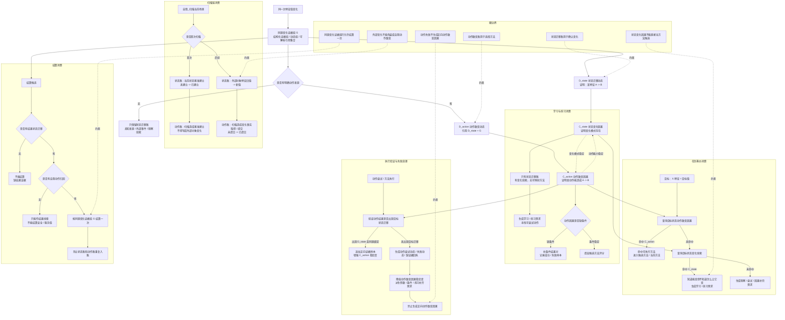

# 当前状态、动态、因果生成流程图

更新时间：2026-06-26

## 依据

```text
docs/00_文档总索引.md
规范/禁止性规范20260611.md
规范/规范目录.md
计划/计划索引.md
docs/工程图谱/05_规则原子索引.md
规范/方法动作动态硬规则规范20260512.md
规范/动作动态即因果账本规范20260512.md
规范/动态信息分层获取与聚合规范20260430.md
规范/因果补完流程规范20260516.md
规范/因果信息用途与用法规范20260516.md
规范/安全服务值结算规范20260518.md
规范/需求临时因果视图展开规范20260526.md
流程图/20260626_当前状态动态因果生成流程图_v0.2.md
```

## 说明

本图是 v0.3 修订版，重点表达双账的消费路径：状态迁移账用于确认变化，动作致变账用于选择方法。两套账不是重复事实，而是同一次变化的两个用途层；二者通过同源变化证据组互证，安全 / 服务 / 任务完成 / 需求满足只按同源证据组结算一次。本图不宣称当前代码已经完整实现这些接口。

## 流程图



## 关键边界

```text
1. 状态账回答“发生了什么变化”；动作账回答“谁能造成这个变化”。
2. 任务筹办优先查询动作致变因果；状态变化因果只能生成学习、练习、观察、尝试或证据补齐需求。
3. 学习层把“有状态变化但无动作致变”作为练习目标来源；动作执行但目标状态没变时，只能生成失败证据，不能生成正向动作致变因果。
4. 扫描动作不应被写成造成外部对象变化；首次扫描建立内部基准，后续扫描取得或提交变化事实。
5. 结算必须同时具备结果状态迁移和自我动作归因；同源变化证据组只允许结算一次。
6. 本图不宣称扫描需求自然生长闭合、练习链完全闭合、自我苏醒完成或初步成熟完成。
```
