# 观察本能函数 6085 内部代码路径流程图 v0.2

更新时间：2026-06-28

## 依据

```text
代码：
    本能方法类.h
        枚举_本能方法ID::自我_观察单个空间候选并组合存在假设 = 6085
    自我动作实现.外设模块.ixx
        自我观察单个空间候选并组合存在假设
```

## 说明

本图严格按 `自我观察单个空间候选并组合存在假设` 函数体内的代码顺序绘制。函数体中调用的 helper / 外部函数均只画成“模块调用”，不展开其内部实现；函数外部统一承接链也不在本图展开。

## 流程图

```mermaid
flowchart TD
    Start["进入 6085 函数体<br/>自我观察单个空间候选并组合存在假设"] --> Now["now = 当前_微秒()"]
    Now --> EnvCall["模块调用：确保本能方法自身环境<br/>参数含 方法首节点 / 本能ID=6085 / 输出结果场景 / now / 规格确认函数"]
    EnvCall --> EnvOk{"环境.已成功 ?"}
    EnvOk -->|否| EnvFailCall["模块调用：输出本能方法自身环境失败<br/>输入参数场景 / 输出结果场景 / now"]
    EnvFailCall --> ReturnEnvFail["return 环境失败输出"]

    EnvOk -->|是| OutScene["模块调用：双目相机实际输出场景"]
    OutScene --> Camera["模块调用：解析双目相机目标外设"]
    Camera --> Host["模块调用：解析双目相机目标宿主"]
    Host --> InitResult["初始化 结构_双目相机调用结果 结果{}"]

    InitResult --> ReadCandidates["模块调用：读取已落账空间候选集合<br/>返回值被忽略；结果作为输出参数被更新"]
    ReadCandidates --> InitPassive["初始化 结构_被动识别外设观察材料结果 被动识别结果{}"]
    InitPassive --> PassiveCall["模块调用：被动识别外设观察材料_内部治理<br/>返回 被动识别存在；输出 被动识别结果"]

    PassiveCall --> JudgeCall["模块调用：计算空间候选独立性判断(结果)"]
    JudgeCall --> QueueCall["模块调用：生成空间候选观察队列(结果)"]
    QueueCall --> HypCall["模块调用：组合观察存在假设(结果, 队列)"]

    HypCall --> PassiveBool["计算 被动识别可形成观察结果<br/>已运行 && 材料可交付观察方法<br/>&& 同一性/归属不是冲突或证据不足<br/>&& (唯一已有存在 || 合并数量 > 0 || 未命中已知存在且待建立)"]
    PassiveBool --> SuccessBool["计算 成功<br/>成功 = 结果.成功 || 被动识别可形成观察结果"]
    SuccessBool --> HypState["计算 观察假设状态<br/>假设.假设状态 > 0 ? 假设.假设状态 :<br/>(被动识别可形成观察结果 ? 已生成 : 0)"]

    HypState --> DynCall["模块调用：写入双目相机I64事实与动态<br/>特征=观察存在假设<br/>值=成功 ? 观察假设状态 : 0<br/>传入方法 / 输入场景 / 输出场景 / 运行虚拟存在"]
    DynCall --> GovernanceCall["模块调用：写入观察识别归属结果<br/>输入 目标宿主 / 被动识别结果 / 动态 / now<br/>输出 观察治理结果"]
    GovernanceCall --> RecordCall["模块调用：写入观察内部治理记录<br/>输入 方法首节点 / 输入场景 / 实际输出场景 / 运行存在 / 被动识别结果 / 观察治理结果 / 动态 / now"]

    RecordCall --> CopyResult["auto 记录结果 = 结果"]
    CopyResult --> PatchRecord{"成功 && !记录结果.成功 ?"}
    PatchRecord -->|是| PatchRecordFields["修正记录结果<br/>记录结果.成功=true<br/>失败原因=0<br/>消息=观察被动识别归属结果已写入"]
    PatchRecord -->|否| DefineWriter
    PatchRecordFields --> DefineWriter["定义 写结果(lambda)"]

    DefineWriter --> WriterBody["lambda 内容为模块调用集合<br/>写入双目相机通用结果<br/>写入观察存在假设摘要<br/>写入被动识别材料摘要<br/>写观察治理计数 I64"]
    WriterBody --> WriteRunHost["调用 写结果(本轮运行虚拟存在)"]
    WriteRunHost --> WriteSceneHost["调用 写结果(实际输出场景)"]
    WriteSceneHost --> WriteTargetHost["调用 写结果(目标宿主)"]

    WriteTargetHost --> OutputRunCall["模块调用：输出运行虚拟存在<br/>输入 本轮运行虚拟存在 / 输入参数场景 / 实际输出场景 / now"]
    OutputRunCall --> ActionResultLog["模块调用：记录双目相机本能动作结果<br/>方法名=自我_观察单个空间候选并组合存在假设<br/>输入 记录结果 / 相机存在 / 目标宿主 / 动态 / 输出运行"]
    ActionResultLog --> SuccessLogGate{"成功 ?"}
    SuccessLogGate -->|是| HypLog["项目运行日志：观察存在假设<br/>记录假设状态 / 来源候选 / 验证状态 / 距离 / 尺寸 / 方位 / 轮廓支持评分"]
    SuccessLogGate -->|否| PassiveLog
    HypLog --> PassiveLog["项目运行日志：观察被动识别闭环<br/>记录被动识别结果、治理计数、被动治理动作动态和边界标记"]

    PassiveLog --> RunLedger["模块调用：更新方法运行账<br/>参数 成功"]
    RunLedger --> ReturnRun["return 输出运行"]

    subgraph Scope["范围约束"]
        S1["只画 6085 函数体内代码顺序"]
        S2["被调用 helper / 外部函数均作为模块节点<br/>不展开内部实现"]
        S3["函数外部统一承接链不在本图重复展开"]
    end

    Start -.范围.-> S1
    PassiveCall -.模块.-> S2
    EnvCall -.边界.-> S3
```



## 关键边界

```text
1. 本图只覆盖 6085 函数体内部，节点顺序对应函数体中的实际调用和条件判断。
2. `读取已落账空间候选集合` 的返回值在 6085 中被忽略，只通过 `结果` 输出参数影响后续判断。
3. `被动识别外设观察材料_内部治理`、`写入观察识别归属结果`、`写入观察内部治理记录` 等 helper 只作为模块节点，不展开内部流程。
4. 函数外部统一承接链另行维护，不在每个本能方法内部图中重复绘制。
```
