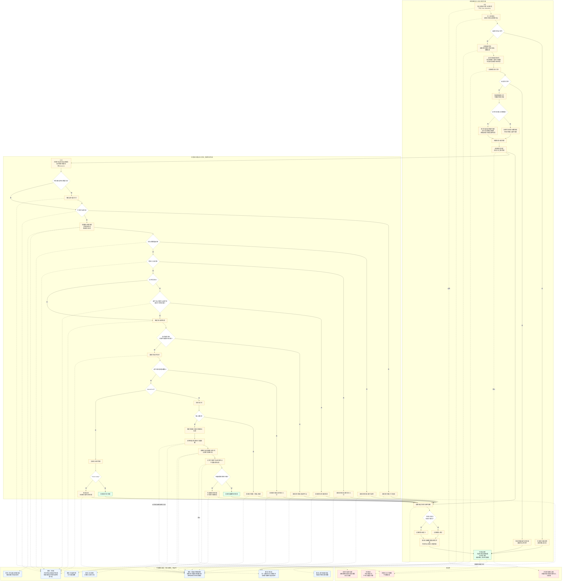

# 任务执行治理函数内部流程图

更新时间：2026-06-29

## 依据

```text
任务模块.执行.ixx:957-1512
规范/任务筹办与执行边界规范20260512.md:15-32,78-103,361-387,641-658,689-712
规范/方法动作动态硬规则规范20260512.md:439-497,556-583
用户口径：工作线程本身不能创建任何动态，动态只能由本能方法、治理函数创建。
```

## 说明

本图只描述 `任务模块.执行::执行任务` 与 `任务执行桥类::执行方法_同步等待` 的内部治理流程。外部调用函数统一用“模块”节点表示，不展开外部模块内部逻辑。

## 流程图



## 关键边界

```text
1. 任务执行是治理普通函数，只返回过程回执、建议状态、运行结果和动作验证摘要。
2. 任务执行桥可以调用本能动作集，但不能在桥内创建动作动态。
3. 工作线程不能裸写动态；任务状态动作动态必须通过“提交任务状态变化”入口创建。
4. 被调用本能方法若造成世界事实变化，由该本能方法或对应治理提交入口负责状态、动态和因果证据。
5. 本图不宣称内部循环完成、自我苏醒完成或初步成熟完成。
```
