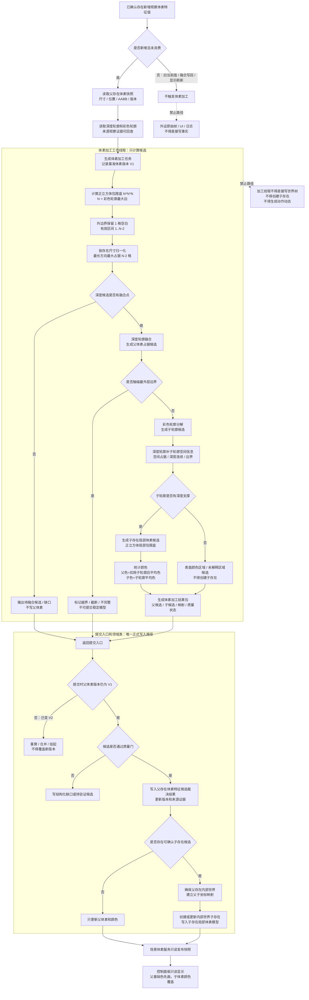

# 已确认存在体素融合分解流程图 v0.1

更新时间：2026-06-30

## 依据

```text
用户关于存在体素分辨率、颜色、融合点、正立方体包围盒、子存在体素和体素加工线程的讨论结论。
规范/已确认存在体素融合与分解规范20260630.md
规范/详细设计/已确认存在体素融合与分解实现方案20260630.md
计划/20260630_已确认存在体素融合分解施工计划_v0.1.md
规范/场景体素服务与视觉先验融合规范20260625.md
规范/已确认观察存在内部结构递归细分规范20260525.md
```

## 说明

本流程图只表达已确认存在体素融合与分解的实现逻辑边界，不表示代码已经实现。体素加工线程只生成候选结果包；正式写入仍由提交入口裁决。

## 流程图



## 关键边界

```text
1. 新增未消费观察体素特征值才触发加工，外设原始帧新增不触发。
2. 深度轮廓负责融合，彩色轮廓负责分解，子轮廓必须由深度补空间。
3. 没有融合点时不写父体素，只形成待融合候选或缺口。
4. 所有体素包围盒都是正立方体，最外边界占据表示不完整或越界；完整存在最长方向最大占据格数为 N-2。
5. 父存在保留完整体素模型；子存在确认后拥有自己的局部体素模型。
6. 体素加工线程只返回候选，正式写入必须经过提交入口和版本闸门。
7. 控制面板显示只读，颜色覆盖只属于渲染优先级。
```
