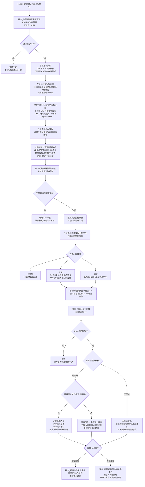
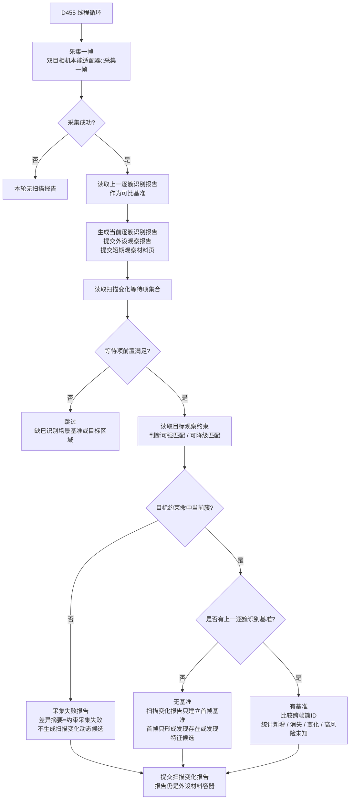
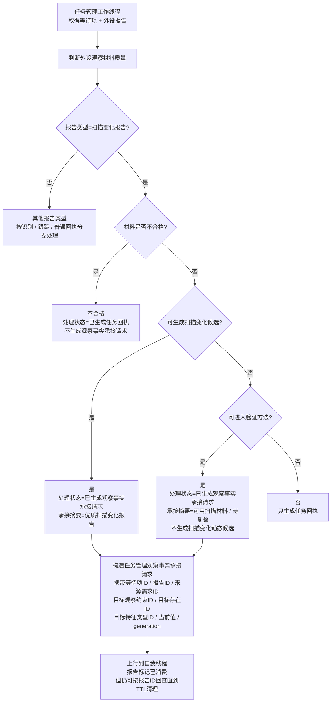
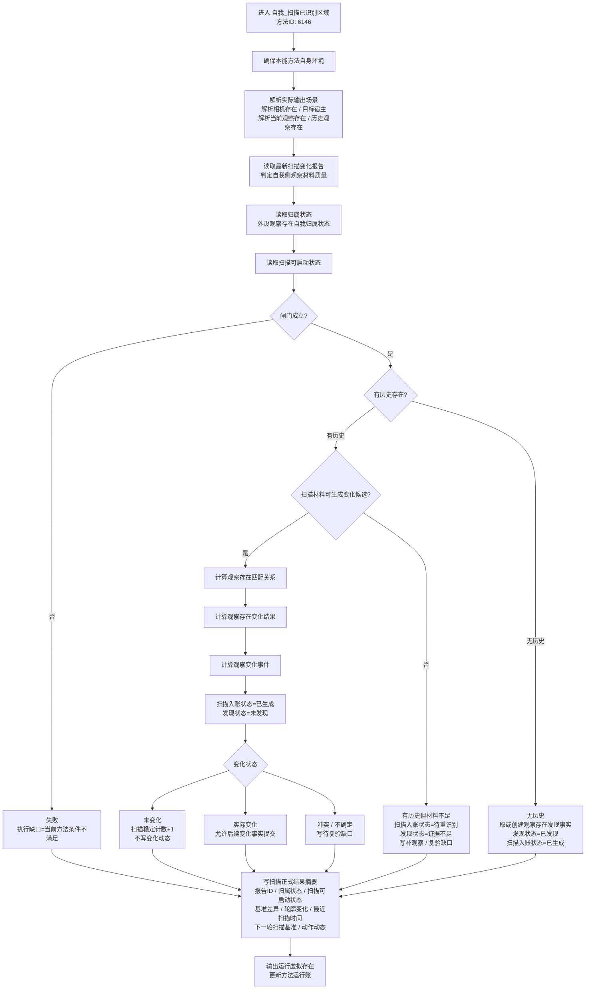
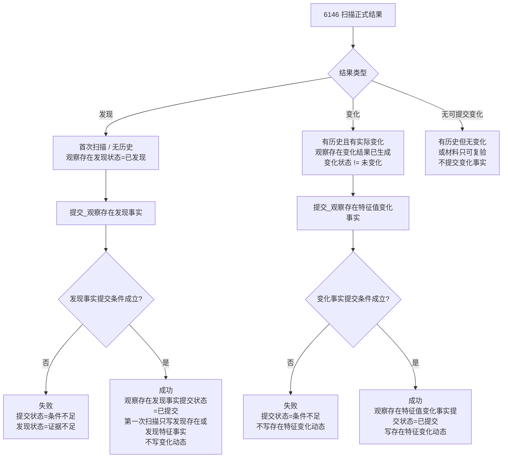

# 当前_本能方法_扫描内部实现逻辑流程图

生成时间：2026-06-07

依据范围：当前代码。本文只描述代码中已经能追踪到的扫描链路，不把外设报告、等待项、目标观察约束或队列项当成正式世界事实。

## 1. 当前代码结论

```text
当前代码中的“扫描”不是 D455 报告直接入账。

实际链路分成五段：

1. 识别 / 对应事实提交后，6150 写入稳定子集桥：
   正式已确认观察存在
   可观测单位到存在映射项
   外设观察存在自我归属状态 == 已归属
   扫描可启动状态 == 1
   扫描目标观察约束特征组

2. 任务管理界面线程按稳定子集可用扫描约束批量创建扫描等待项。

3. D455 独占线程按等待项和目标观察约束生成扫描变化报告。

4. 任务管理工作线程匹配外设报告并做材料质量分级：
   不合格 -> 只回执
   可用 -> 待复验观察承接，不生成扫描变化动态候选
   优质 -> 扫描变化观察承接请求

5. 自我侧 6146 自我_扫描已识别区域 读取报告和正式目标存在：
   有历史 + 材料可生成变化候选 -> 计算变化结果 / 变化事件
   有历史 + 材料只可复验 -> 待重识别 / 补观察缺口
   无历史 -> 首次扫描只生成发现存在或发现特征事实
```

当前边界：

```text
扫描报告只是材料。
目标观察约束只是外设观察输入。
6146 是扫描方法主体，但不是最终提交入口。
首次扫描不写变化动态。
无变化不写变化动态。
只有“有历史 + 优质扫描材料 + 有实际变化”才允许提交观察存在特征值变化事实。
扫描链不直接写需求满足，不直接写安全值。
```

## 2. 代码依据索引

| 链路 | 当前代码位置 | 说明 |
| --- | --- | --- |
| 方法登记 | `本能方法类.cpp:56-64` | 登记 `自我_扫描已识别区域`、`提交_观察存在特征值变化事实`、`提交_当前观察范围可观测单位存在对应事实`、`提交_观察存在发现事实`。 |
| 稳定子集桥 | `自我动作实现.外设模块.ixx:21327-21839` | 6150 写正式已确认观察存在、映射项、扫描可启动状态、扫描目标观察约束。 |
| 扫描等待项 | `任务模块.管理界面线程.impl.cpp:3064-3190` | 读取可用扫描目标观察约束，按稳定子集全量创建 `已识别场景扫描变化` 等待项。 |
| D455 扫描前置 | `外设线程_D455深度相机.ixx:978-991` | 等待项绑定目标观察约束时，必须可强匹配或可降级匹配。 |
| D455 扫描报告生成 | `外设线程_D455深度相机.ixx:1004-1113` | 从逐簇识别报告生成扫描变化报告；首帧缺基准时只建立基准。 |
| D455 循环入队 | `外设线程_D455深度相机.ixx:1550-1599` | 每帧生成逐簇识别报告后，按扫描等待项生成扫描变化报告并入队。 |
| 任务管理质量门 | `任务模块.管理工作线程.ixx:3239-3358` | 扫描报告按质量分为回执、待复验观察承接、扫描变化观察承接。 |
| 6146 扫描主体 | `自我动作实现.外设模块.ixx:19799-20090` | 读取当前存在、历史存在、扫描报告、归属状态、扫描可启动状态和材料质量，生成扫描正式结果。 |
| 发现事实提交 | `自我动作实现.外设模块.ixx:21963-22125` | 首次扫描发现存在或发现特征事实的提交入口。 |
| 变化事实提交 | `自我动作实现.外设模块.ixx:22128-22310` | 有历史、有实际变化、来源质量允许时，提交观察存在特征值变化事实。 |

## 3. 总流程图



## 4. 外设侧扫描报告生成



## 5. 任务管理承接质量门



## 6. 6146 内部实现流程



6146 成功闸门对应当前代码条件：

```text
有当前存在
&& 归属状态已读
&& 归属状态 == 外设观察存在自我归属状态_已归属
&& 扫描可启动状态已读
&& 扫描可启动状态 == 1
&& 扫描材料可复验
```

6146 生成变化候选的额外条件：

```text
有历史存在
&& 扫描材料可生成变化候选
```

## 7. 提交入口流程



发现事实提交条件：

```text
当前存在存在
&& 扫描正式结果可读
&& 观察存在发现状态 == 已发现
&& 来源报告可进入验证方法
```

变化事实提交条件：

```text
当前存在存在
&& 已识别区域扫描入账状态 == 已生成
&& 变化结果已生成
&& 变化状态 != 未变化
&& 来源报告可生成扫描变化候选
```

## 8. 当前运行状态口径

按当前计划索引记录，扫描输入条件桥已经闭合：

```text
6150 已形成稳定子集扫描目标上下文。
任务管理已按稳定子集全量提交扫描等待项。
D455 已生成扫描变化报告。
自我线程已按正式目标存在生成扫描任务主体。
6146 已自然执行。
归属状态已读 == 1。
扫描可启动状态已读 == 1。
扫描闸门成立 == 1。
```

但当前材料质量门仍停在：

```text
当前扫描材料等级 == 可用
可生成扫描变化候选 == 0
可生成跟踪动态候选 == 0
可进入提交入口组织 == 0
```

因此当前代码口径下，这类材料只能作为：

```text
可复验材料
首帧扫描基准
待重识别输入
```

不能宣称已经生成：

```text
扫描变化动态候选
稳定跟踪动态候选
提交入口事实
安全值变化
需求满足
```

## 9. 硬边界

```text
1. D455 是观察材料生产者，不是世界真值裁决者。
2. 外设报告 / 等待项 / 目标观察约束 / 队列项不进入正式认知链作为事实主体。
3. 扫描必须绑定已归属且扫描可启动的当前存在。
4. 首次扫描只能建立发现存在或发现特征事实，不写变化动态。
5. 有历史但材料未达“可生成扫描变化候选”时，只能待重识别或补观察复验。
6. 无实际变化时不提交变化事实。
7. 提交_观察存在特征值变化事实不直接消费外设提交包，只消费 6146 组织出的正式扫描结果和可回查来源报告质量。
8. 扫描链不直接写需求满足，不直接写安全值。
```
