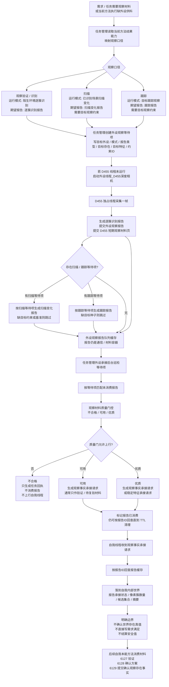
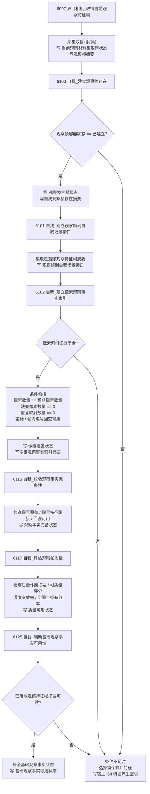
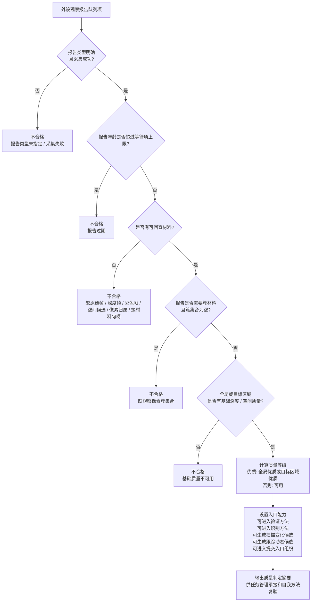
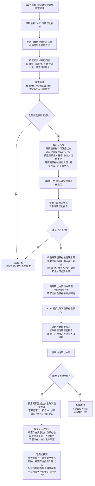
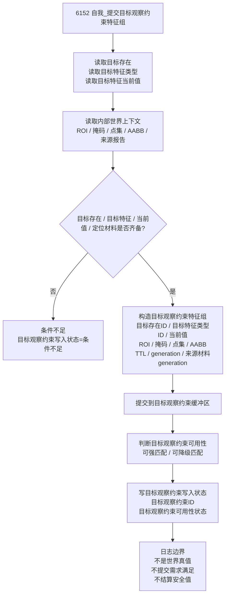

# 当前_本能方法_观察内部实现逻辑流程图

生成时间：2026-06-07

依据范围：当前代码。本文只描述已在代码中能追踪到的观察相关实现链，不把报告、等待项、材料页或队列项写成正式世界事实。

## 1. 当前代码结论

```text
当前代码中，“观察”不是一个单一的自我_观察外设材料方法。

已落地的观察相关实现分成三层：

1. 基础观察事实链：
   双目相机_取得当前观察特征帧
   -> 自我_建立观察帧存在
   -> 自我_建立观察帧到自我场景接口
   -> 自我_建立像素观察事实索引
   -> 自我_校验观察事实完备性
   -> 自我_评估观察帧质量
   -> 自我_判断基础观察事实可用性

2. D455 外设报告承接链：
   任务管理按方法供料要求创建外设观察等待项
   -> D455 独占线程生成逐簇识别 / 扫描变化 / 跟踪报告
   -> 外设观察报告队列缓存和质量门控
   -> 任务管理工作线程生成观察事实承接请求
   -> 自我线程按报告ID回查并落到自我内部世界材料候选

3. 观察存在提交链：
   自我_验证外设观察像素簇候选
   -> 自我_确认外设观察存在候选
   -> 提交_确认观察存在事实
```

当前边界：

```text
外设报告 / 等待项 / 材料页 / 队列项 = 通信与缓存容器。
自我线程承接报告 = 材料候选入自我内部世界，不确认世界存在真值。
提交_确认观察存在事实 = 当前代码中正式创建或合并已确认观察存在的入口。
扫描 / 跟踪报告质量不足时，只能形成待复验材料或任务回执，不生成变化动态或稳定跟踪动态候选。
```

## 2. 代码依据索引

| 链路 | 当前代码位置 | 说明 |
| --- | --- | --- |
| 本能方法 ID | `本能方法类.h:49-62`、`本能方法类.h:84-85` | 观察事实、观察验证、确认提交、发现事实相关方法 ID。 |
| 方法登记 | `本能方法类.cpp:37-41`、`本能方法类.cpp:64`、`本能方法类.cpp:95` | 基础观察、观察验证、确认提交、目标观察约束方法登记。 |
| 基础观察事实链 | `自我动作实现.外设模块.ixx:16219`、`:16284`、`:16355`、`:16489`、`:16654`、`:16734`、`:16814` | 取得观察特征帧、建立帧存在、接口、像素索引、完备性、质量、基础可用性。 |
| 目标观察约束 | `自我动作实现.外设模块.ixx:19157` | 写入目标观察约束特征组，不作为世界真值。 |
| 观察验证 / 确认 / 提交 | `自我动作实现.外设模块.ixx:20386`、`:20717`、`:20894` | 验证像素簇候选、生成确认方案、提交确认观察存在事实。 |
| 任务管理等待项 | `任务模块.管理界面线程.impl.cpp:784`、`:2856`、`:2990`、`:3336` | 方法供料口径映射、等待项创建、启动 D455、巡检等待项。 |
| 任务管理承接 | `任务模块.管理工作线程.ixx:3214` | 匹配报告、质量门控、生成观察事实承接上行。 |
| 外设报告质量门 | `外设观察报告队列.ixx:1537`、`:2519` | 判断观察材料质量、按等待项匹配未消费报告。 |
| D455 线程生产报告 | `外设线程_D455深度相机.ixx:1538` | 采集一帧，生成逐簇识别报告，并按等待项生成扫描 / 跟踪报告。 |
| 自我线程材料承接 | `自我线程模块.impl.cpp:12877` | 按报告ID回查，材料候选入自我内部世界，不确认世界真值。 |

## 3. 当前总流程图



## 4. 基础观察事实链

这条链是当前代码中较早落地的“当前观察帧 -> 基础观察事实可用”的内部实现路径。



## 5. D455 报告质量门控



## 6. 观察验证 / 确认 / 正式提交链



## 7. 目标观察约束支线

目标观察约束不是观察结果事实，而是扫描 / 跟踪等后续外设运行的约束输入。



## 8. 当前实现硬边界

```text
1. 观察事实链可以写当前观察帧、观察帧容器、像素索引、完备性、质量、基础观察事实可用性等特征。
2. D455 外设线程只生产报告和材料页，不直接写需求树、世界树真值或安全 / 服务结算。
3. 任务管理工作线程是报告的第一承接者：匹配等待项、做质量门控、生成上行请求。
4. 自我线程收到观察事实承接请求后，只把报告和簇材料作为自我内部世界候选材料落账。
5. 自我_验证外设观察像素簇候选只验证材料可回查和簇候选一致性。
6. 自我_确认外设观察存在候选只生成确认方案，不创建观察存在。
7. 提交_确认观察存在事实才创建或合并已确认观察存在，并写关系二次特征和提交状态。
8. 目标观察约束特征组是外设后续观察输入，不是世界事实。
9. 可用但非优质扫描 / 跟踪材料只能形成待复验材料，不能生成扫描变化动态候选或稳定跟踪动态候选。
10. 当前代码没有把“观察完成”直接等同于“当前场景全部明确”或“安全值提高”。
```

一句话：

```text
当前观察实现是“外设产材料、任务管理分拣、自我承接候选、提交入口确认存在”的链路；报告和等待项不是事实，6129 才是观察存在正式入账入口。
```
