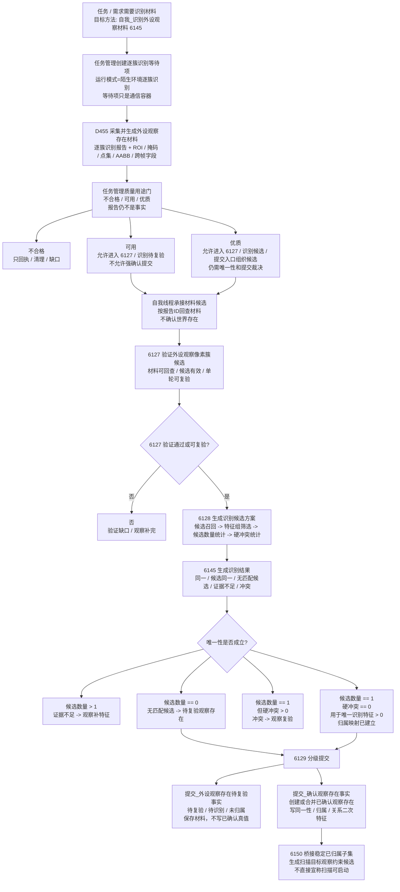
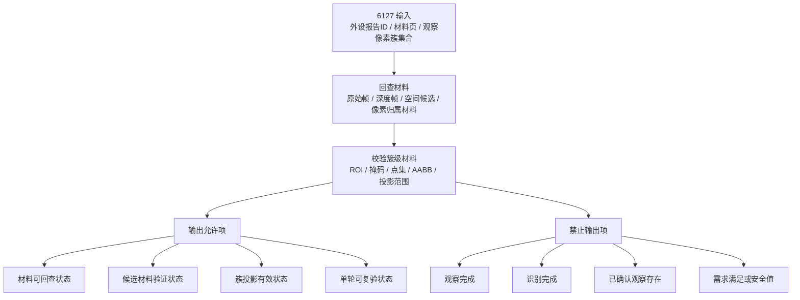
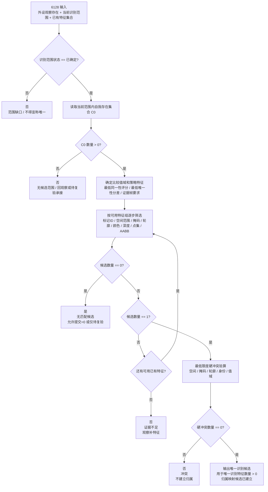
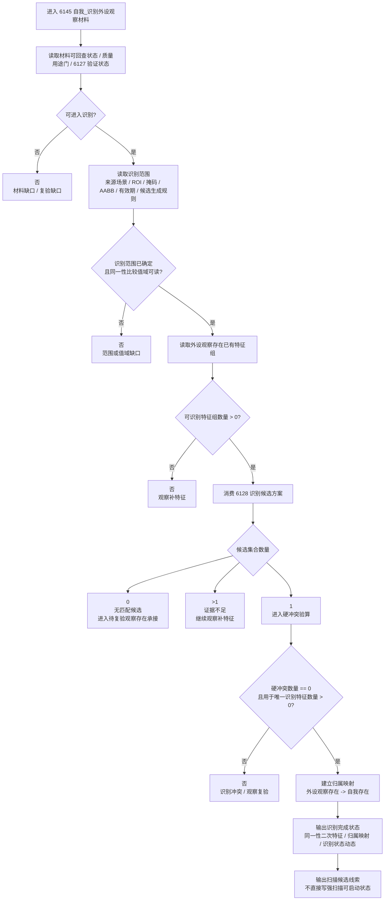
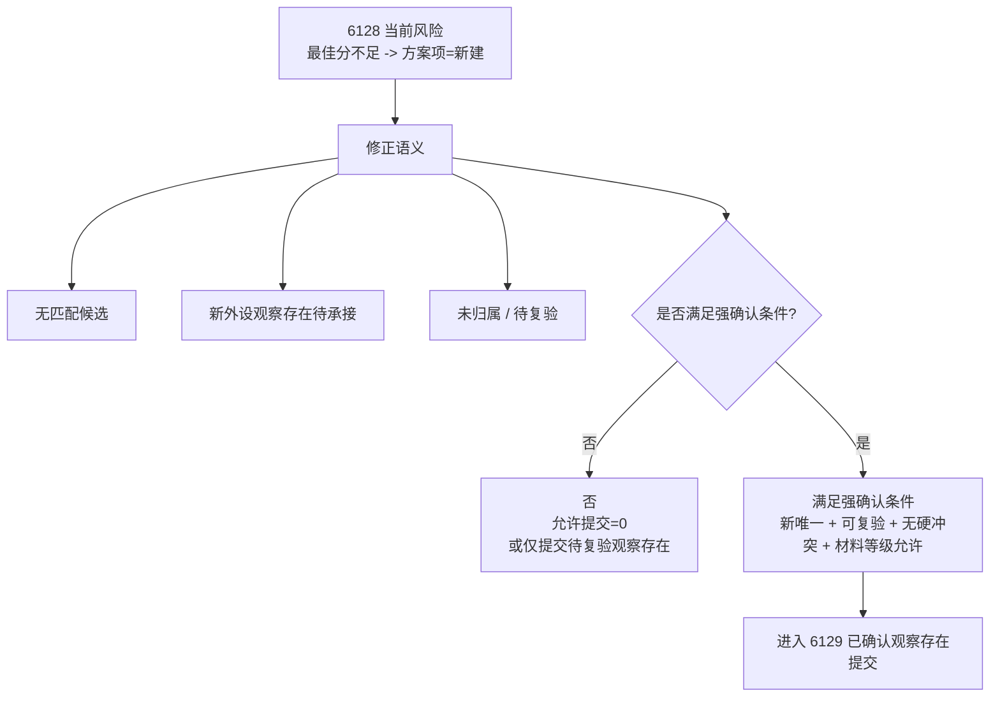
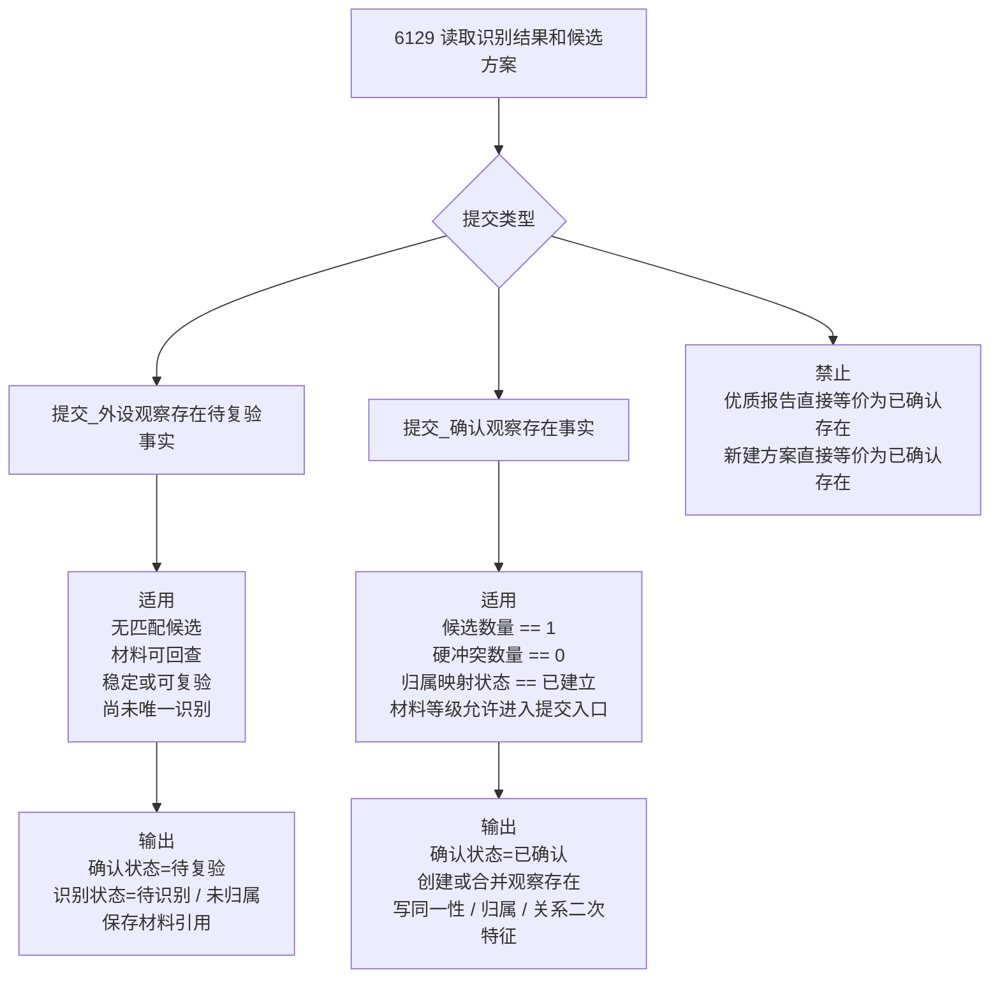
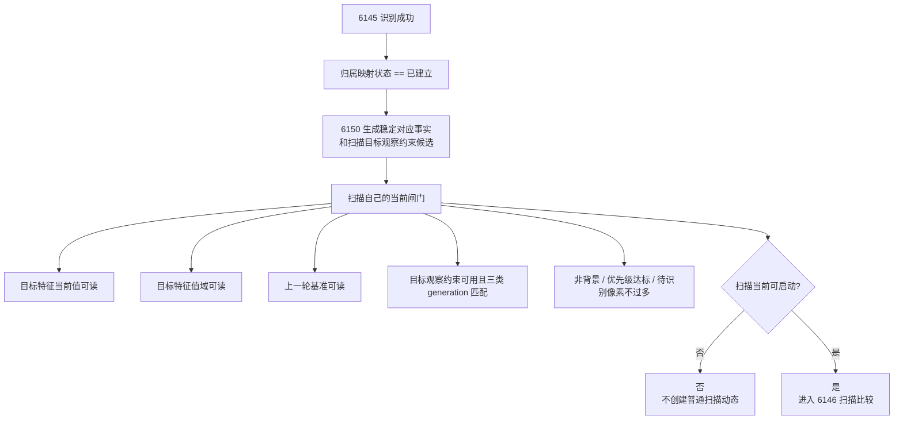

# 当前_本能方法_识别内部实现逻辑流程图

生成时间：2026-06-07

依据范围：当前代码主链 + `规范/识别本能方法唯一性收敛规范20260607.md`。本文保留当前识别实现骨架，但同步 2026-06-07 修正口径：识别完成不以“所有观察材料完成”为核心，而以“当前识别范围内候选唯一且无硬冲突”为核心。本文只修订流程图和计划口径，不证明代码已经全部实现。

## 1. 当前主链保留

```text
当前代码里的识别主链继续保留：

任务管理创建逐簇识别等待项
    -> D455 生成逐簇识别材料
    -> 任务管理质量用途门分拣
    -> 自我线程承接材料候选
    -> 6127 验证材料可回查和候选有效
    -> 6128 生成识别候选方案
    -> 6145 生成同一性 / 归属 / 识别状态
    -> 6129 分级提交观察存在
    -> 6150 只把已归属稳定子集桥接给扫描目标观察约束
```

当前仍然成立的边界：

```text
D455 只产逐簇识别材料，不裁决世界真值。
任务管理线程只是承接和分拣外设报告。
自我线程先承接材料候选，不直接确认世界存在。
6127 只验证材料可回查、候选有效和单轮可复验性。
6128 只生成识别候选方案，不创建观察存在。
6145 生成同一性、归属映射和识别状态，不写新一阶特征值。
6129 才是观察存在正式提交入口。
6150 才把稳定已归属子集桥接给扫描约束。
```

本次修正后的核心定案：

```text
识别完成 != 所有特征观察完成。
识别完成 = 当前识别范围已确定
          + 候选集合数量 == 1
          + 硬冲突数量 == 0
          + 用于唯一识别特征数量 > 0
          + 归属映射状态 == 已建立。
```

## 2. 代码依据索引

| 链路 | 当前代码位置 | 当前含义 | 修正口径 |
| --- | --- | --- | --- |
| 方法 ID | `本能方法类.h:60-62`、`:78` | 6127 / 6128 / 6129 / 6145 已登记。 | 方法主键保留。 |
| 任务管理供料映射 | `任务模块.管理界面线程.impl.cpp:846-849`、`:2860-2910` | 6145 映射到陌生环境逐簇识别和逐簇识别报告。 | 等待项仍是通信容器。 |
| D455 逐簇识别材料 | `外设线程_D455深度相机.ixx:525-626`、`:1551-1570` | 生成逐簇识别报告、材料句柄和跨帧字段。 | 报告只作材料，不作事实。 |
| 材料质量门 | `外设观察报告队列.ixx:1537-1700` | 判断不合格 / 可用 / 优质及用途能力。 | 可用可入识别待复验，优质才可入强确认候选。 |
| 自我线程材料承接 | `自我线程模块.impl.cpp:12877-13125` | 按报告 ID 回查并落内部候选材料。 | 不确认存在真值。 |
| 6127 验证 | `自我动作实现.外设模块.ixx:20386-20715` | 验证报告、帧、空间候选、像素归属材料和簇投影。 | 不写观察完成、识别完成或已确认存在。 |
| 6128 候选方案 | `自我动作实现.外设模块.ixx:20717-20892`、`:9649-9745` | 当前按固定分数生成新建 / 合并 / 冲突 / 证据不足。 | 改为候选召回、特征组筛选、唯一性统计和冲突统计。 |
| 匹配分数 | `自我动作实现.外设模块.ixx:9202-9232` | 当前由投影重叠、中心距离、深度差计算 0..10000 分。 | 作为默认视觉特征组评分，不再替代唯一性原则。 |
| 6145 识别主体 | `自我动作实现.外设模块.ixx:19421-19805` | 当前读取前置、验证、质量并生成归属结果。 | 成功条件改为唯一性成立，不以观察完成为硬前置。 |
| 6129 提交事实 | `自我动作实现.外设模块.ixx:20894-21215` | 当前正式创建或合并已确认观察存在。 | 拆为待复验观察存在提交和已确认观察存在提交。 |
| 6150 对应事实桥 | `自我动作实现.外设模块.ixx:21327-21839` | 消费识别结果，形成稳定对应事实和扫描约束。 | 只桥接已归属稳定子集；扫描启动仍由扫描闸门判定。 |

## 3. 修正后总流程图



## 4. 6127 职责收紧



## 5. 6128 唯一性筛选算法



当前固定打分逻辑的修正位置：

```text
投影重叠率 60% + 中心评分 25% + 深度评分 15%
最佳分数 >= 7500
最佳分数 - 次佳分数 >= 1200
```

修正后只作为默认视觉特征组评分，不再作为唯一识别原则本身。对应阈值应改为可读取的策略特征：

```text
识别策略.最低同一性评分
识别策略.最低唯一性分差
识别策略.候选匹配评分值域
识别策略.最小同一性证据帧数
```

阈值来源必须可追溯：

```text
特征类型默认比较值域
当前任务容差
外设测量不确定度
目标存在历史稳定值域
外设学习结果
安全 / 服务根需求约束
```

## 6. 6145 唯一性识别主体



6145 修正后成功条件：

```text
识别范围状态 == 已确定
外设观察存在.材料可回查状态 == 可回查
外设观察存在.可识别特征组数量 > 0
同一性比较值域状态 == 可读
候选集合数量 == 1
硬冲突数量 == 0
用于唯一识别特征数量 > 0
归属映射状态 == 已建立
```

不再把以下组合当成识别完成的充分条件：

```text
稳定复现状态 == 稳定
&& 观察完成状态 == 已完成
&& 可复验状态 == 可复验
```

这些状态仍可作为普通视觉材料质量、可复验和观察完成的输入证据，但不能替代候选唯一性。

## 7. 新建方案降级



定案：

```text
无最佳匹配 != 可以正式新建已确认观察存在。

无匹配候选默认输出：
    同一性状态 == 无匹配候选
    归属状态 == 未归属
    允许提交 == 0
    或仅允许提交为 待复验观察存在。
```

## 8. 6129 提交入口分级



## 9. 硬冲突量化

```text
硬冲突至少分为：

空间冲突：
    空间中心误差 > 最大允许空间误差
    或 空间范围重合率 < 最低空间范围重合率

掩码冲突：
    掩码重合率 < 最低硬掩码重合率

轮廓冲突：
    轮廓偏差 > 最大允许硬轮廓偏差

身份冲突：
    同一外设观察存在强匹配多个自我存在
    或 同一自我存在被多个互斥外设观察存在强匹配

值域冲突：
    当前特征值超出目标存在该特征的合法值域
```

输出不应只写“冲突”，而应写：

```text
外设观察存在.硬冲突数量
外设观察存在.识别冲突类型
外设观察存在.冲突二次特征集合
```

## 10. 扫描衔接边界



6145 输出应从强状态收紧为：

```text
扫描候选线索状态 == 已生成
```

扫描是否启动由 6146 / 6150 / 任务管理扫描等待项闸门重新判定，不能由一次识别通过长期写死。

## 11. 硬边界

```text
1. 报告 / 等待项 / 材料页只作通信和缓存容器。
2. 6127 不写观察完成、识别完成或已确认观察存在。
3. 6128 不以固定分数替代唯一性筛选。
4. 6145 不要求所有特征观察完成，只要求当前范围唯一且无硬冲突。
5. 无匹配候选不等于正式新建已确认观察存在。
6. 候选唯一但有硬冲突，不得写已归属。
7. 识别不补写颜色、空间坐标、轮廓、深度等一阶特征值。
8. 扫描候选线索不等于扫描可启动状态。
9. 识别完成不反推全场景明确、安全明确、需求满足或安全 / 服务值结算。
```

## 12. 最终定案

```text
当前代码已经会“打分选候选”；
下一步要升级为“用已有合法特征把当前识别范围内候选集合压成唯一”。

能压唯一且无硬冲突：
    识别完成，建立归属映射。

候选不唯一：
    观察补特征。

无匹配候选：
    待复验观察存在承接，不直接新建已确认存在。

唯一但冲突：
    观察复验，不写归属。

识别成功后：
    只输出扫描候选线索，扫描启动仍走扫描自己的闸门。
```
