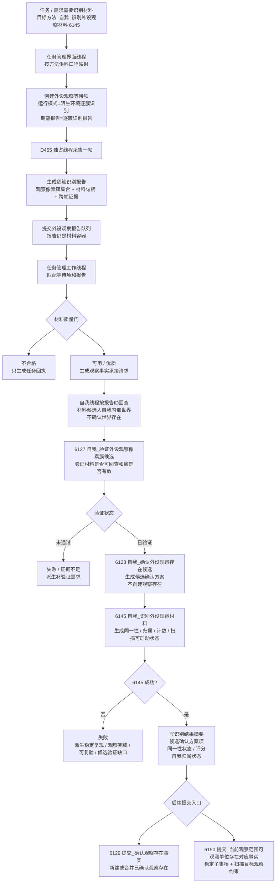
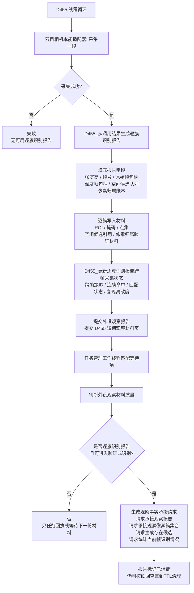
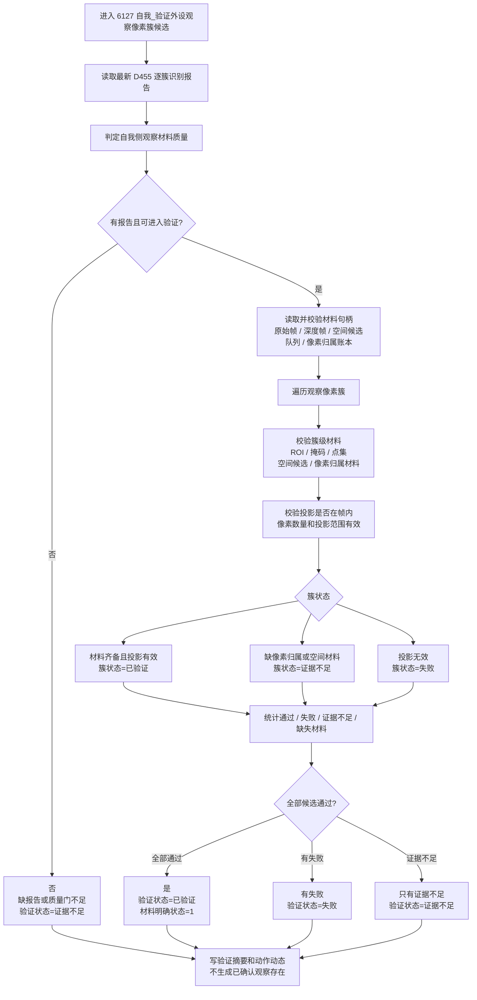
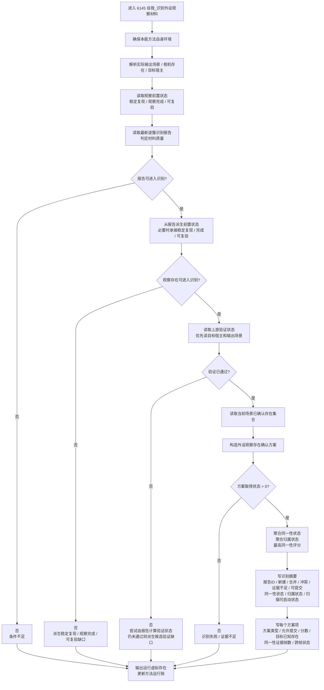
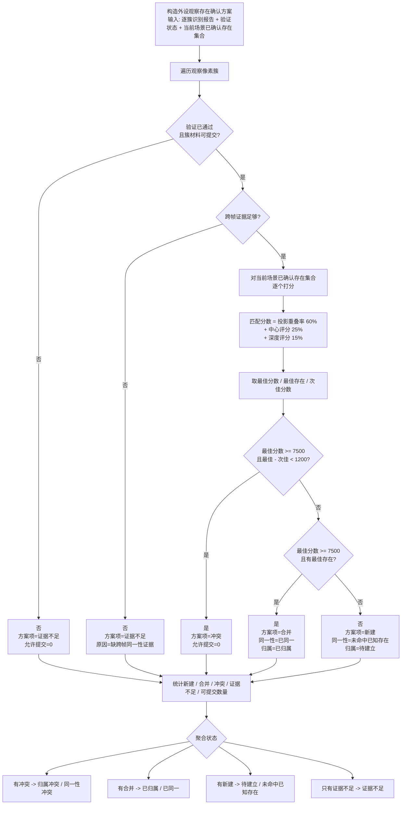
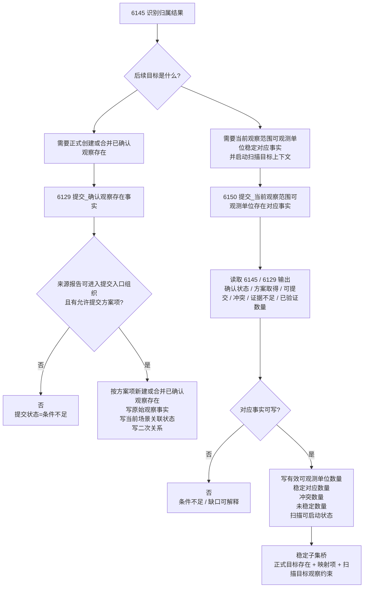

# 当前_本能方法_识别内部实现逻辑流程图

生成时间：2026-06-07

依据范围：当前代码。本文只描述当前代码能追踪到的识别链路，不把外设报告、等待项、材料页或承接请求当成正式世界事实。

## 1. 当前代码结论

```text
当前代码中的“识别”不是把所有特征比完，也不是 D455 直接确认世界存在。

实际链路分成六段：

1. 任务管理按当前方法供料口径创建识别等待项：
   自我_识别外设观察材料 -> 陌生环境逐簇识别 -> 逐簇识别报告。

2. D455 独占线程采集一帧并生成逐簇识别报告：
   观察像素簇集合
   ROI / 掩码 / 点集 / 空间候选 / 像素归属材料句柄
   跨帧匹配状态 / 连续命中次数 / 复现离散度

3. 任务管理工作线程匹配等待项和报告，并做观察材料质量门：
   不合格 -> 只回执
   可用或优质逐簇识别报告 -> 观察事实承接请求

4. 自我线程按报告ID回查材料，写入自我内部世界材料候选：
   报告可回查状态
   观察像素簇集合承接状态
   存在候选集合状态 / 候选数量
   未解释区域比例
   注意：这里仍不确认世界存在。

5. 自我侧方法执行：
   6127 自我_验证外设观察像素簇候选
   6128 自我_确认外设观察存在候选
   6145 自我_识别外设观察材料

6. 提交入口后续：
   6129 提交_确认观察存在事实
   6150 提交_当前观察范围可观测单位存在对应事实
   其中 6150 会把稳定子集继续桥接到扫描目标观察约束。
```

当前边界：

```text
6145 是当前识别方法主体，输出同一性 / 归属 / 候选确认方案 / 稳定对应计数 / 扫描可启动状态。
6127 只验证外设观察像素簇候选材料，不创建已确认观察存在。
6128 只生成外设观察存在候选确认方案，不创建观察存在。
6129 才创建或合并正式已确认观察存在。
6150 才组织当前观察范围可观测单位存在对应事实，并为扫描写目标观察约束。

外设报告只作材料。
识别不写变化动态。
识别不结算安全值。
当前场景是否全部明确必须带范围和计数条件，不能由单个报告直接推出。
```

## 2. 代码依据索引

| 链路 | 当前代码位置 | 说明 |
| --- | --- | --- |
| 方法 ID | `本能方法类.h:60-62`、`:78` | 6127 验证、6128 确认、6129 提交确认、6145 识别。 |
| 方法登记 | `本能方法类.cpp:39-41`、`:57` | 四个识别相关方法登记为自我内部动作。 |
| 任务管理供料映射 | `任务模块.管理界面线程.impl.cpp:846-849`、`:2860-2910` | 6145 映射到陌生环境逐簇识别和逐簇识别报告。 |
| D455 逐簇识别报告 | `外设线程_D455深度相机.ixx:525-626` | 从采集结果生成逐簇识别报告和簇级材料句柄。 |
| D455 跨帧证据 | `外设线程_D455深度相机.ixx:360-455` | 写入跨帧簇ID、连续命中次数、匹配状态和复现离散度。 |
| D455 报告入队 | `外设线程_D455深度相机.ixx:1551-1570` | 逐簇识别报告提交到外设观察报告队列。 |
| 材料质量门 | `外设观察报告队列.ixx:1537-1700` | 判断不合格 / 可用 / 优质，以及是否可进入验证、识别、提交入口组织。 |
| 任务管理承接 | `任务模块.管理工作线程.ixx:3239-3265`、`:3318-3358` | 逐簇识别报告可进入验证或识别时生成观察事实承接请求。 |
| 自我线程材料候选 | `自我线程模块.impl.cpp:12877-13125` | 报告按 ID 回查后入自我内部世界，只承接材料和候选，不确认世界对象。 |
| 6127 验证 | `自我动作实现.外设模块.ixx:20386-20715` | 验证报告、帧、空间候选、像素归属材料和簇投影。 |
| 6128 候选确认 | `自我动作实现.外设模块.ixx:20717-20892` | 基于验证状态和逐簇报告生成候选确认方案。 |
| 6145 识别主体 | `自我动作实现.外设模块.ixx:19421-19805` | 读取观察前置状态、验证状态、报告质量，生成识别归属结果。 |
| 确认方案算法 | `自我动作实现.外设模块.ixx:9649-9745` | 按跨帧证据、材料可提交状态、最佳/次佳匹配分生成新建/合并/冲突/证据不足项。 |
| 匹配分数 | `自我动作实现.外设模块.ixx:9202-9232` | 由投影重叠率、中心距离、深度差生成 0-10000 分。 |
| 同一性 / 归属聚合 | `自我动作实现.外设模块.ixx:8541-8628` | 将方案项转成同一性状态、归属状态和最高同一性评分。 |
| 6129 提交事实 | `自我动作实现.外设模块.ixx:20894-21215` | 正式创建或合并已确认观察存在，写原始事实和二次关系。 |
| 6150 对应事实桥 | `自我动作实现.外设模块.ixx:21327-21839` | 消费识别结果，形成稳定对应事实和扫描目标观察约束。 |

## 3. 总流程图



## 4. D455 与任务管理材料链



## 5. 6127 像素簇候选验证流程



## 6. 6145 识别主体流程



6145 当前成功条件：

```text
观察存在可进入识别
&& 有 D455 逐簇识别报告
&& 观察材料可进入识别方法
&& 上游验证状态 == 已验证
&& 方案.方案取得状态 > 0
```

其中：

```text
观察存在可进入识别 =
    稳定复现状态已读
    && 观察完成状态已读
    && 可复验状态已读
    && 稳定复现状态 == 稳定
    && 观察完成状态 == 已完成
    && 可复验状态 == 可复验
```

## 7. 确认方案算法



当前代码里的量化点：

```text
跨帧连续命中次数 >= 外设观察存在同一性最小证据帧数
最佳匹配分数 >= 7500
最佳分数 - 次佳分数 >= 1200 时才避免多候选冲突
匹配分数值域 = 0..10000
```

注意：

```text
当前代码没有实现任意特征组的通用唯一性搜索。
当前实现使用的是：
    材料可回查
    跨帧证据
    投影范围重叠
    中心距离
    深度差
    当前场景已确认存在集合
这些量化证据来生成合并 / 新建 / 冲突 / 证据不足方案。
```

## 8. 提交入口后续



## 9. 当前运行状态口径

按当前计划索引记录：

```text
P9c 已完成：
    6145 自我_识别外设观察材料
    已能承接稳定复现 / 观察完成 / 可复验和候选验证状态。

P9d 已推进：
    6150 已消费 6145 识别结果。
    任务 C 稳定对应存在数量明确状态已完成。
    6150 已把稳定子集组织成正式已确认观察存在、
    可观测单位到存在映射项和扫描目标观察约束。
```

因此当前可确认的是：

```text
识别结果已经足够形成稳定子集桥。
识别结果已经能为扫描创建目标观察约束。
识别结果不等于全场景全部明确。
识别结果不直接生成扫描变化动态或跟踪动态。
识别结果不直接写需求满足或安全值。
```

## 10. 硬边界

```text
1. D455 只生产逐簇识别材料，不裁决世界真值。
2. 任务管理承接请求只是上行通信，不是正式世界事实。
3. 自我线程材料承接只写材料候选，不确认稳定世界对象。
4. 6127 验证材料可回查和候选簇有效，不创建已确认观察存在。
5. 6128 生成候选确认方案，不创建已确认观察存在。
6. 6145 生成识别归属结果、同一性状态和归属状态，不写变化动态。
7. 6129 才是已确认观察存在创建 / 合并的提交入口。
8. 6150 才把识别结果组织成当前观察范围稳定对应事实和扫描目标上下文。
9. 当前代码的唯一性判断是局部量化收敛，不是全世界唯一，也不是所有特征全量比较。
10. 安全值、需求满足、基础风险明确都不能由识别报告直接推出。
```
