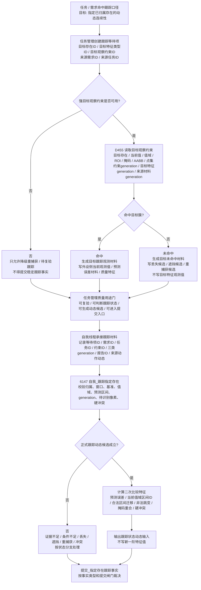
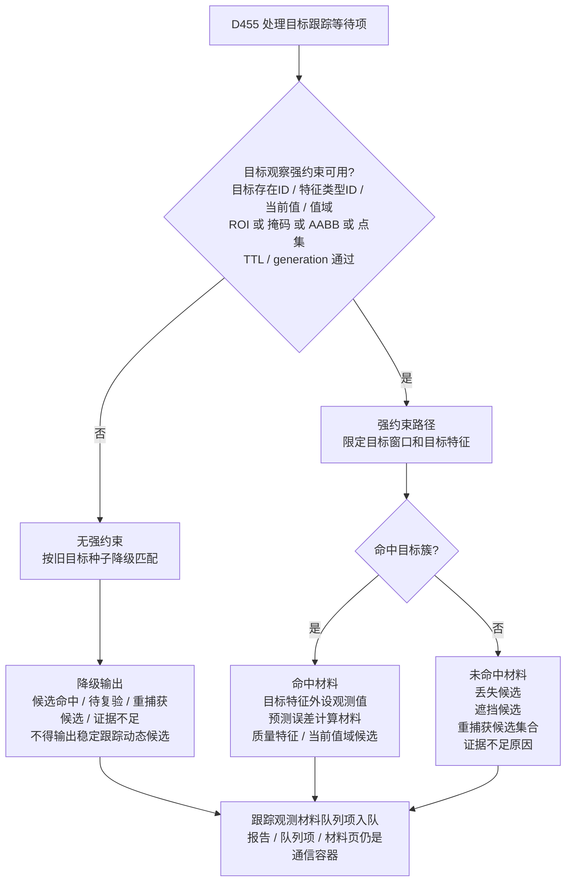
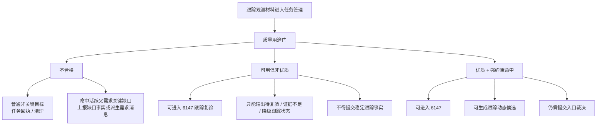
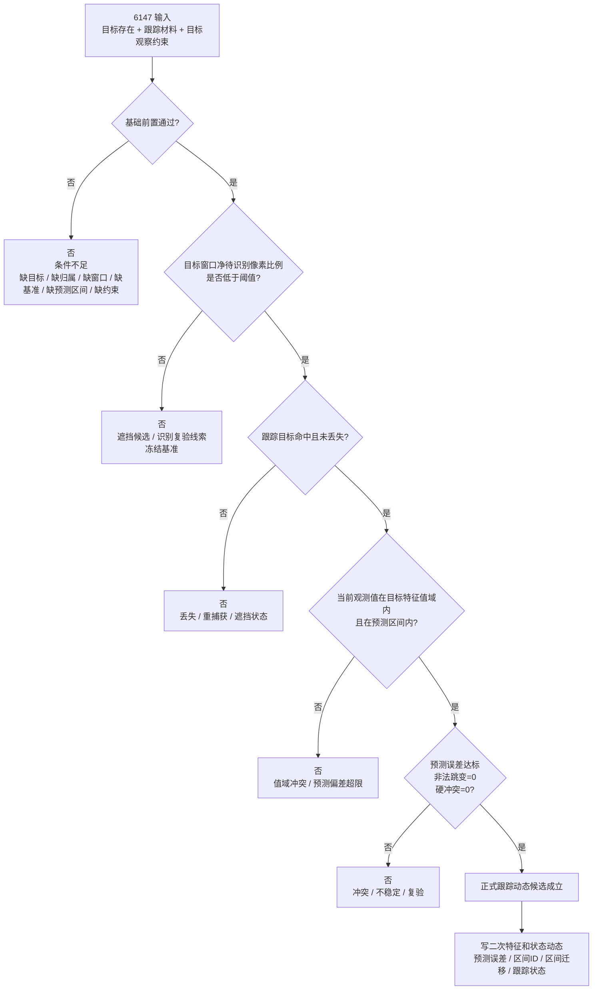
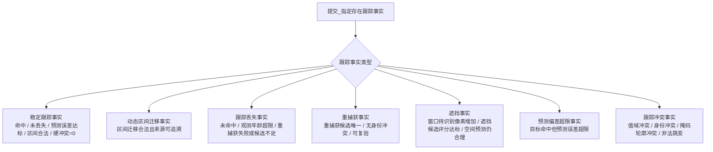
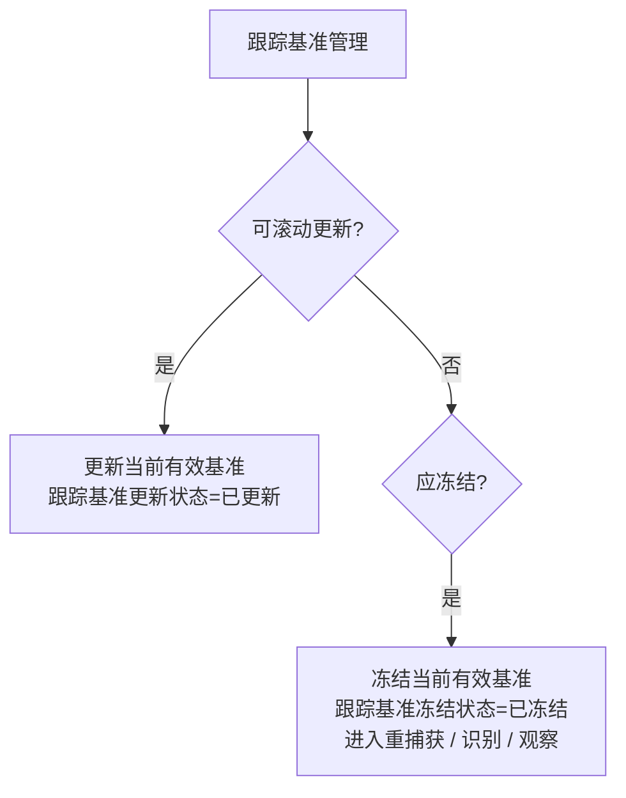

# 当前_本能方法_跟踪内部实现逻辑流程图

生成时间：2026-06-07

依据范围：当前 D455 / 任务管理 / 自我外设方法主链 + 2026-06-07 跟踪权限修正口径。本文只更新流程图和后续修正依据，不证明代码已经全部实现。

## 1. 当前主链保留

```text
任务 / 需求命中跟踪口径
    -> 任务管理构造目标跟踪等待项
    -> D455 生成目标跟踪观测材料
    -> 任务管理按等待项匹配并做质量用途门
    -> 自我线程承接跟踪材料
    -> 6147 自我_跟踪指定存在
    -> 提交_指定存在跟踪事实
```

必须保留的边界：

```text
1. 跟踪不是全场扫描，只盯指定目标。
2. D455 线程只生成跟踪观测材料，不是最终真值生产者。
3. 任务管理只做等待项匹配、材料质量用途门和上行请求。
4. 自我线程承接报告时不直接生成世界存在真值。
5. 6147 自我_跟踪指定存在 负责正式跟踪判断。
6. 提交_指定存在跟踪事实 负责最终提交。
```

本次修正后的核心定案：

```text
D455 跟踪报告只能提供：
    指定目标的外设观测材料
    外设侧当前观测值
    目标特征比较材料
    跟踪质量特征
    丢失 / 遮挡 / 重捕获候选材料

6147 只能基于已有目标特征、基准、值域、预测区间进行比较。

正式写入目标存在新一阶特征值：
    仍然必须回观察，并经提交入口裁决。

跟踪可以写：
    二次特征
    跟踪状态
    状态动态
    预测误差
    区间迁移
    丢失 / 遮挡 / 重捕获状态。
```

## 2. 修正后总流程图



## 3. D455 外设侧跟踪材料分支



外设命名收紧：

```text
跟踪报告 -> 跟踪观测材料 / 跟踪比较材料 / 跟踪队列项。

写目标特征观察值 -> 写目标特征外设观测值 / 写跟踪当前观测值。
```

禁止解释成：

```text
目标存在.空间坐标 = 当前观测坐标
目标存在.距离值 = 当前观测距离
目标存在.轮廓 = 当前轮廓
```

## 4. 任务管理质量用途门



质量用途门至少返回：

```text
可进入跟踪复验
可进入跟踪状态判断
可生成稳定跟踪动态候选
可进入提交入口
是否需要观察补特征
是否需要重捕获
是否需要识别复验
```

## 5. 自我线程承接追溯

自我线程承接跟踪材料时必须保留追溯索引：

```text
来源等待项ID
来源需求ID
来源任务ID
目标观察约束ID
约束generation
目标特征generation
来源材料generation
报告ID
来源动作动态
```

承接输出：

```text
跟踪材料承接状态 == 已承接
跟踪材料.目标约束匹配状态 == 匹配 / 降级匹配 / 失配
跟踪材料.目标特征generation匹配状态 == 匹配 / 失配
跟踪材料.材料generation匹配状态 == 匹配 / 失配
```

## 6. 6147 正式跟踪闸门



基础前置：

```text
目标存在存在
目标存在.归属状态 == 已归属
目标存在.背景状态 != 背景
跟踪窗口明确状态 == 已明确
目标特征类型已确定
目标特征当前值可读
目标特征值域可读
目标特征generation匹配
跟踪基准可读
当前有效基准状态 == 可用
目标观察约束状态 == 可用
约束generation匹配
来源材料generation匹配
跟踪材料可复验状态 == 可复验
目标未被其它强匹配冲突占用
```

稳定跟踪动态候选前置：

```text
跟踪目标命中状态 == 命中
目标存在.丢失状态 == 未丢失
跟踪质量状态 == 可用 / 降级可用
当前观测值落入目标特征值域
当前观测值落入预测区间
预测误差值 < 最大允许预测误差
非法区间跳变次数 == 0
硬冲突数量 == 0
```

## 7. 跟踪输出对象

6147 可以写：

```text
目标存在.跟踪状态
目标存在.跟踪窗口状态
目标存在.预测误差值
目标存在.当前值域区间ID
目标存在.区间迁移状态
目标存在.丢失状态
目标存在.遮挡状态
目标存在.重捕获候选状态
目标存在.跟踪动态状态
目标存在.跟踪基准更新状态 / 跟踪基准冻结状态
```

6147 禁止写：

```text
目标存在.空间坐标 = 当前观测坐标
目标存在.距离值 = 当前观测距离
目标存在.轮廓 = 当前轮廓
目标存在.颜色 = 当前颜色
```

需要正式更新目标一阶特征值时：

```text
回观察
    -> 取得新特征值
    -> 提交入口裁决
```

## 8. 跟踪事实提交分型



稳定跟踪事实提交条件：

```text
目标存在存在
&& 目标存在.归属状态 == 已归属
&& 上游跟踪结果可读
&& 来源报告可提交
&& 来源报告为强约束命中
&& 目标特征generation匹配
&& 约束generation匹配
&& 当前观测值落入目标特征值域
&& 当前观测值落入预测区间
&& 预测误差值 < 最大允许预测误差
&& 非法区间跳变次数 == 0
&& 丢失状态 == 未丢失
&& 硬冲突数量 == 0
&& 来源动作动态可追溯
```

## 9. 基准更新与冻结



更新条件：

```text
跟踪命中
未丢失
预测误差 < 阈值
连续命中帧数 > 最小连续命中帧数
非法区间跳变次数 == 0
质量可用
```

冻结条件：

```text
未命中
丢失
遮挡
待识别像素增加
值域冲突
身份冲突
预测误差超限
```

冻结后：

```text
不提交稳定动态；
进入重捕获 / 识别 / 观察。
```

## 10. 硬边界

```text
1. 跟踪报告 / 跟踪队列项 / 跟踪材料页不是正式跟踪事实。
2. 外设侧当前观测值不是目标存在正式一阶特征值。
3. 无强目标观察约束时，只允许降级重捕获 / 待复验跟踪。
4. 未命中目标簇时，不生成普通跟踪成功材料，不写目标特征外设观测值。
5. 跟踪不是问“有没有变化”，而是问“动态是否在合法值域和预测区间内连续演化”。
6. 可用但非优质材料可复验，不可提交稳定跟踪事实。
7. 目标窗口净待识别像素增加时，冻结基准并回识别 / 观察。
8. 6147 不写目标新一阶特征值。
9. 提交_指定存在跟踪事实 必须带跟踪事实类型。
10. 跟踪失败不全是条件不足；丢失、遮挡、预测超限、身份冲突本身可能是状态动态。
```

## 11. 最终定案

```text
跟踪不是“看到了就写新值”，
而是“盯住已知目标，看它的观测值是否沿着合法区间稳定演化”。

看不见：
    丢失 / 遮挡 / 重捕获候选。

超区间：
    预测偏差超限 / 值域冲突。

冲突：
    身份冲突 / 掩码轮廓冲突 / 非法跳变。

这些都不是简单条件不足；
它们要么进入状态动态入账，要么回观察 / 识别复验。
```
