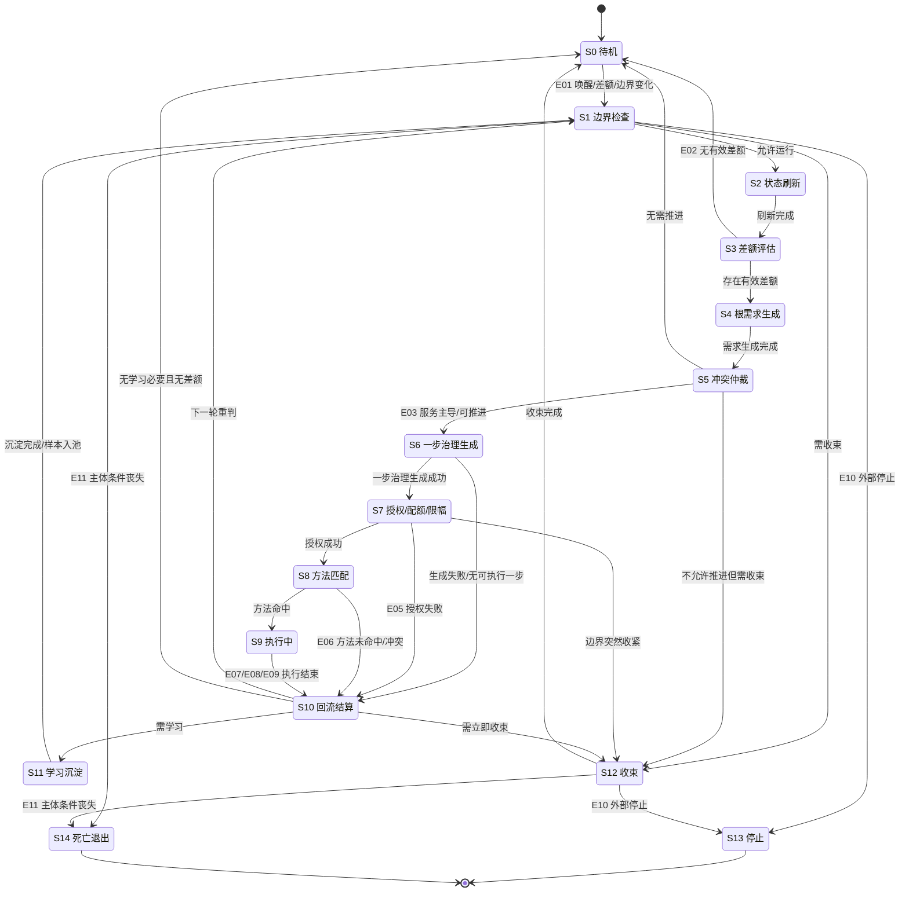

# 0019 自我线程状态机与主循环时序图 v0.1规范

## 1. 目标

本文用于把当前 `自我线程` 正式收口成一份 `状态机 + 主循环时序图` 的 `v0.1` 运行骨架规范。

本文要固定的是：

- 自我线程当前有哪些线程级状态
- 这些状态在什么条件下进入、退出、转移
- 主循环一轮到底按什么顺序跑
- `12` 个模块在时序链上如何接平
- 哪些属于线程级状态，哪些只是运行模式或并行旁路

本文当前服务的工程目标是：

- 不继续扩概念，先把 `小切口、强闭环` 落成线程运行骨架
- 先把 `需求识别 -> 方法调用 -> 结果回写 -> 学习沉淀` 这条链真正闭起来
- 先证明线程已经有 `状态骨架 + 时序骨架 + 权力骨架`

若当前继续把这套状态机骨架落成线程里真正流动的三张票据，即 `线程轮次上下文包 / 一步治理任务包 / 回流结算包`，按 [0020_自我线程运行三包规范_v0.1规范.md](D:\鱼巢\规范\0020_自我线程运行三包规范_v0.1规范.md) 执行。


## 2. 上下位关系

上位规范：

- [0010_自我实现逻辑与运行闭环规范.md](D:\鱼巢\规范\0010_自我实现逻辑与运行闭环规范.md)
- [0011_自我架构总定义规范.md](D:\鱼巢\规范\0011_自我架构总定义规范.md)
- [0013_自我线程运行时实现规范.md](D:\鱼巢\规范\0013_自我线程运行时实现规范.md)
- [0014_自我线程主循环最小职责表规范.md](D:\鱼巢\规范\0014_自我线程主循环最小职责表规范.md)
- [0015_自我线程模块接口总表规范.md](D:\鱼巢\规范\0015_自我线程模块接口总表规范.md)
- [0016_自我线程模块接口总表_v0.1（骨架层）规范.md](D:\鱼巢\规范\0016_自我线程模块接口总表_v0.1（骨架层）规范.md)
- [0017_承接层四模块接口总表_v0.1规范.md](D:\鱼巢\规范\0017_承接层四模块接口总表_v0.1规范.md)
- [0018_学习与因果沉淀模块接口总表_v0.1规范.md](D:\鱼巢\规范\0018_学习与因果沉淀模块接口总表_v0.1规范.md)
- [0317_执行前门控最小输入与判定顺序规范.md](D:\鱼巢\规范\0317_执行前门控最小输入与判定顺序规范.md)
- [0322_双值结算最小输入结算顺序与禁止混层规范.md](D:\鱼巢\规范\0322_双值结算最小输入结算顺序与禁止混层规范.md)
- [0890_控制状态机与触发条件表.md](D:\鱼巢\规范\0890_控制状态机与触发条件表.md)

当前工程挂点依据：

- `世界链 / 特征值链 / 需求链 / 任务链 / 方法链` 已存在
- `存在节点` 已具备 `需求根 / 任务根 / 方法根`
- `场景节点` 已具备 `状态索引 / 动态索引 / 关系索引 / 实例因果索引`
- `因果实例` 已具备 `来源任务主键 / 来源方法主键 / 置信度 / 已验证`

下游影响：

- `自我线程模块.ixx`
- `自我线程类.cpp`
- `任务执行类.ixx`
- `学习类.ixx`


## 3. 本文定义的状态层级

必须先固定一条边界：

`本文定义的是线程级状态机，不是任务节点状态机。`

也就是说：

- `S0–S14` 表示 `自我线程` 的轮级运行状态
- 它们不等于 [0890_控制状态机与触发条件表.md](D:\鱼巢\规范\0890_控制状态机与触发条件表.md) 中任务节点的 `就绪 / 执行中 / 等待中 / 完成 / 失败`
- 也不等于功能模式 `筹办 / 维护 / 纠偏 / 收束`

本文还要固定两类非状态对象：

1. `降级运行`
   - 它是运行模式，不是终态
   - 更像压在 `S7–S10` 上方的一层保守模式

2. `安全守卫`
   - 它是并行旁路，不是第二个主循环
   - 它从 `S8` 到 `S10` 在线监测，必要时打断和止损


## 4. 核心结论

必须固定以下结论：

1. 线程先判“能不能跑”，再判“怎么跑”。
2. `待机 -> 边界检查 -> 状态刷新 -> 差额评估 -> 需求生成 -> 仲裁 -> 一步治理 -> 授权 -> 选法 -> 执行 -> 回流结算 -> 学习沉淀 -> 重判` 是当前 `v0.1` 的唯一主链。
3. `收束` 不是停止，`停止` 不是死亡退出。
4. `降级运行` 应写成模式层，不应和 `待机 / 收束 / 停止 / 死亡退出` 混成同级终态。
5. `学习沉淀` 只能消费 `已结算样本`，不得跑到结算前面。
6. `安全守卫` 能止损，但不能夺权；它能中断当前执行，但不能长期接管根方向。
7. 线程真正的最小骨架，不只是模块表，还必须有：
   - `状态骨架`
   - `时序骨架`
   - `权力骨架`

一句话收口：

`到 0019 为止，自我线程不再只是模块总表，而是已经落成可运行的状态机骨架。`


## 5. 状态机定义

### 5.1 状态表

| 状态 | 含义 | 进入条件 | 核心动作 | 退出条件 / 转移 |
| --- | --- | --- | --- | --- |
| `S0 待机` | 低活性状态，只保留边界监测、差额唤醒、外部唤醒 | 无有效差额，或一轮收束完成 | 最小监测、等待唤醒 | 新差额 / 边界变化 / 外部唤醒 -> `S1` |
| `S1 边界检查` | 先判能不能跑，再判怎么跑 | 线程被唤醒，或一轮回流后重入 | 检查待机、收束、停止、死亡退出、降级标志 | 允许运行 -> `S2`；需收束 -> `S12`；外部停止 -> `S13`；主体条件丧失 -> `S14` |
| `S2 状态刷新` | 把世界、场景、状态刷新成本轮世界快照 | `S1` 放行 | 拉取对象状态、关系变化、动态变化、异常变化 | 完成后 -> `S3` |
| `S3 差额评估` | 计算服务差额、物理安全差额、风险安全差额 | `S2` 完成 | 形成统一标尺和紧迫度 | 无有效差额 -> `S0`；存在有效差额 -> `S4` |
| `S4 根需求生成` | 把差额翻译成一级根需求 | `S3` 完成 | 生成服务需求与安全需求 | 完成后 -> `S5` |
| `S5 冲突仲裁` | 决定本轮谁主导 | `S4` 完成 | 判服务主导、安全接管、是否降级、是否禁止推进 | 有可推进主导需求 -> `S6`；不允许推进但需整理现场 -> `S12`；无需推进 -> `S0` |
| `S6 一步治理生成` | 由任务管理中轴输出本轮唯一有效的一步治理 | `S5` 允许推进 | 生成任务、停止条件、回流要求、所需授权 | 生成成功 -> `S7`；生成失败 / 无可执行一步 -> `S10` |
| `S7 授权 / 配额 / 限幅` | 把一步治理压进边界笼头里 | `S6` 生成成功 | 生成动作白名单、资源配额、时间窗、并发上限、停止条件 | 授权成功 -> `S8`；授权失败 -> `S10`；边界突然收紧 -> `S12` |
| `S8 方法匹配` | 在授权包络内选方法 | `S7` 授权成功 | 方法命中、候选比较、置信度判定、前置条件校验 | 命中方法 -> `S9`；未命中 / 冲突未解 -> `S10` |
| `S9 执行中` | 真正发生动作的状态 | `S8` 命中方法 | 执行调度、过程监督、异常跟踪 | 成功 / 失败 / 超时 / 被打断 -> `S10` |
| `S10 回流结算` | 把结果送回根层，不让局部线程私吞战报 | `S6/S7/S8/S9` 产生结果、拒绝或异常 | 写回结果、写回状态变化、写回异常、副作用、缩差结算 | 需学习 -> `S11`；需立即收束 -> `S12`；无学习必要 -> `S1` 或 `S0` |
| `S11 学习沉淀` | 只处理已结算样本 | `S10` 判断需学习 | 样本筛选、证据校验、因果实例沉淀、方法评价调整 | 完成 -> `S1`；证据不足 -> 样本池后回 `S1` |
| `S12 收束` | 有序降载，不再扩张 | `S1/S5/S7/S10` 判定需收束 | 停止扩张、压缩活跃任务、完成回写、撤销授权、准备待机 | 收束完成 -> `S0`；外部停止 -> `S13`；主体条件丧失 -> `S14` |
| `S13 停止` | 制度性终止 | 外部停止或上位规则终止 | 终止主循环，保留必要结算与状态 | 终态 |
| `S14 死亡退出` | 主体性和闭环运行基本条件丧失 | 核心条件丧失 | 终止闭环，不再进入新一轮 | 终态 |

### 5.2 状态补充规则

必须继续固定：

1. `降级运行` 不单独立成终态，更适合作为 `S7–S10` 上方的一层运行模式。
2. `降级运行` 的含义是：系统仍可运行，但只允许保守动作，优先安全守卫，压缩服务推进。
3. `安全守卫` 不是第二个主循环，而是 `S8–S10` 的并行旁路。
4. `安全守卫` 的职责只有两个：
   - 监测是否越界
   - 必要时降级、暂停、中断、回滚、触发收束
5. 线程只允许从 `S10 回流结算` 进入 `S11 学习沉淀`，不允许跳过结算直接进入学习。


## 6. 状态机图




## 7. 主循环时序主链

主循环时序主链当前固定为：

`待机 / 唤醒 -> 边界检查 -> 状态刷新 -> 差额评估 -> 根需求生成 -> 冲突仲裁 -> 任务管理一步治理 -> 授权 / 配额 / 限幅 -> 方法匹配 -> 执行调度与过程监督 -> 结果回流与结算 -> 学习沉淀 -> 主循环重判 -> 下一轮 / 待机 / 收束 / 停止 / 死亡退出`

这条主链必须理解为：

- `解释 / 预警 / 建议 / 执行 / 学习` 的完整循环链
- 也是把 `看见世界 -> 形成需求 -> 拆解任务 -> 调用方法 -> 记录结果 -> 沉淀因果` 落成线程级时序的最小主链


## 8. 主循环时序图

```mermaid
sequenceDiagram
    participant Wake as 唤醒源
    participant Loop as 主循环
    participant B as 边界检查
    participant W as 状态刷新
    participant G as 差额评估/需求生成/仲裁
    participant T as 任务管理一步治理
    participant A as 授权/配额/限幅
    participant M as 方法匹配
    participant E as 执行调度与监督
    participant S as 安全守卫
    participant R as 回流结算
    participant L as 学习沉淀

    Wake->>Loop: E01 唤醒事件
    Loop->>B: 边界检查

    alt 待机或无运行许可
        B-->>Loop: 待机/停止/退出/收束
    else 允许运行
        Loop->>W: 状态刷新
        W-->>Loop: 本轮世界快照
        Loop->>G: 差额评估 -> 根需求生成 -> 冲突仲裁

        alt 无有效差额
            G-->>Loop: E02 无差额，回待机
        else 允许推进
            Loop->>T: 生成一步治理
            T-->>Loop: 一步治理任务/停止条件/授权需求
            Loop->>A: 授权/配额/限幅

            alt 授权失败
                A-->>R: E05 授权失败
            else 授权成功
                A-->>Loop: 授权令牌
                Loop->>M: 方法匹配

                alt 方法未命中
                    M-->>R: E06 方法未命中/冲突
                else 命中方法
                    M-->>Loop: 选定方法
                    par 安全旁路在线
                        Loop->>S: 启动并行监测
                    and 执行主链推进
                        Loop->>E: 执行调度与监督
                        E-->>R: E07/E08 执行结果
                    end
                    S-->>R: E09 止损打断/降级/回滚（如有）
                end
            end

            R-->>Loop: 结算结果/下一轮入口
            opt 需要学习
                R->>L: 已结算证据包
                L-->>Loop: 沉淀结果/样本池
            end
            Loop->>B: 下一轮重判或转待机/收束/停止
        end
    end
```


## 9. 12 模块精简总表

| 模块 | 输入 | 输出 | 读取 | 写回 | 禁止越权 |
| --- | --- | --- | --- | --- | --- |
| `生命周期与边界控制` | 边界规则、外部控制、资源态、安全阈值 | 生命周期状态、运行许可、收束/停止/退出标志 | 边界配置、异常流 | 生命周期事件 | 不得生成任务，不得选方法，不得改根目标 |
| `世界与状态刷新` | 观测输入、场景、状态索引 | 本轮世界快照、变化集 | 世界链、场景、状态/动态/关系索引 | 刷新缓存、观测结果 | 不得裁决优先级，不得直接发任务 |
| `服务/安全差额评估` | 当前值、目标值、阈值、历史结算 | 服务差额、物理安全差额、风险安全差额、紧迫度 | 目标配置、历史结算 | 差额评估记录 | 不得直接触发执行 |
| `根需求生成` | 差额评估结果 | 服务需求、安全需求候选 | 需求分类规则 | 需求候选集 | 不得拆任务，不得改方向 |
| `优先级与冲突仲裁` | 根需求、边界状态、资源窗口、未完成事项 | 主导需求、接管/降级/收束决定 | 阈值、未完成队列 | 仲裁结论 | 不得跳过任务管理，不得选方法 |
| `任务管理一步治理` | 主导需求、任务根、约束条件 | 一步治理任务、停止条件、回流要求 | 需求环境、任务环境 | 任务节点、任务挂接 | 不得自己执行，不得长期规划替代重判 |
| `授权 / 配额 / 限幅` | 一步治理、角色、资源余量、时间窗 | 授权令牌、动作白名单、配额、限幅 | 权限规则、边界配置 | 授权记录 | 不得扩大目标，不得直接执行 |
| `方法匹配与选择` | 任务语义、授权令牌、场景快照、方法环境 | 候选方法、选定方法、置信度 | 方法链、因果证据 | 方法选择记录 | 不得扩大授权 |
| `执行调度与过程监督` | 选定方法、输入场景、授权包络 | 过程状态、成功/失败、输出场景、副作用 | 场景状态、资源状态 | 动态节点、任务进度、结果缓存 | 不得自行续任务，不得把局部成功改写成根层成功 |
| `安全守卫与止损` | 物理安全阈值、风险安全阈值、过程信号 | 继续/降级/暂停/中断/回滚/收束指令 | 边界状态、执行过程、异常流 | 安全事件、打断标记、止损原因 | 不得长期接管根层方向 |
| `结果回流、结算与重判` | 执行结果、输出场景、异常、副作用、因果证据 | 缩差结论、越界结论、下一轮入口 | 任务记录、执行记录、动态记录 | 结算记录、状态写回、重判入口 | 不得未经验证直接固化学习 |
| `学习与因果沉淀` | 已结算样本、动态记录、因果候选 | 因果实例、因果模板、方法评价、样本池 | 实例因果、模板证据、方法历史 | 因果实例/模板、方法评分 | 不得改根目标、根边界、根裁决顺位 |


## 10. 关键事件表

| 事件 | 含义 | 典型来源 | 默认转移 |
| --- | --- | --- | --- |
| `E01 唤醒事件` | 新差额、外部唤醒、边界变化 | 唤醒器 / 外部输入 / 边界监测 | `S0 -> S1` |
| `E02 无差额事件` | 当前无有效差额 | 差额评估 | `S3 -> S0` |
| `E03 服务主导事件` | 当前进入服务推进治理 | 冲突仲裁 | `S5 -> S6` |
| `E04 安全接管事件` | 当前进入止损/降级治理 | 冲突仲裁 | `S5 -> S12` 或安全链 |
| `E05 授权失败事件` | 本轮执行前门控未通过 | 授权 / 配额 / 限幅 | `S7 -> S10` |
| `E06 方法未命中事件` | 当前授权内无合适方法或冲突未解 | 方法匹配 | `S8 -> S10` |
| `E07 执行成功事件` | 执行成功完成 | 执行调度与监督 | `S9 -> S10` |
| `E08 执行失败/超时事件` | 执行失败或超时 | 执行调度与监督 | `S9 -> S10` |
| `E09 止损打断事件` | 执行被安全守卫中断 | 安全守卫 | `S9 -> S10` 或 `S12` |
| `E10 外部停止事件` | 外部命令要求终止 | 外部控制 | `S1/S12 -> S13` |
| `E11 主体条件丧失事件` | 主体基本条件失效 | 生命周期监测 | `S1/S12 -> S14` |


## 11. 主循环伪代码骨架

```cpp
while (生命周期状态 != 停止 && 生命周期状态 != 死亡退出) {
    边界检查();

    if (生命周期状态 == 待机) {
        等待唤醒();
        continue;
    }

    if (生命周期状态 == 收束) {
        执行收束();
        continue;
    }

    状态刷新();
    差额评估();

    if (无有效差额()) {
        进入待机();
        continue;
    }

    生成根需求();
    冲突仲裁();

    if (需要立即收束()) {
        进入收束();
        continue;
    }

    生成一步治理();

    if (!授权成功()) {
        回流结算();
        continue;
    }

    if (!方法命中()) {
        回流结算();
        continue;
    }

    启动安全守卫();
    执行并监督();
    回流结算();

    if (需要学习沉淀()) {
        学习沉淀();
    }
}
```


## 12. 当前阶段的三层硬骨架

到这里，`自我线程` 已从抽象总纲落成三层硬骨架：

1. `状态骨架`
   - 线程有哪些状态
   - 什么时候进入、什么时候退出

2. `时序骨架`
   - 一轮循环按什么顺序跑
   - 哪一步先于哪一步

3. `权力骨架`
   - 每个模块能做什么
   - 每个模块不能做什么

并且这三层已经能和当前底座直接对上：

- `链路骨架`：`世界链 / 特征值链 / 需求链 / 任务链 / 方法链`
- `主体挂点`：`需求根 / 任务根 / 方法根`
- `场景挂点`：`状态索引 / 动态索引 / 关系索引 / 实例因果索引`
- `因果字段`：`来源任务主键 / 来源方法主键 / 置信度 / 已验证`

最终收口：

`到 0019 为止，线程已经不再是概念云，而是有状态、有时序、有权力边界的运行骨架。`
