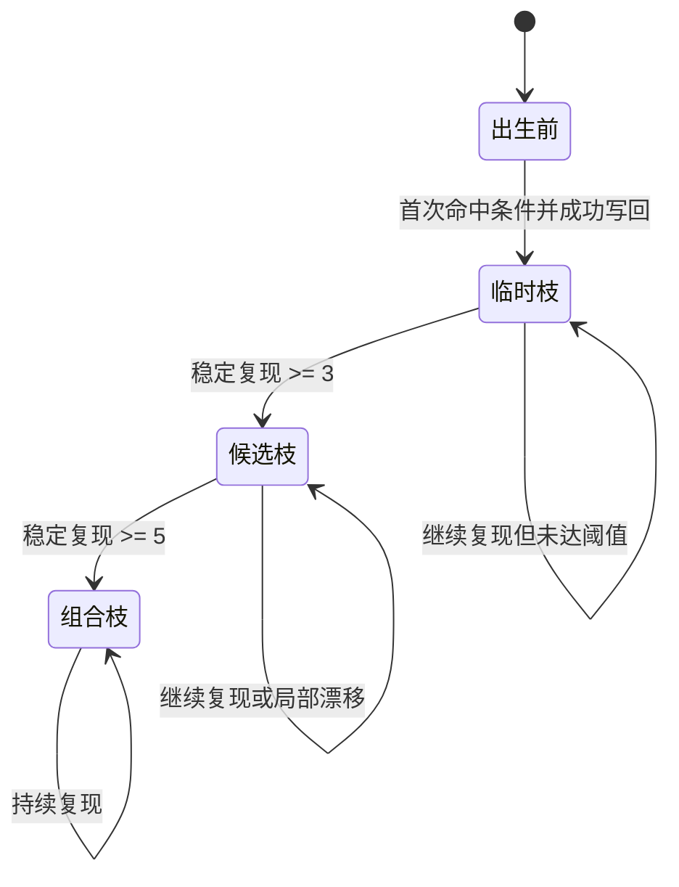
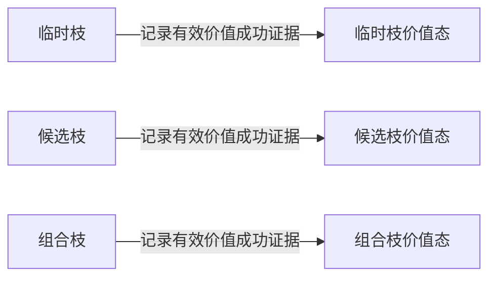

# 1150 任务管理任务方法生长状态图规范

## 1. 目标

本文用于把 `任务管理任务` 的方法生长过程，按当前规范统一收成一张可落实现、可对齐代码、可对齐因果写回的状态图。

本文重点固定：

- `出生前 -> 临时枝 -> 候选枝 -> 组合枝` 的正式生长路径
- `价值枝` 的语义边界
- 每个阶段应出现哪些 `特征值`
- 每个阶段如何压缩成 `二次特征`
- 每个阶段应形成什么样的 `实例因果` 与 `因果链`

具体到 `任务管理方法` 的专用因果生成时机、因果裁剪和轻量链组织，以 [1190_任务管理方法因果生成规范.md](D:\鱼巢\规范\1190_任务管理方法因果生成规范.md) 为准。

涉及 `主体级聚合 / 分身继承 / 本能能力缺口` 的额外承载，以 [1228_任务管理主体虚拟存在与分身继承规范.md](D:\鱼巢\规范\1228_任务管理主体虚拟存在与分身继承规范.md) 为准；本文不重写生长主干。


## 2. 基本判断

必须先固定以下 6 条：

1. `任务管理任务方法` 的正式来源升格，当前只有：
- `运行期临时`
- `反推`
- `组合`

2. 因此本文中的 `价值枝` 不是新的 `枚举_方法沉淀来源`。

3. `价值枝` 只是一个逻辑叠加态，表示：
- 某条已有枝
- 已经挂上至少一条有效 `价值成功证据`

4. 正式来源升格仍然只由 `稳定复现` 决定。

5. 价值叠加只表示“这条枝不只是会推进治理，还已经被证明确实带来可结算价值”。
6. 若系统启用了主体层，则 `出生前 -> 临时枝 -> 候选枝 -> 组合枝` 的阶段证据允许回并到主体虚拟存在，但这不改变本文的阶段判定阈值，也不把 `本能能力缺口` 误写成新的生长阶段。


## 3. 正式生长状态图



价值叠加路径单独固定为：



说明：

- `临时枝价值态 / 候选枝价值态 / 组合枝价值态` 是逻辑表示，不是新的来源枚举。
- 当前代码里，来源仍然是 `运行期临时 / 反推 / 组合`，价值性主要体现在 `节点_价值成功证据次数` 等评估原始量上。


## 4. 五个阶段的状态标识

## 4.1 出生前

定义：

- 当前还没有命中可复用管理枝，或虽然命中过相似条件，但还没有形成可写回的成功路径。

典型一级特征值：

```text
当前功能域 = 筹办
任务链已成形 = 0
已有可尝试方法 = 0
需要新子任务或新步骤 = 1
依赖缺失 = 1
最近执行失败 = 0
最近结果稳定 = 1
风险变坏 = 0
检查点通过 = 1
安全值_Q10000 = 7800
服务值_Q10000 = 5200
需求值_Q10000 = 6400
当前预算_Q10000 = 6400
```

典型二次特征：

```text
治理态型 = 补结构型
结构完备度 = 低
方法可用度 = 低
风险门控 = 可扩张
输入条件主键 = 筹办|链未成形|无可试方法|需补条件|风险稳定
```

因果状态：

- 允许存在“任务局势因果”，例如“依赖缺失导致进入筹办域”。
- 但此时还没有形成稳定的“条件 -> 管理方法 -> 结构推进”方法实例因果。


## 4.2 临时枝

定义：

- 某个管理方法首次在相似输入条件下成功推进任务，并被写回方法树。
- 其来源应为 `运行期临时`。

典型一级特征值：

```text
当前功能域 = 筹办
任务链已成形 = 0 -> 1
已有可尝试方法 = 0 -> 1
任务_当前步骤ID = 0 -> step_A
任务_当前方法首节点指针 = 0 -> method_M
任务_最近结果节点指针 = 0 或 result_R
宿主任务状态 = 待筹办 -> 就绪
```

典型二次特征：

```text
结构推进成立 = 1
治理闭环成立 = 1
治理态型 = 筹办成功型
当前结果主键 = 补条件后可进入就绪态
当前输入条件主键 = 筹办|链未成形|无可试方法|需补条件|风险稳定
```

典型方法评估特征：

```text
来源 = 运行期临时
节点_运行次数 >= 1
节点_样本数 >= 1
节点_成功次数 >= 1
节点_治理闭环证据次数 >= 1
节点_最近输入条件主键 != ""
节点_最近治理域 = 筹办/维护/纠偏/收束
节点_最近宿主任务状态 = 就绪/执行中/待重筹办/终结态之一
```

单跳实例因果模板：

```text
因：
  输入条件主键 = K1
  治理态型 = 补结构型

动作：
  调用 管理_筹办器

果：
  新步骤建立
  推荐方法绑定
  宿主任务进入就绪态
```


## 4.3 候选枝

定义：

- 同类条件下已稳定复现，达到候选枝阈值。
- 来源应从 `运行期临时` 升格为 `反推`。

典型一级特征值：

```text
当前功能域 = 筹办 或 维护 或 纠偏 或 收束
输入条件主键 = K1 或 K1 同桶变体
宿主任务推进结果稳定出现 = 1
最近执行失败 = 0
结果主键保持主干一致 = 1
```

典型二次特征：

```text
稳定复现级别 = 候选
治理可复用性 = 中
结果漂移风险 = 低
同条件主键复现 = 1
```

典型方法评估特征：

```text
来源 = 反推
节点_成功次数 >= 3
节点_成功次数 >= 节点_失败次数
节点_最近输入条件主键 = K1
节点_阶段标记 = 当前治理域
```

因果状态：

- 已形成多条同层实例因果。
- 这些实例因果共享相同或相近的条件主键。
- 可以组织成轻量因果链，表达：

```text
输入条件 K1
-> 命中管理方法 M
-> 推进任务结构
-> 宿主任务进入更前进状态
```


## 4.4 组合枝

定义：

- 该枝已在相似任务中稳定复现到正式组合阈值。
- 来源应升格为 `组合`。

典型一级特征值：

```text
输入条件主键 = K1 持续复现
结果主键持续稳定 = 1
最近执行失败 = 0
连续失败打断 = 0
```

典型二次特征：

```text
稳定复现级别 = 正式组合
治理可复用性 = 高
条件-结果耦合稳定 = 高
结果漂移风险 = 低
```

典型方法评估特征：

```text
来源 = 组合
节点_成功次数 >= 5
节点_连续失败次数 = 0
节点_成功次数 >= 节点_失败次数
节点_最近输入条件主键 = K1
```

因果状态：

- 已不只是“同层多次成功”，而是形成了一条较稳定的治理链解释。
- 典型链路可写成：

```text
根值压力
-> 进入某治理域
-> 命中组合枝 M
-> 任务结构推进
-> 叶子任务得到执行机会
-> 结果节点形成
```


## 4.5 价值枝

定义：

- 任一已有枝在后续运行中，挂上至少一条有效 `价值成功证据`。
- 它不是新来源，而是 `价值叠加态`。

典型一级特征值：

```text
最终产出可结算叶子结果 = 1
宿主任务进入状态 = 完成 或 其他终结态
所属根树 = 安全 或 服务
结算增量 > 0
```

典型二次特征：

```text
治理价值成立 = 1
价值闭环类型 = 安全结算型 或 服务结算型
条件-价值映射已出现 = 1
```

典型方法评估特征：

```text
节点_价值成功证据次数 >= 1
节点_累计价值结算增量 > 0
节点_最近价值输入条件主键 != ""
节点_最近价值治理域 != 未定义
节点_最近价值宿主任务状态 != 未定义
节点_最近价值所属根树 != 未定义
```

因果状态：

- 这里出现的是一条更长的价值因果链：

```text
输入条件 K1
-> 管理方法 M 推进任务结构
-> 叶子任务得到执行
-> 结果节点成立
-> 形成可结算叶子结果
-> 根账本增加
```


## 5. 二次特征的最小压缩规则

任务管理任务的方法成长，不应直接把所有一级特征原样写回方法树，而应先压缩成较稳定的二次特征。

建议固定以下压缩规则：

1. 结构态压缩

```text
任务链已成形 = 0 且 已有可尝试方法 = 0
-> 结构完备度 = 低
-> 治理态型 = 补结构型
```

2. 稳态压缩

```text
任务链已成形 = 1 且 最近结果稳定 = 1 且 检查点通过 = 1
-> 治理态型 = 稳态推进型
```

3. 纠偏压缩

```text
最近执行失败 = 1 或 风险变坏 = 1 或 检查点通过 = 0
-> 治理态型 = 偏离修复型
```

4. 收束压缩

```text
已满足完成判据 = 1 或 已确定无法继续 = 1
-> 治理态型 = 终态收口型
```

5. 价值压缩

```text
最终产出可结算叶子结果 = 1 且 结算增量 > 0
-> 治理价值成立 = 1
```

说明：

- `输入条件主键` 应主要由一级特征桶化组合而来。
- `二次特征` 应主要承载“这一簇条件代表什么治理局势”。
- `因果` 记录的是发生过什么，不应被二次特征替代。


## 6. 因果组织规则

## 6.1 单跳实例因果

单跳实例因果必须满足：

- `同锚点`
- `同层级`
- `时间有序`

因此，`任务管理任务` 的单跳治理因果，建议统一写成：

```text
因：
  一级特征值 + 二次特征 + 输入条件主键

动作：
  当前管理方法

果：
  管理产出 + 任务结构推进 + 宿主状态变化
```


## 6.2 多跳因果链

跨层解释必须走因果链，不能把跨层结果伪装成单跳因果。

任务管理任务最典型的多跳链是：

```text
根值与任务局势
-> 进入治理域
-> 管理方法命中
-> 任务结构推进
-> 叶子任务执行
-> 结果节点成立
-> 根账本变化
```

其中：

- 前三跳多为治理层
- 中间两跳多为任务执行层
- 最后一跳多为根值结算层


## 7. 最小轮次推演

为了便于代码落地，可把一条管理方法枝的成长最小推演成 6 轮：

### 第 1 轮

```text
输入条件主键 = K1
首次推进成功
来源 = 运行期临时
节点_成功次数 = 1
节点_治理闭环证据次数 = 1
```

结果：

- 方法出生
- 形成第一条治理实例因果

### 第 2 轮

```text
输入条件主键 = K1
再次推进成功
节点_成功次数 = 2
```

结果：

- 仍是临时枝
- 因果链长度增加

### 第 3 轮

```text
输入条件主键 = K1
再次推进成功
节点_成功次数 = 3
来源 -> 反推
```

结果：

- 升格为候选枝

### 第 4-5 轮

```text
输入条件主键 = K1
持续推进成功
节点_成功次数 = 5
来源 -> 组合
```

结果：

- 升格为组合枝

### 第 6 轮及以后

```text
最终产出可结算叶子结果 = 1
节点_价值成功证据次数 += 1
节点_累计价值结算增量 > 0
```

结果：

- 进入价值叠加态
- 该枝不只是“会治理”，而且“治理后真能产生价值”


## 8. 一句话收口

可收敛为一句话：

`任务管理任务的方法生长，本质上是“一级特征值被压缩成二次特征，再经由单跳实例因果和多跳因果链组织，最终靠稳定复现完成来源升格，并靠价值成功证据形成价值叠加态”的过程。`
