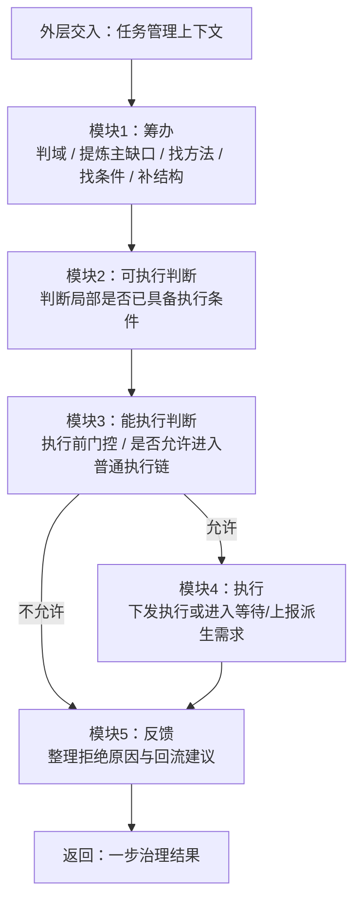
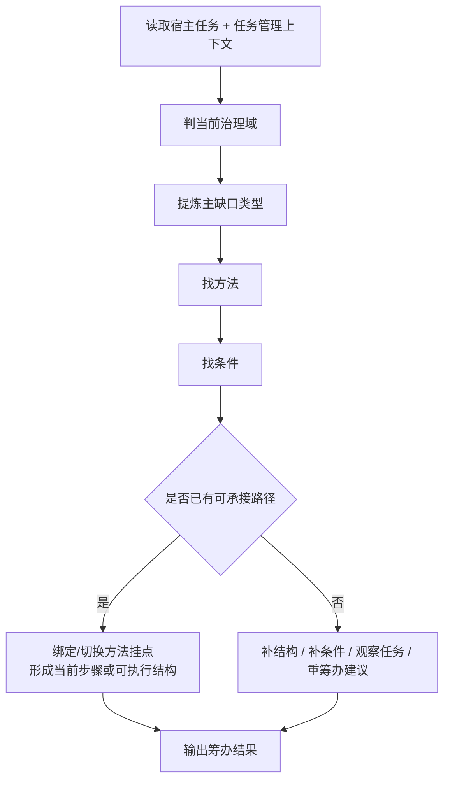
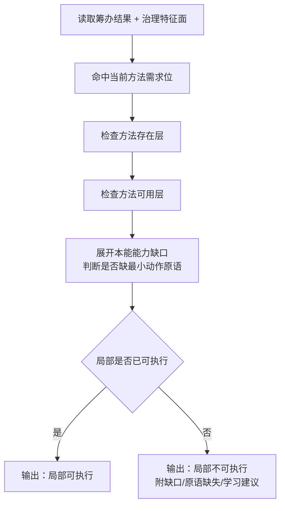
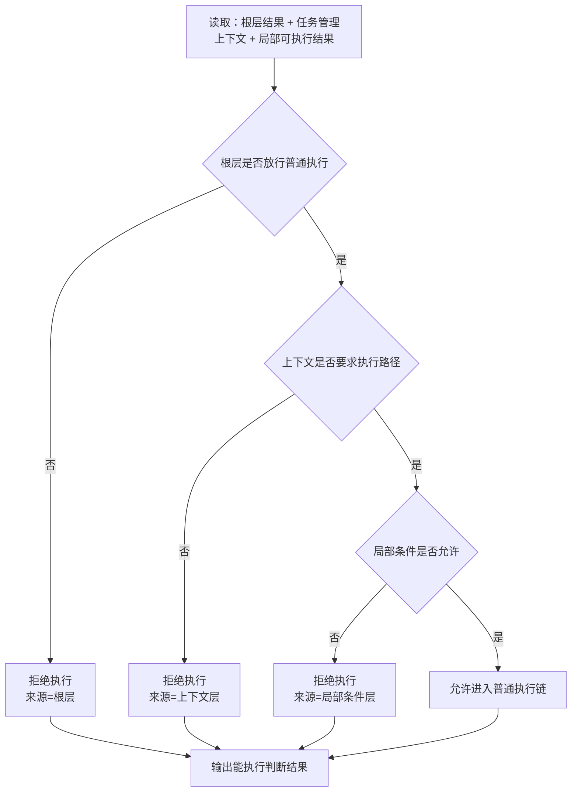
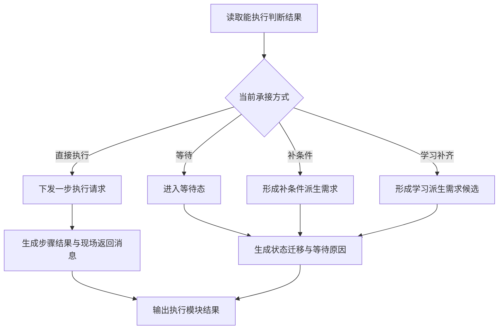
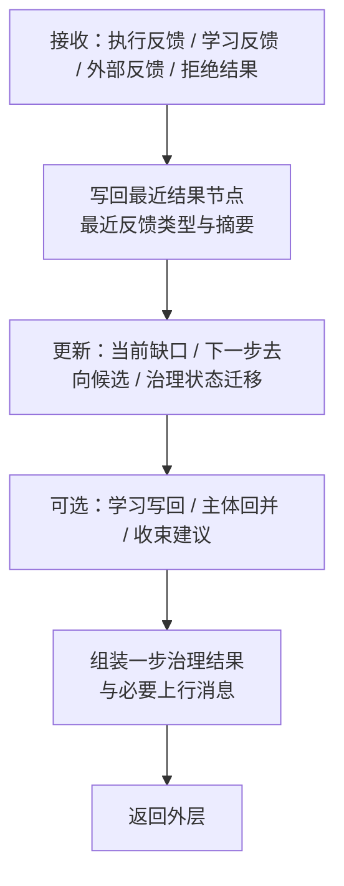
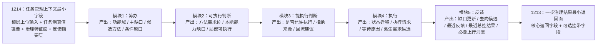

# 1315 任务管理任务五模块流程规范

## 1. 目标

本文用于把 `任务管理任务` 内部单轮治理流程，固定为一条明确的 `五模块串联链`。

本文要回答的是：

- `任务管理任务` 内部到底按哪几个模块串起来
- `推进一步` 这个原语最少应读什么、做什么、吐什么
- `筹办 / 可执行判断 / 能执行判断 / 执行 / 反馈` 各自负责什么
- `可执行判断` 与 `能执行判断` 为什么不能混成一层
- [1214_任务管理上下文最小字段表规范.md](D:\鱼巢\规范\1214_任务管理上下文最小字段表规范.md) 的字段，如何流入五模块
- [1213_任务管理一步治理结果最小返回面规范.md](D:\鱼巢\规范\1213_任务管理一步治理结果最小返回面规范.md) 的结果面，如何从五模块收口产生

本文只定义 `任务管理任务内部流程`，不替代 `自我线程主循环` 的总协调职责。


## 2. 上下位关系

上位规范：

- [0566_条件判定结果层与条件裁决边界规范.md](D:\鱼巢\规范\0566_条件判定结果层与条件裁决边界规范.md)
- [0567_最终裁决层与外层重判边界规范.md](D:\鱼巢\规范\0567_最终裁决层与外层重判边界规范.md)
- [0910_任务控制四域职责表.md](D:\鱼巢\规范\0910_任务控制四域职责表.md)
- [0970_任务筹办规则.md](D:\鱼巢\规范\0970_任务筹办规则.md)
- [1115_任务管理任务最小职责表规范.md](D:\鱼巢\规范\1115_任务管理任务最小职责表规范.md)
- [1213_任务管理一步治理结果最小返回面规范.md](D:\鱼巢\规范\1213_任务管理一步治理结果最小返回面规范.md)
- [1214_任务管理上下文最小字段表规范.md](D:\鱼巢\规范\1214_任务管理上下文最小字段表规范.md)

互补规范：

- [0028_自我线程消息总表规范.md](D:\鱼巢\规范\0028_自我线程消息总表规范.md)
- [0029_自我线程消息协议与分发规范_v0.1.md](D:\鱼巢\规范\0029_自我线程消息协议与分发规范_v0.1.md)
- [0317_执行前门控最小输入与判定顺序规范.md](D:\鱼巢\规范\0317_执行前门控最小输入与判定顺序规范.md)
- [0318_执行前门控拒绝原因类型表规范.md](D:\鱼巢\规范\0318_执行前门控拒绝原因类型表规范.md)
- [0568_方法存在可用可执行成熟分层规范.md](D:\鱼巢\规范\0568_方法存在可用可执行成熟分层规范.md)
- [0577_原语层与选择函数规范.md](D:\鱼巢\规范\0577_原语层与选择函数规范.md)
- [1000_任务执行类实现规范（当前顺序执行骨架）.md](D:\鱼巢\规范\1000_任务执行类实现规范（当前顺序执行骨架）.md)
- [1207_学习任务作为任务管理内部治理子任务规范.md](D:\鱼巢\规范\1207_学习任务作为任务管理内部治理子任务规范.md)
- [1215_学习任务目标-对象-产出-回流规范.md](D:\鱼巢\规范\1215_学习任务目标-对象-产出-回流规范.md)
- [1228_任务管理主体虚拟存在与分身继承规范.md](D:\鱼巢\规范\1228_任务管理主体虚拟存在与分身继承规范.md)
- [0014_自我线程主循环最小职责表规范.md](D:\鱼巢\规范\0014_自我线程主循环最小职责表规范.md)
- [1300_任务树数据结构与步骤子任务执行规范.md](D:\鱼巢\规范\1300_任务树数据结构与步骤子任务执行规范.md)
- [1310_任务树结构体字段草案与状态机转移表.md](D:\鱼巢\规范\1310_任务树结构体字段草案与状态机转移表.md)
- [1311_任务步骤结构规范_v0.1.md](D:\鱼巢\规范\1311_任务步骤结构规范_v0.1.md)
- [1316_编译通过与运行日志验收规范.md](D:\鱼巢\规范\1316_编译通过与运行日志验收规范.md)
- [1317_任务管理五模块日志点清单规范.md](D:\鱼巢\规范\1317_任务管理五模块日志点清单规范.md)


## 3. 核心结论

必须固定以下结论：

1. `任务管理任务` 在架构层上仍然是 `某个任务的局部治理执行体`；本文定义的 `筹办 -> 可执行判断 -> 能执行判断 -> 执行 -> 反馈`，只是它在实现层上的一种固定展开。
2. `任务管理任务` 内部单轮治理流程，当前统一压成 `筹办 -> 可执行判断 -> 能执行判断 -> 执行 -> 反馈` 五模块。
3. 这里的 `能执行判断`，规范语义上应理解为 `允许执行判断`；它回答的是“这轮准不准进入普通执行链”，不是“局部条件够不够”。
4. `可执行判断` 与 `能执行判断` 必须严格分层：前者属于 `局部条件与能力判断`，后者属于 `执行前门控`。
5. 若宿主当前没有可用方法，或已有方法头尚未具备 `动作 + 条件 + 结果` 的最小可用骨架，本轮不得把 `默认本能兜底` 当作普通执行方法挂入执行链；应直接改判为 `学习承接 + 保持等待`。
6. `任务管理任务` 的内部流程起点，是“外层已经形成的任务管理上下文”；终点，是“返回一步治理结果给外层”。
7. `根层重判`、`双值结算`、`主链最终去向裁决`、`待机/停机边界处理`，都不属于本文定义的五模块内部职责。
8. `任务管理任务` 在任一治理轮内，最多只承接一步；本轮内部形成的去向、收束、学习、补条件结论，都只是候选或建议。
9. `执行模块` 负责的是 `执行承接`、`局部等待处理` 与 `派生需求上报准备`，不是在任务管理线程里长期阻塞式代跑叶子执行器，也不是直接实例化正式子任务。
10. 当本轮因“方法缺失/方法未可用”被判成学习承接时，`执行模块` 只允许进入 `学习承接与业务派生阶段`，不允许继续进入普通执行后段。
11. `反馈模块` 负责把执行、学习、外部反馈重新收成治理中间态，并组装 `一步治理结果` 与必要的上行消息；它不能越权把局部成功直接写成需求已满足。
12. [1115_任务管理任务最小职责表规范.md](D:\鱼巢\规范\1115_任务管理任务最小职责表规范.md) 定义最小职责，[1214_任务管理上下文最小字段表规范.md](D:\鱼巢\规范\1214_任务管理上下文最小字段表规范.md) 定义最小输入，[1213_任务管理一步治理结果最小返回面规范.md](D:\鱼巢\规范\1213_任务管理一步治理结果最小返回面规范.md) 定义最小输出；本文负责把三者压成一条可执行的 `五模块流程骨架`。
13. 从自我线程一级模块层级看，`策略沙盘与方案演练` 不是和自我线程并列的一级模块，而是 `任务管理中轴 / 任务管理任务` 内部可调用的二级策略子模块。
14. 从“上下文包 -> 一步治理任务包”的局部路径看，可再压出一条实现子链：`需求归并 -> 候选方案生成 -> 策略沙盘与方案演练 -> 方案比较与裁剪 -> 一步治理任务包生成`。
15. 上面这条实现子链，不替代本文的 `筹办 -> 可执行判断 -> 能执行判断 -> 执行 -> 反馈` 五模块骨架，而是它在前半段内部可展开的二级实现路径。
16. 五模块内部允许做的“能力增强”，只限于 `组合增强 / 参数增强 / 模板增强 / 经验增强`；不得借实现细化扩张出 `根层判断`、`正式需求树写入`、`正式子任务创建`、`双值总账修改` 等新权力。
17. 若从最小可调度单元看，`任务管理任务` 当前还应收成为：`一颗任务树 + 一个原语函数“推进一步” + 一份局部运行态 + 三类上行消息`；五模块是 `推进一步` 的内部展开，而不是与它并列的新外壳。
18. `任务推进` 的最小解释单元，不是“先决定做哪个动作”，而是“为了让某个存在的某个特征进入某个目标状态，需要哪些前置状态与动作路径”。
19. `步骤` 是让一个中间特征达到中间目标状态；`方法` 是把当前状态集推进到目标状态集的一种可复用动作路径。
20. `派生需求` 是当前步骤要达成目标状态、但所需前置状态无法在本地满足时的缺口上报；`结果` 是执行后哪些特征达到了目标状态、哪些没达到，以及出现了哪些关键中间状态。
21. 因此每个步骤都必须先能回答两个问题：`想拿到哪个特征的哪个目标状态`，以及 `为了拿到它，需要哪些状态和动作`。
22. `推进一步` 运行时不得直接以裸 `二次特征` 作为继续、切换、等待、终止的最终依据；必须先经 `原语层` 输出，再由 `selection_policy` 或同级选择函数决定下一步。

可收敛为一句话：

`任务管理任务内部流程 = 先把路搭出来，再判断局部能否做，再判断本轮准不准做，再把一步动作、等待或派生需求上报落下，最后把结果重新收成稳定治理返回面。`

补充固定：

- 若后续要验证这条五模块流程是否真实命中，统一按 [1316_编译通过与运行日志验收规范.md](D:\鱼巢\规范\1316_编译通过与运行日志验收规范.md) 和 [1317_任务管理五模块日志点清单规范.md](D:\鱼巢\规范\1317_任务管理五模块日志点清单规范.md) 做 `关键点预测 + 正式链路日志核对`。


## 4. 定义与边界

### 4.0 架构层与实现层的关系

必须先固定：

1. [1115_任务管理任务最小职责表规范.md](D:\鱼巢\规范\1115_任务管理任务最小职责表规范.md) 中的 `局部治理执行体` 是架构定义。
2. 本文的 `五模块串联` 是实现定义，不替代架构定义。
3. 以后若继续细化模块、状态机、类职责，应理解为在实现层展开，不得借机改写架构边界。

### 4.1 本文定义的起止边界

本文定义的流程固定为：

```text
外层已形成任务管理上下文
-> 任务管理任务内部五模块串联
-> 返回一步治理结果
```

因此必须固定：

1. 本文的起点不是 `自我线程心跳`、不是 `mailbox 取消息`，而是已经交到 `任务管理任务` 手里的那份 `任务管理上下文`。
2. 本文的终点不是 `主链是否继续`，而是 `一步治理结果` 返回外层之后为止。
3. 外层如何继续做 `根层重判 -> 主链调度 -> 是否再提交任务管理任务`，由 [0014_自我线程主循环最小职责表规范.md](D:\鱼巢\规范\0014_自我线程主循环最小职责表规范.md) 负责。

### 4.2 五模块的最小定义

| 模块 | 最小职责 | 典型产物 | 不负责 |
| --- | --- | --- | --- |
| `筹办` | 判当前治理域、提炼主缺口、找方法、找条件、补结构；若方法不存在或未可用则锁定待学习方法头 | `当前功能域判定结果`、`主缺口类型`、`候选方法`、`待学习方法头`、`条件缺口` | 最终放行执行 |
| `可执行判断` | 判断局部上是否已具备进入执行闭环的条件 | `当前方法需求位`、`当前本能能力缺口类型`、`局部可执行/不可执行` | 最终执行前门控 |
| `能执行判断` | 判断这轮是否允许进入普通执行链 | `是否允许执行`、`拒绝来源层级`、`主拒绝原因类型` | 叶子执行本体 |
| `执行` | 把本轮决定落成一步动作、等待态、局部结构写回或派生需求上报准备 | `治理状态迁移`、`执行下发请求`、`派生需求候选`、`学习候选` | 长时间阻塞执行、正式子任务实例化 |
| `反馈` | 回收本轮结果，写回证据与中间态，组装一步治理结果与必要上行消息 | `当前下一步去向候选`、`最近反馈摘要`、`一步治理结果`、`线程状态/派生需求/结果消息` | 需求满足最终裁决、正式需求树落账 |

补充固定：

- 若当前问题是“策略沙盘放在哪一层”，答案不是把它单列为第六模块
- 它应放在 `筹办 / 可执行判断 / 能执行判断` 前半段可调用的方案比较子链里
- 它服务的是 `一步治理任务包生成`，而不是替代 `反馈` 或 `外层重判`

### 4.3 关于“能执行判断”的正式口径

用户习惯上会把第三段叫成 `能执行判断`，但规范中必须补充固定：

1. 若只说“能执行”，容易和 `局部可执行` 混层。
2. 为避免混层，本文统一把第三段解释为：`能执行判断 = 允许执行判断 = 执行前门控`。
3. 以后若代码里保留“能执行判断”命名，也应在注释或规范引用中明确它实际对应 `允许执行判断层`。

### 4.4 最小结构式与线程关系

从最小可调度单元看，`任务管理任务` 当前可正式收成为：

`一颗任务树 + 一个原语函数“推进一步” + 一份局部运行态 + 三类上行消息`

四部分分别是：

- `任务树`：承载任务根语义、步骤结构、条件挂载、方法挂载与依赖引用。
- `推进一步`：在当前控制上下文下，对当前前沿步骤做一次最小推进。
- `局部运行态`：承载当前前沿、等待原因、局部预算、最近结果缓存、已上报派生需求、已收到依赖结果等运行时驱动信息。
- `三类上行消息`：`线程状态消息 / 派生需求消息 / 结果消息`。

必须固定：

1. `自我线程` 不直接展开任务树。
2. `自我线程` 只负责决定这颗树当前有没有资格继续 `推进一步`。
3. `任务管理任务` 负责在获准后真正迈出这一步，并把事实通过三类上行消息交回外层。

一句话收口：

`线程管节拍，任务管理任务管步子。`

### 4.5 原语绑定与选择策略

任务节点、步骤节点在运行时至少应带以下绑定：

- `guard_primitives`
  - 解释前提/条件是否满足
- `direction_primitives`
  - 解释方向是否连续一致
- `result_primitives`
  - 解释当前结果是否落入目标范围
- `conflict_primitives`
  - 解释当前是否与目标方向或安全边界冲突
- `escalation_primitives`
  - 解释当前是否必须触发 `3次 / n次特征`
- `selection_policy`
  - 根据原语结果和历史执行上下文选下一执行原语或下一方法节点

必须固定：

1. `结果方向二次特征`、`条件索引`、`结果摘要` 继续作为步骤运行时证据面。
2. `推进一步` 只允许通过这些证据去喂原语，不允许直接用裸 `二次特征节点` 拍板。
3. 当原语只能判断 `同向`，却仍无法区分 `接近 / 相等 / 超过` 时，本轮必须输出 `触发升阶`，不得硬判 `已达标` 或 `继续强推`。


## 5. 总体流程

任务管理任务内部单轮治理，总体流程固定为：

```text
任务管理上下文
-> 筹办
-> 可执行判断
-> 能执行判断（允许执行判断）
-> 执行
-> 反馈
-> 一步治理结果
```

### 5.1 总体流程图



### 5.2 总体流程的固定要求

必须固定：

1. `筹办` 先于 `可执行判断`，因为没有方法与条件承接，后面无法判断局部可执行。
2. `可执行判断` 先于 `能执行判断`，因为执行前门控至少要消费一份“局部已经做到什么程度”的结果。
3. `能执行判断` 先于 `执行`，因为未被放行时不得直接下发普通执行。
4. `反馈` 同时承接两类结果：`已执行后的反馈` 与 `未允许执行时的拒绝反馈`。

### 5.3 “推进一步”原语

`推进一步` 当前建议定义为：

`在当前控制上下文、只读事实面和已回流依赖结果的约束下，对任务树做一次最小推进。`

补充固定：

- `推进一步` 的运行时判定入口，统一理解为：`证据面 -> 原语层 -> selection_policy -> 下一最小推进动作`。
- `推进一步` 可以调用执行原语，但不得裸读 `二次特征` 直接决定 `继续 / 切换 / 回滚 / 结束 / 升阶`。

#### 5.3.0 任务推进最小原理

在 `推进一步` 内部，当前还应固定下面这条最小原理：

- `任务`：让某个关键特征达到目标状态。
- `步骤`：让一个中间特征达到一个中间目标状态。
- `方法`：把当前状态集推进到目标状态集的一种可复用动作路径。
- `派生需求`：当前步骤要达成目标状态，但所需前置状态无法在本地满足时，上报出去的缺口。
- `结果`：执行后哪些特征真的达到了目标状态，哪些没达到，以及过程中出现了哪些关键中间状态。

可收成一句话：

`推进一步` 先找目标状态，再查前置状态，再选动作推进，最后检查结果状态。

补充固定放置层级：

- 本文所说的 `步骤结构`，不新增外层流程。
- 它只落在：`执行当前域 -> 当前域任务子树 -> 当前步骤节点`。
- 步骤节点的正式字段合同，统一按 [1311_任务步骤结构规范_v0.1.md](D:\鱼巢\规范\1311_任务步骤结构规范_v0.1.md) 执行。

进一步压成两个问题就是：

1. `为什么要这么做`
   因为当前还没有得到某个关键特征的目标状态。
2. `这么做需要什么`
   需要一组前置状态满足，再执行一组动作路径。

#### 5.3.1 最小输入表

| 输入类 | 最小输入 | 作用 |
| --- | --- | --- |
| `任务根面` | `任务根节点`、`来源需求`、`方向`、`服务对象`、`完成标准`、`父任务引用` | 回答“这是什么任务”，默认按只读或读多写少理解 |
| `树主体` | `任务树主体`、`步骤节点集`、`条件挂载`、`方法挂载`、`外部依赖引用` | 回答“当前推进到哪了”，其中步骤节点至少应带 [1311_任务步骤结构规范_v0.1.md](D:\鱼巢\规范\1311_任务步骤结构规范_v0.1.md) 定义的 `8` 组字段 |
| `局部运行态` | `当前前沿`、`当前等待原因`、`局部预算`、`最近结果缓存`、`已上报派生需求`、`已收到依赖结果` | 驱动本轮最小推进 |
| `控制上下文` | `打断`、`收束`、`停止`、`预算刷新`、`优先级刷新` | 回答“这一步当前准不准继续推进” |
| `只读事实面` | `场景只读事实`、`存在只读事实`、`方法可调用事实` | 提供前置条件判断材料 |
| `回流输入` | `已路由回来的子结果 / 依赖结果` | 决定当前步骤能否继续推进、解除等待或收束 |

#### 5.3.2 固定过程

`推进一步` 每次只允许按以下顺序做一件最小推进动作：

1. `选当前前沿并识别目标状态`：找出当前最靠前、最有资格推进的步骤，并读取该步骤的 `目标存在 / 目标特征 / 目标状态`。
2. `检查控制约束`：优先检查 `打断 / 收束 / 停止 / 预算不足`。
3. `检查前置状态`：检查前序、资源、确认、方法可调用、依赖结果和风险门控是否满足。
4. `选择动作推进`：若前置状态满足，则从 `动作集 / 方法集` 中选择一条路径推进；若不满足，则优先判断应 `局部等待` 还是 `上报派生需求`。
5. `检查结果状态并分流`：检查目标特征是否已达到目标状态；若仍未达到，则再判断应 `本地继续推进 / 局部等待 / 上报派生需求 / 失败或收束或回退` 中的哪一类。

#### 5.3.3 四分分类表

| 分类 | 触发条件 | 允许动作 | 主要写回 | 允许上行消息 |
| --- | --- | --- | --- | --- |
| `本地继续推进` | 当前目标状态尚未达到，控制约束放行，前置状态满足，且仍存在可继续尝试的动作路径 | 调用本地方法或动作，继续推进一步 | `步骤状态`、`结果片段`、`局部运行态`、`动作动态` | `线程状态消息`，必要时 `结果消息` |
| `局部等待` | 当前目标状态尚未达到，部分前置状态暂未满足，或执行后更适合等待回流、确认或窗口变化 | 更新等待原因、保持前沿或切换到等待前沿 | `等待原因`、`步骤状态`、`局部运行态` | `线程状态消息` |
| `需要派生需求` | 当前目标状态尚未达到，关键前置状态无法在本地满足，且需要外部支撑、补条件、补方法或补原语 | 形成派生需求候选并上报外层 | `已上报派生需求`、`外部依赖待定`、`局部运行态` | `派生需求消息`，必要时附带 `线程状态消息` |
| `失败 / 收束 / 回退` | 当前目标状态未命中，且已不适合继续本地推进或等待；或已命中局部失败/收束/回退条件 | 更新局部失败态、收束态或回退建议 | `结果片段`、`步骤状态`、`最近结果缓存`、`局部运行态` | `结果消息`，必要时附带 `线程状态消息` |

补充固定：

- 若目标状态已经命中，则本轮直接形成 `本步成立` 的结果写回与返回映射，不再把它混进“未达成时的分流”。

#### 5.3.4 最小输出表

每次 `推进一步` 的输出，当前只允许是以下几种之一或它们的小组合：

| 输出类 | 最小输出 | 说明 |
| --- | --- | --- |
| `运行态更新` | `局部运行态更新` | 本轮推进后的前沿、等待、预算、缓存变化 |
| `消息输出` | `一条线程状态消息` | 表达当前运行状态、等待原因、是否可继续推进 |
| `消息输出` | `一条派生需求消息` | 表达本地不可消化且需外部支撑的事实 |
| `消息输出` | `一条结果消息` | 表达当前步骤或当前任务已形成的结果事实 |
| `审计输出` | `一条动作动态记录` | 表达本轮最小动作边界 |
| `状态输出` | `一组状态变化项` | 仅当本轮确有执行事实或关键中间状态变化时附带 |

#### 5.3.5 推进一步状态迁移表

对 `当前前沿步骤`，`推进一步` 最少应支持以下状态迁移：

| 当前状态 | 经 `推进一步` 后可转向 | 典型原因 |
| --- | --- | --- |
| `未开始` | `可推进`、`等待中`、`已收束` | 前序刚满足、依赖未到位、控制要求直接收束 |
| `可推进` | `推进中`、`等待中`、`已失败`、`已收束` | 进入本地推进、命中等待、命中失败、命中控制收束 |
| `推进中` | `等待中`、`已完成`、`已失败`、`已收束` | 一步动作完成后进入等待、完成、失败或收束 |
| `等待中` | `可推进`、`等待中`、`已失败`、`已收束` | 依赖结果回流、继续等待、等待超时失败、控制收束 |
| `已完成` | `已完成` | 当前步骤已结束，不再由本轮重复推进 |
| `已失败` | `已失败`、`已收束` | 局部失败保持，或由外层要求收束 |
| `已收束` | `已收束` | 当前步骤已结束，不再继续推进 |

补充固定：

1. `推进一步` 是最小调度原语，不是内部长循环许可证。
2. 一轮若需要继续，必须重新回到外层，由自我线程决定是否再次批准 `推进一步`。
3. 五模块只是 `推进一步` 的内部展开链，不是替代它的新上位概念。


## 6. 五模块流程

### 6.1 模块一：筹办

`筹办` 的作用，是把当前宿主任务搭成“能够承接下一步治理”的结构。

它回答的是：

- 当前更像落在哪个治理域
- 当前最主要的缺口是什么
- 当前有没有可朝需求推进的方法候选
- 这些方法当前缺哪些条件
- 需要补方法、补条件、补结构，还是已经能形成下一步路径

#### 6.1.1 最小输入

- `最近根层重判结果`
- `当前主需求指针`
- `当前管理对象指针`
- `当前步骤指针`
- `当前方法首节点指针`
- `最近结果节点指针`
- `当前缺口类型`
- `当前下一步去向`
- `最近反馈类型`
- `最近反馈摘要`

#### 6.1.2 最小输出

- `当前功能域判定结果`
- `主缺口类型`
- `候选方法列表`
- `当前选中方法`
- `条件缺口清单`
- `结构写回摘要`
- `当前下一步去向候选`

#### 6.1.3 固定步骤

1. 读取宿主任务与当前治理上下文。
2. 判定当前治理域。
3. 提炼主缺口类型。
4. 围绕当前需求找方法。
5. 围绕候选方法找条件。
6. 若已有可承接路径，则绑定/切换方法挂点与当前步骤。
7. 若暂无可承接路径，则输出 `补结构 / 补条件 / 观察试探 / 待重筹办` 一类结论。

#### 6.1.4 模块流程图



#### 6.1.5 严格限制

必须固定：

1. `筹办` 不等于执行。
2. `筹办` 不得直接给出“任务已经完成”或“主链应该结束”的最终结论。
3. `筹办` 只能组织下一步路径，不能替代外层根层重判。

### 6.2 模块二：可执行判断

`可执行判断` 的作用，是回答“在任务管理上下文内部，当前局部条件是否已足以进入执行闭环”。

它回答的是：

- 当前缺口被压成哪个方法需求位
- 当前方法存在层、可用层是否够用
- 当前是不是还缺最小动作原语
- 当前局部是否已经可执行

#### 6.2.1 最小输入

- `当前功能域判定结果`
- `主缺口类型`
- `当前选中方法`
- `输入条件主键`
- `治理态型`
- `结构完备度`
- `方法可用度`
- `风险门控`

#### 6.2.2 最小输出

- `当前方法需求位`
- `当前准备度`
- `当前本能能力缺口类型`
- `缺失原语位图`
- `是否建议转学习`
- `局部可执行/不可执行`

#### 6.2.3 固定步骤

1. 命中当前方法需求位。
2. 判断方法存在层是否成立。
3. 判断方法可用层是否成立。
4. 展开本能能力缺口，检查是否还缺最小动作原语。
5. 输出 `局部可执行` 或 `局部不可执行` 结果。

#### 6.2.4 模块流程图



#### 6.2.5 严格限制

必须固定：

1. `局部可执行` 不等于 `本轮允许执行`。
2. `当前方法需求位` 是桥层，不得直接冒充具体方法枝或最终裁决。
3. 缺少最小动作原语时，只能显式返回 `本能能力缺口`，不得假装已经补齐。

### 6.3 模块三：能执行判断

本模块在规范语义上固定为 `允许执行判断`。

它回答的是：

- 根层边界是否允许进入普通执行链
- 当前上下文是否要求继续走执行路径
- 局部条件是否已经达到本轮放行下限
- 若不允许执行，拒绝来自哪一层

#### 6.3.1 最小输入

- `最近根层重判结果`
- `当前下一步去向候选`
- `局部可执行/不可执行结果`
- `风险门控`
- `当前管理对象指针`
- `当前步骤指针`
- `当前方法首节点指针`

#### 6.3.2 最小输出

- `是否允许进入普通执行链`
- `拒绝来源层级`
- `主拒绝原因类型`
- `建议回流路径`

#### 6.3.3 固定步骤

1. 先看根层是否允许普通执行。
2. 再看当前上下文是否要求继续走执行路径。
3. 最后看局部条件是否满足本轮放行下限。
4. 输出 `允许执行` 或 `拒绝执行`，并显式挂带拒绝来源。

#### 6.3.4 模块流程图



#### 6.3.5 严格限制

必须固定：

1. 本模块不得跳过 `最近根层重判结果` 单独放行执行。
2. 本模块给出的 `允许执行`，只表示“允许进入普通执行链”，不表示任务一定成功。
3. 本模块给出的 `拒绝执行`，应优先返回拒绝来源与回流建议，而不是静默吞掉本轮结果。

### 6.4 模块四：执行

`执行` 模块负责把第三模块的判断，落成一次明确的治理动作。

它回答的是：

- 当前是直接下发一步执行，还是进入等待
- 当前更像补条件、补结构，还是转学习
- 当前步骤和结果节点应如何推进

#### 6.4.1 最小输入

- `是否允许进入普通执行链`
- `当前步骤指针`
- `当前方法首节点指针`
- `当前下一步去向候选`
- `补条件建议`
- `学习建议`
- `当前任务树结构`

#### 6.4.2 最小输出

- `当前治理状态迁移`
- `等待原因`
- `执行下发请求`
- `结果节点写回摘要`
- `补条件派生需求候选`
- `学习派生需求候选`
- `线程状态消息草稿`

#### 6.4.3 固定步骤

1. 若允许执行，则下发一步执行请求。
2. 若不进入普通执行，但更像应等待，则进入等待态。
3. 若更像缺条件，则形成补条件派生需求或补条件承接建议。
4. 若更像缺方法/缺原语，则形成学习派生需求候选。
5. 把本轮动作写回到步骤、结果、状态迁移与派生需求候选面。

#### 6.4.4 模块流程图



#### 6.4.5 严格限制

必须固定：

1. `执行` 模块不等于叶子执行器本体。
2. `执行` 模块不得在管理线程里长期阻塞等待外部世界。
3. `执行` 模块只能落下一步承接动作，不得在内部连跑多轮完整闭环。
4. `执行` 模块可以形成 `派生需求消息` 或 `学习候选`，但不得绕过外层直接实例化正式子任务。

### 6.5 模块五：反馈

`反馈` 模块负责把执行、学习、外部回流重新收成下一轮还能继续消费的治理中间态。

它回答的是：

- 本轮到底回收到了什么反馈
- 最近结果与最近反馈摘要如何更新
- 当前缺口与下一步去向是否发生变化
- 本轮是否形成学习写回、主体回并或收束建议
- 最终交回外层的一步治理结果长什么样

#### 6.5.1 最小输入

- `执行返回消息`
- `学习反馈`
- `外部反馈`
- `拒绝执行结果`
- `当前步骤指针`
- `当前方法首节点指针`
- `最近结果节点指针`
- `最近反馈摘要`

#### 6.5.2 最小输出

- `当前缺口类型`
- `当前下一步去向候选`
- `最近反馈类型`
- `最近反馈摘要`
- `最近总控结果`
- `一步治理结果`
- `线程状态消息 / 派生需求消息 / 结果消息`

#### 6.5.3 固定步骤

1. 接收本轮执行反馈、学习反馈、外部反馈或拒绝执行结果。
2. 写回最近结果节点、最近反馈类型与最近反馈摘要。
3. 更新 `当前缺口类型 / 当前下一步去向候选 / 当前治理状态迁移`。
4. 若启用主体层，可挂带 `主体回并摘要`。
5. 组装并返回 `一步治理结果`。
6. 若本轮已形成局部运行事实、派生需求或结果事实，则同步组装对应上行消息。

#### 6.5.4 模块流程图



#### 6.5.5 严格限制

必须固定：

1. `反馈` 只能形成治理中间态与建议，不能越权写成 `需求已满足`。
2. `反馈` 可以输出 `收束建议 / 重筹办建议 / 学习派生需求候选`，但它们都只是候选。
3. `反馈` 返回外层后，仍需再次经过外层重判与主链调度。
4. `反馈` 即使生成三类上行消息，也仍只是把事实交回自我线程，不授予直接落正式需求树或正式子任务的权力。


## 7. 五模块字段流转

### 7.1 总体字段流转图



### 7.2 字段流转对照表

| 模块 | 主输入字段 | 核心中间产物 | 主输出字段 |
| --- | --- | --- | --- |
| `筹办` | `最近根层重判结果`、`当前主需求指针`、`当前管理对象指针`、`当前步骤指针`、`当前方法首节点指针`、`最近结果节点指针`、`当前缺口类型`、`当前下一步去向`、`最近反馈类型/摘要` | `当前功能域判定结果`、`主缺口类型`、`候选方法列表`、`条件缺口清单` | `当前功能域判定结果`、`主缺口类型`、`当前选中方法`、`结构写回摘要`、`当前下一步去向候选` |
| `可执行判断` | `当前功能域判定结果`、`主缺口类型`、`当前选中方法`、`输入条件主键`、`治理态型`、`结构完备度`、`方法可用度`、`风险门控` | `当前方法需求位`、`当前准备度`、`当前本能能力缺口类型`、`缺失原语位图` | `局部可执行/不可执行`、`是否建议转学习`、`当前方法需求位`、`当前本能能力缺口类型` |
| `能执行判断` | `最近根层重判结果`、`当前下一步去向候选`、`局部可执行/不可执行结果`、`风险门控`、`当前步骤指针`、`当前方法首节点指针` | `拒绝来源层级`、`主拒绝原因类型`、`建议回流路径` | `是否允许进入普通执行链`、`拒绝来源层级`、`主拒绝原因类型` |
| `执行` | `是否允许进入普通执行链`、`当前步骤指针`、`当前方法首节点指针`、`当前下一步去向候选`、`学习建议`、`当前任务树结构` | `执行下发请求`、`等待原因`、`补条件派生需求候选`、`学习派生需求候选` | `当前治理状态迁移`、`结果节点写回摘要`、`执行返回消息`、`派生需求候选` |
| `反馈` | `执行返回消息`、`学习反馈`、`外部反馈`、`拒绝执行结果`、`当前步骤/方法/结果镜像`、`最近反馈摘要` | `当前缺口更新`、`当前下一步去向候选`、`最近总控结果`、`管理证据摘要`、`必要上行消息草稿` | `当前功能域判定结果`、`当前缺口类型`、`当前下一步去向候选`、`当前治理状态迁移`、`当前步骤指针镜像`、`当前方法首节点指针镜像`、`最近结果节点指针镜像`、`最近总控结果`、`最近反馈类型`、`最近反馈摘要`、`线程状态消息 / 派生需求消息 / 结果消息` |

### 7.3 与 1214 和 1213 的固定关系

必须固定：

1. [1214_任务管理上下文最小字段表规范.md](D:\鱼巢\规范\1214_任务管理上下文最小字段表规范.md) 是五模块的最小稳定输入面。
2. `筹办 -> 可执行判断 -> 能执行判断 -> 执行 -> 反馈` 是对这份输入面的单轮消费顺序。
3. [1213_任务管理一步治理结果最小返回面规范.md](D:\鱼巢\规范\1213_任务管理一步治理结果最小返回面规范.md) 是五模块完成单轮消费后，必须稳定交回外层的最小输出面。
4. `当前方法需求位 / 当前本能能力缺口类型 / 输入条件主键 / 治理态型` 这类桥接字段，可以跨轮保留并再次进入下一轮 `任务管理上下文`。


## 8. 严格禁止的混层

以下做法必须禁止：

1. 把 `任务管理任务内部五模块流程` 直接等同 `自我线程主循环流程`。
2. 把 `筹办` 当成 `执行`。
3. 把 `局部可执行` 当成 `本轮允许执行`。
4. 把 `当前下一步去向候选` 当成最终裁决。
5. 把 `执行模块` 当成叶子执行器本体。
6. 把 `反馈模块` 输出的局部成功，直接写成 `需求已满足`。
7. 把 `学习派生需求候选 / 收束建议 / 重筹办建议` 当成已批准动作。
8. 跳过 `方法需求位 -> 本能能力缺口` 这条桥层，直接把成长需求硬写成具体方法。
9. 把 `执行模块` 形成的派生需求候选，直接当成已经实例化的正式子任务。
10. 把 `结果方向二次特征`、`条件模板命中` 或 `结果摘要命中` 直接当成最终路由结论。


## 9. 当前阶段工程结论

当前阶段可先按以下口径理解：

1. [1115_任务管理任务最小职责表规范.md](D:\鱼巢\规范\1115_任务管理任务最小职责表规范.md) 已经固定了 `任务管理任务` 最少必须做什么。
2. [1214_任务管理上下文最小字段表规范.md](D:\鱼巢\规范\1214_任务管理上下文最小字段表规范.md) 已经固定了这条流程最少应读到哪些稳定字段。
3. [1213_任务管理一步治理结果最小返回面规范.md](D:\鱼巢\规范\1213_任务管理一步治理结果最小返回面规范.md) 已经固定了这条流程最少必须返回哪些结果面。
4. 本文的作用，是把这三份规范压到一条 `五模块串联流程` 上，避免继续把 `筹办 / 局部可执行 / 执行前门控 / 执行承接 / 反馈收口` 混在同一个大函数概念里。
5. 后续若继续落代码，应优先保持这五模块的边界稳定，再逐步细化每个模块内部的字段、状态机与类职责归位。
6. 继续增强五模块实现时，默认只允许做 `组合 / 参数 / 模板 / 经验` 四类增强，不得借模块落地扩大治理权限。
