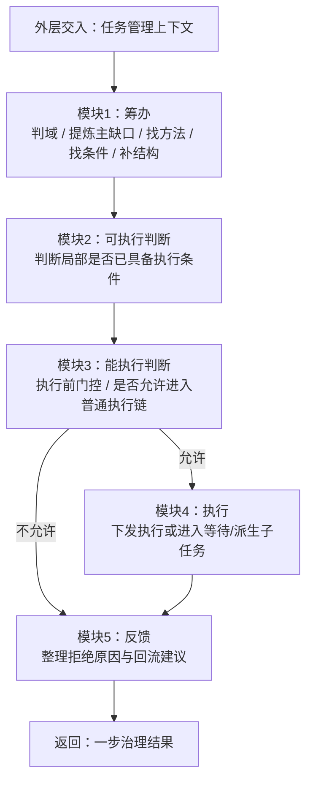
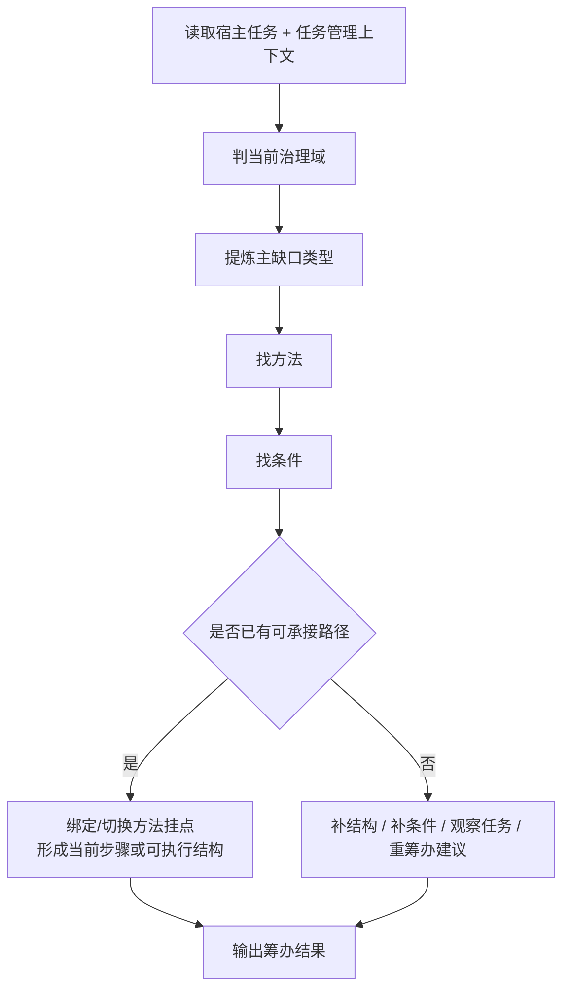
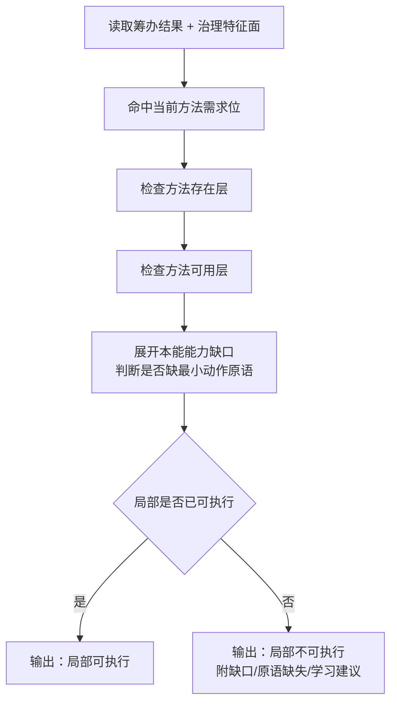
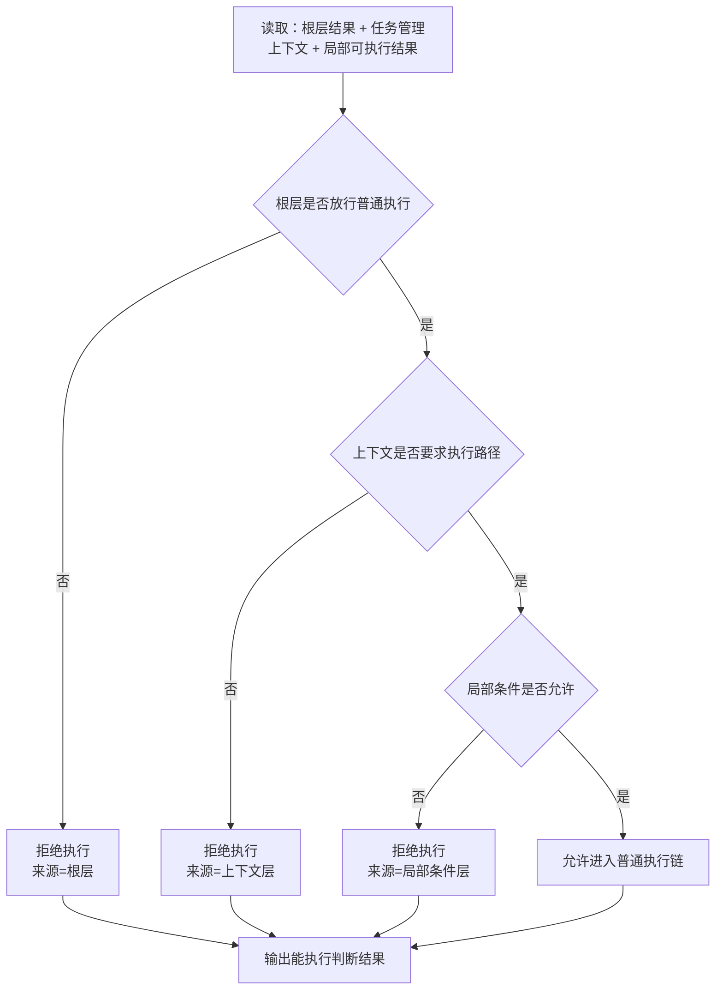
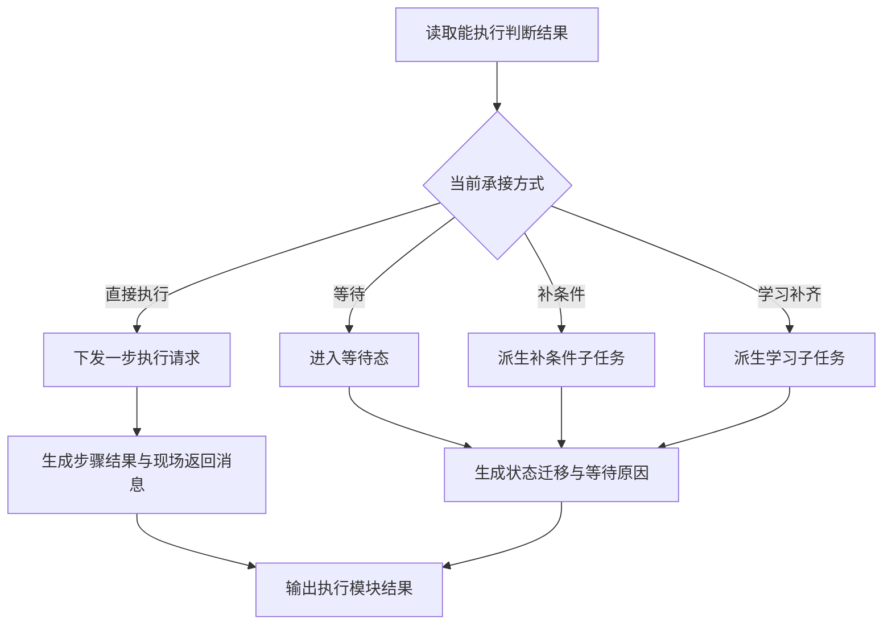
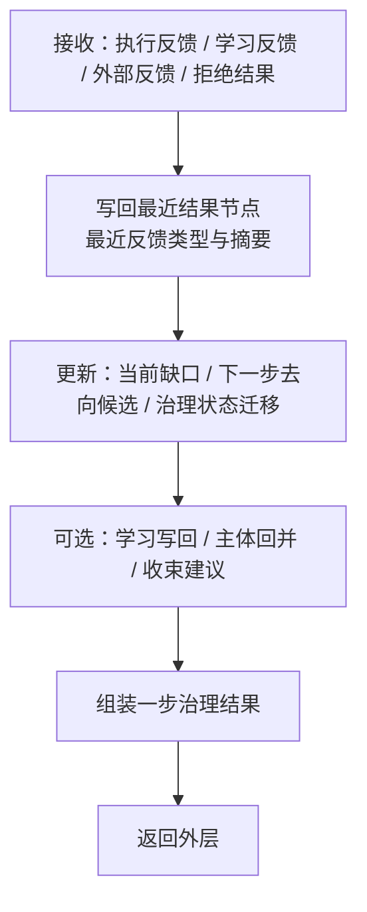
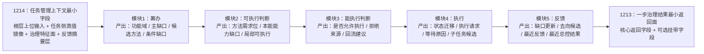

# 1315 任务管理任务五模块流程规范

## 1. 目标

本文用于把 `任务管理任务` 内部单轮治理流程，固定为一条明确的 `五模块串联链`。

本文要回答的是：

- `任务管理任务` 内部到底按哪几个模块串起来
- `筹办 / 可执行判断 / 能执行判断 / 执行 / 反馈` 各自负责什么
- `可执行判断` 与 `能执行判断` 为什么不能混成一层
- [1214_任务管理上下文最小字段表规范.md](D:\鱼巢\规范\1214_任务管理上下文最小字段表规范.md) 的字段，如何流入五模块
- [1213_任务管理一步治理结果最小返回面规范.md](D:\鱼巢\规范\1213_任务管理一步治理结果最小返回面规范.md) 的结果面，如何从五模块收口产生

本文只定义 `任务管理任务内部流程`，不替代 `自我线程主循环` 的总协调职责。


## 2. 上下位关系

上位规范：

- [0566_条件判定结果层与条件裁决边界规范.md](D:\鱼巢\规范\0566_条件判定结果层与条件裁决边界规范.md)
- [0567_最终裁决层与外层重判边界规范.md](D:\鱼巢\规范\0567_最终裁决层与外层重判边界规范.md)
- [0910_任务控制四域职责表.md](D:\鱼巢\规范\0910_任务控制四域职责表.md)
- [0970_任务筹办规则.md](D:\鱼巢\规范\0970_任务筹办规则.md)
- [1115_任务管理任务最小职责表规范.md](D:\鱼巢\规范\1115_任务管理任务最小职责表规范.md)
- [1213_任务管理一步治理结果最小返回面规范.md](D:\鱼巢\规范\1213_任务管理一步治理结果最小返回面规范.md)
- [1214_任务管理上下文最小字段表规范.md](D:\鱼巢\规范\1214_任务管理上下文最小字段表规范.md)

互补规范：

- [0317_执行前门控最小输入与判定顺序规范.md](D:\鱼巢\规范\0317_执行前门控最小输入与判定顺序规范.md)
- [0318_执行前门控拒绝原因类型表规范.md](D:\鱼巢\规范\0318_执行前门控拒绝原因类型表规范.md)
- [0568_方法存在可用可执行成熟分层规范.md](D:\鱼巢\规范\0568_方法存在可用可执行成熟分层规范.md)
- [1000_任务执行类实现规范（当前顺序执行骨架）.md](D:\鱼巢\规范\1000_任务执行类实现规范（当前顺序执行骨架）.md)
- [1207_学习任务作为任务管理内部治理子任务规范.md](D:\鱼巢\规范\1207_学习任务作为任务管理内部治理子任务规范.md)
- [1215_学习任务目标-对象-产出-回流规范.md](D:\鱼巢\规范\1215_学习任务目标-对象-产出-回流规范.md)
- [1228_任务管理主体虚拟存在与分身继承规范.md](D:\鱼巢\规范\1228_任务管理主体虚拟存在与分身继承规范.md)
- [0014_自我线程主循环最小职责表规范.md](D:\鱼巢\规范\0014_自我线程主循环最小职责表规范.md)
- [1300_任务树数据结构与步骤子任务执行规范.md](D:\鱼巢\规范\1300_任务树数据结构与步骤子任务执行规范.md)
- [1310_任务树结构体字段草案与状态机转移表.md](D:\鱼巢\规范\1310_任务树结构体字段草案与状态机转移表.md)
- [1316_编译通过与运行日志验收规范.md](D:\鱼巢\规范\1316_编译通过与运行日志验收规范.md)
- [1317_任务管理五模块日志点清单规范.md](D:\鱼巢\规范\1317_任务管理五模块日志点清单规范.md)


## 3. 核心结论

必须固定以下结论：

1. `任务管理任务` 内部单轮治理流程，当前统一压成 `筹办 -> 可执行判断 -> 能执行判断 -> 执行 -> 反馈` 五模块。
2. 这里的 `能执行判断`，规范语义上应理解为 `允许执行判断`；它回答的是“这轮准不准进入普通执行链”，不是“局部条件够不够”。
3. `可执行判断` 与 `能执行判断` 必须严格分层：前者属于 `局部条件与能力判断`，后者属于 `执行前门控`。
4. `任务管理任务` 的内部流程起点，是“外层已经形成的任务管理上下文”；终点，是“返回一步治理结果给外层”。
5. `根层重判`、`双值结算`、`主链最终去向裁决`、`待机/停机边界处理`，都不属于本文定义的五模块内部职责。
6. `任务管理任务` 在任一治理轮内，最多只承接一步；本轮内部形成的去向、收束、学习、补条件结论，都只是候选或建议。
7. `执行模块` 负责的是 `执行承接`，不是在任务管理线程里长期阻塞式代跑叶子执行器。
8. `反馈模块` 负责把执行、学习、外部反馈重新收成治理中间态，并组装 `一步治理结果`；它不能越权把局部成功直接写成需求已满足。
9. [1115_任务管理任务最小职责表规范.md](D:\鱼巢\规范\1115_任务管理任务最小职责表规范.md) 定义最小职责，[1214_任务管理上下文最小字段表规范.md](D:\鱼巢\规范\1214_任务管理上下文最小字段表规范.md) 定义最小输入，[1213_任务管理一步治理结果最小返回面规范.md](D:\鱼巢\规范\1213_任务管理一步治理结果最小返回面规范.md) 定义最小输出；本文负责把三者压成一条可执行的 `五模块流程骨架`。
10. 从自我线程一级模块层级看，`策略沙盘与方案演练` 不是和自我线程并列的一级模块，而是 `任务管理中轴 / 任务管理任务` 内部可调用的二级策略子模块。
11. 从“上下文包 -> 一步治理任务包”的局部路径看，可再压出一条实现子链：`需求归并 -> 候选方案生成 -> 策略沙盘与方案演练 -> 方案比较与裁剪 -> 一步治理任务包生成`。
12. 上面这条实现子链，不替代本文的 `筹办 -> 可执行判断 -> 能执行判断 -> 执行 -> 反馈` 五模块骨架，而是它在前半段内部可展开的二级实现路径。

可收敛为一句话：

`任务管理任务内部流程 = 先把路搭出来，再判断局部能否做，再判断本轮准不准做，再把一步动作或等待/子任务落下，最后把结果重新收成稳定治理返回面。`

补充固定：

- 若后续要验证这条五模块流程是否真实命中，统一按 [1316_编译通过与运行日志验收规范.md](D:\鱼巢\规范\1316_编译通过与运行日志验收规范.md) 和 [1317_任务管理五模块日志点清单规范.md](D:\鱼巢\规范\1317_任务管理五模块日志点清单规范.md) 做 `关键点预测 + 正式链路日志核对`。


## 4. 定义与边界

### 4.1 本文定义的起止边界

本文定义的流程固定为：

```text
外层已形成任务管理上下文
-> 任务管理任务内部五模块串联
-> 返回一步治理结果
```

因此必须固定：

1. 本文的起点不是 `自我线程心跳`、不是 `mailbox 取消息`，而是已经交到 `任务管理任务` 手里的那份 `任务管理上下文`。
2. 本文的终点不是 `主链是否继续`，而是 `一步治理结果` 返回外层之后为止。
3. 外层如何继续做 `根层重判 -> 主链调度 -> 是否再提交任务管理任务`，由 [0014_自我线程主循环最小职责表规范.md](D:\鱼巢\规范\0014_自我线程主循环最小职责表规范.md) 负责。

### 4.2 五模块的最小定义

| 模块 | 最小职责 | 典型产物 | 不负责 |
| --- | --- | --- | --- |
| `筹办` | 判当前治理域、提炼主缺口、找方法、找条件、补结构 | `当前功能域判定结果`、`主缺口类型`、`候选方法`、`条件缺口` | 最终放行执行 |
| `可执行判断` | 判断局部上是否已具备进入执行闭环的条件 | `当前方法需求位`、`当前本能能力缺口类型`、`局部可执行/不可执行` | 最终执行前门控 |
| `能执行判断` | 判断这轮是否允许进入普通执行链 | `是否允许执行`、`拒绝来源层级`、`主拒绝原因类型` | 叶子执行本体 |
| `执行` | 把本轮决定落成一步动作、等待态或子任务 | `治理状态迁移`、`执行下发请求`、`子任务/学习任务候选` | 长时间阻塞执行 |
| `反馈` | 回收本轮结果，写回证据与中间态，组装一步治理结果 | `当前下一步去向候选`、`最近反馈摘要`、`一步治理结果` | 需求满足最终裁决 |

补充固定：

- 若当前问题是“策略沙盘放在哪一层”，答案不是把它单列为第六模块
- 它应放在 `筹办 / 可执行判断 / 能执行判断` 前半段可调用的方案比较子链里
- 它服务的是 `一步治理任务包生成`，而不是替代 `反馈` 或 `外层重判`

### 4.3 关于“能执行判断”的正式口径

用户习惯上会把第三段叫成 `能执行判断`，但规范中必须补充固定：

1. 若只说“能执行”，容易和 `局部可执行` 混层。
2. 为避免混层，本文统一把第三段解释为：`能执行判断 = 允许执行判断 = 执行前门控`。
3. 以后若代码里保留“能执行判断”命名，也应在注释或规范引用中明确它实际对应 `允许执行判断层`。


## 5. 总体流程

任务管理任务内部单轮治理，总体流程固定为：

```text
任务管理上下文
-> 筹办
-> 可执行判断
-> 能执行判断（允许执行判断）
-> 执行
-> 反馈
-> 一步治理结果
```

### 5.1 总体流程图



### 5.2 总体流程的固定要求

必须固定：

1. `筹办` 先于 `可执行判断`，因为没有方法与条件承接，后面无法判断局部可执行。
2. `可执行判断` 先于 `能执行判断`，因为执行前门控至少要消费一份“局部已经做到什么程度”的结果。
3. `能执行判断` 先于 `执行`，因为未被放行时不得直接下发普通执行。
4. `反馈` 同时承接两类结果：`已执行后的反馈` 与 `未允许执行时的拒绝反馈`。


## 6. 五模块流程

### 6.1 模块一：筹办

`筹办` 的作用，是把当前宿主任务搭成“能够承接下一步治理”的结构。

它回答的是：

- 当前更像落在哪个治理域
- 当前最主要的缺口是什么
- 当前有没有可朝需求推进的方法候选
- 这些方法当前缺哪些条件
- 需要补方法、补条件、补结构，还是已经能形成下一步路径

#### 6.1.1 最小输入

- `最近根层重判结果`
- `当前主需求指针`
- `当前管理对象指针`
- `当前步骤指针`
- `当前方法首节点指针`
- `最近结果节点指针`
- `当前缺口类型`
- `当前下一步去向`
- `最近反馈类型`
- `最近反馈摘要`

#### 6.1.2 最小输出

- `当前功能域判定结果`
- `主缺口类型`
- `候选方法列表`
- `当前选中方法`
- `条件缺口清单`
- `结构写回摘要`
- `当前下一步去向候选`

#### 6.1.3 固定步骤

1. 读取宿主任务与当前治理上下文。
2. 判定当前治理域。
3. 提炼主缺口类型。
4. 围绕当前需求找方法。
5. 围绕候选方法找条件。
6. 若已有可承接路径，则绑定/切换方法挂点与当前步骤。
7. 若暂无可承接路径，则输出 `补结构 / 补条件 / 观察试探 / 待重筹办` 一类结论。

#### 6.1.4 模块流程图



#### 6.1.5 严格限制

必须固定：

1. `筹办` 不等于执行。
2. `筹办` 不得直接给出“任务已经完成”或“主链应该结束”的最终结论。
3. `筹办` 只能组织下一步路径，不能替代外层根层重判。

### 6.2 模块二：可执行判断

`可执行判断` 的作用，是回答“在任务管理上下文内部，当前局部条件是否已足以进入执行闭环”。

它回答的是：

- 当前缺口被压成哪个方法需求位
- 当前方法存在层、可用层是否够用
- 当前是不是还缺最小动作原语
- 当前局部是否已经可执行

#### 6.2.1 最小输入

- `当前功能域判定结果`
- `主缺口类型`
- `当前选中方法`
- `输入条件主键`
- `治理态型`
- `结构完备度`
- `方法可用度`
- `风险门控`

#### 6.2.2 最小输出

- `当前方法需求位`
- `当前准备度`
- `当前本能能力缺口类型`
- `缺失原语位图`
- `是否建议转学习`
- `局部可执行/不可执行`

#### 6.2.3 固定步骤

1. 命中当前方法需求位。
2. 判断方法存在层是否成立。
3. 判断方法可用层是否成立。
4. 展开本能能力缺口，检查是否还缺最小动作原语。
5. 输出 `局部可执行` 或 `局部不可执行` 结果。

#### 6.2.4 模块流程图



#### 6.2.5 严格限制

必须固定：

1. `局部可执行` 不等于 `本轮允许执行`。
2. `当前方法需求位` 是桥层，不得直接冒充具体方法枝或最终裁决。
3. 缺少最小动作原语时，只能显式返回 `本能能力缺口`，不得假装已经补齐。

### 6.3 模块三：能执行判断

本模块在规范语义上固定为 `允许执行判断`。

它回答的是：

- 根层边界是否允许进入普通执行链
- 当前上下文是否要求继续走执行路径
- 局部条件是否已经达到本轮放行下限
- 若不允许执行，拒绝来自哪一层

#### 6.3.1 最小输入

- `最近根层重判结果`
- `当前下一步去向候选`
- `局部可执行/不可执行结果`
- `风险门控`
- `当前管理对象指针`
- `当前步骤指针`
- `当前方法首节点指针`

#### 6.3.2 最小输出

- `是否允许进入普通执行链`
- `拒绝来源层级`
- `主拒绝原因类型`
- `建议回流路径`

#### 6.3.3 固定步骤

1. 先看根层是否允许普通执行。
2. 再看当前上下文是否要求继续走执行路径。
3. 最后看局部条件是否满足本轮放行下限。
4. 输出 `允许执行` 或 `拒绝执行`，并显式挂带拒绝来源。

#### 6.3.4 模块流程图



#### 6.3.5 严格限制

必须固定：

1. 本模块不得跳过 `最近根层重判结果` 单独放行执行。
2. 本模块给出的 `允许执行`，只表示“允许进入普通执行链”，不表示任务一定成功。
3. 本模块给出的 `拒绝执行`，应优先返回拒绝来源与回流建议，而不是静默吞掉本轮结果。

### 6.4 模块四：执行

`执行` 模块负责把第三模块的判断，落成一次明确的治理动作。

它回答的是：

- 当前是直接下发一步执行，还是进入等待
- 当前更像补条件、补结构，还是转学习
- 当前步骤和结果节点应如何推进

#### 6.4.1 最小输入

- `是否允许进入普通执行链`
- `当前步骤指针`
- `当前方法首节点指针`
- `当前下一步去向候选`
- `补条件建议`
- `学习建议`
- `当前任务树结构`

#### 6.4.2 最小输出

- `当前治理状态迁移`
- `等待原因`
- `执行下发请求`
- `结果节点写回摘要`
- `补条件子任务候选`
- `学习子任务候选`

#### 6.4.3 固定步骤

1. 若允许执行，则下发一步执行请求。
2. 若不进入普通执行，但更像应等待，则进入等待态。
3. 若更像缺条件，则派生补条件子任务或补条件承接。
4. 若更像缺方法/缺原语，则派生学习子任务。
5. 把本轮动作写回到步骤、结果、状态迁移与子任务承接面。

#### 6.4.4 模块流程图



#### 6.4.5 严格限制

必须固定：

1. `执行` 模块不等于叶子执行器本体。
2. `执行` 模块不得在管理线程里长期阻塞等待外部世界。
3. `执行` 模块只能落下一步承接动作，不得在内部连跑多轮完整闭环。

### 6.5 模块五：反馈

`反馈` 模块负责把执行、学习、外部回流重新收成下一轮还能继续消费的治理中间态。

它回答的是：

- 本轮到底回收到了什么反馈
- 最近结果与最近反馈摘要如何更新
- 当前缺口与下一步去向是否发生变化
- 本轮是否形成学习写回、主体回并或收束建议
- 最终交回外层的一步治理结果长什么样

#### 6.5.1 最小输入

- `执行返回消息`
- `学习反馈`
- `外部反馈`
- `拒绝执行结果`
- `当前步骤指针`
- `当前方法首节点指针`
- `最近结果节点指针`
- `最近反馈摘要`

#### 6.5.2 最小输出

- `当前缺口类型`
- `当前下一步去向候选`
- `最近反馈类型`
- `最近反馈摘要`
- `最近总控结果`
- `一步治理结果`

#### 6.5.3 固定步骤

1. 接收本轮执行反馈、学习反馈、外部反馈或拒绝执行结果。
2. 写回最近结果节点、最近反馈类型与最近反馈摘要。
3. 更新 `当前缺口类型 / 当前下一步去向候选 / 当前治理状态迁移`。
4. 若启用主体层，可挂带 `主体回并摘要`。
5. 组装并返回 `一步治理结果`。

#### 6.5.4 模块流程图



#### 6.5.5 严格限制

必须固定：

1. `反馈` 只能形成治理中间态与建议，不能越权写成 `需求已满足`。
2. `反馈` 可以输出 `收束建议 / 重筹办建议 / 学习子任务候选`，但它们都只是候选。
3. `反馈` 返回外层后，仍需再次经过外层重判与主链调度。


## 7. 五模块字段流转

### 7.1 总体字段流转图



### 7.2 字段流转对照表

| 模块 | 主输入字段 | 核心中间产物 | 主输出字段 |
| --- | --- | --- | --- |
| `筹办` | `最近根层重判结果`、`当前主需求指针`、`当前管理对象指针`、`当前步骤指针`、`当前方法首节点指针`、`最近结果节点指针`、`当前缺口类型`、`当前下一步去向`、`最近反馈类型/摘要` | `当前功能域判定结果`、`主缺口类型`、`候选方法列表`、`条件缺口清单` | `当前功能域判定结果`、`主缺口类型`、`当前选中方法`、`结构写回摘要`、`当前下一步去向候选` |
| `可执行判断` | `当前功能域判定结果`、`主缺口类型`、`当前选中方法`、`输入条件主键`、`治理态型`、`结构完备度`、`方法可用度`、`风险门控` | `当前方法需求位`、`当前准备度`、`当前本能能力缺口类型`、`缺失原语位图` | `局部可执行/不可执行`、`是否建议转学习`、`当前方法需求位`、`当前本能能力缺口类型` |
| `能执行判断` | `最近根层重判结果`、`当前下一步去向候选`、`局部可执行/不可执行结果`、`风险门控`、`当前步骤指针`、`当前方法首节点指针` | `拒绝来源层级`、`主拒绝原因类型`、`建议回流路径` | `是否允许进入普通执行链`、`拒绝来源层级`、`主拒绝原因类型` |
| `执行` | `是否允许进入普通执行链`、`当前步骤指针`、`当前方法首节点指针`、`当前下一步去向候选`、`学习建议`、`当前任务树结构` | `执行下发请求`、`等待原因`、`补条件子任务候选`、`学习子任务候选` | `当前治理状态迁移`、`结果节点写回摘要`、`执行返回消息`、`学习子任务候选` |
| `反馈` | `执行返回消息`、`学习反馈`、`外部反馈`、`拒绝执行结果`、`当前步骤/方法/结果镜像`、`最近反馈摘要` | `当前缺口更新`、`当前下一步去向候选`、`最近总控结果`、`管理证据摘要` | `当前功能域判定结果`、`当前缺口类型`、`当前下一步去向候选`、`当前治理状态迁移`、`当前步骤指针镜像`、`当前方法首节点指针镜像`、`最近结果节点指针镜像`、`最近总控结果`、`最近反馈类型`、`最近反馈摘要` |

### 7.3 与 1214 和 1213 的固定关系

必须固定：

1. [1214_任务管理上下文最小字段表规范.md](D:\鱼巢\规范\1214_任务管理上下文最小字段表规范.md) 是五模块的最小稳定输入面。
2. `筹办 -> 可执行判断 -> 能执行判断 -> 执行 -> 反馈` 是对这份输入面的单轮消费顺序。
3. [1213_任务管理一步治理结果最小返回面规范.md](D:\鱼巢\规范\1213_任务管理一步治理结果最小返回面规范.md) 是五模块完成单轮消费后，必须稳定交回外层的最小输出面。
4. `当前方法需求位 / 当前本能能力缺口类型 / 输入条件主键 / 治理态型` 这类桥接字段，可以跨轮保留并再次进入下一轮 `任务管理上下文`。


## 8. 严格禁止的混层

以下做法必须禁止：

1. 把 `任务管理任务内部五模块流程` 直接等同 `自我线程主循环流程`。
2. 把 `筹办` 当成 `执行`。
3. 把 `局部可执行` 当成 `本轮允许执行`。
4. 把 `当前下一步去向候选` 当成最终裁决。
5. 把 `执行模块` 当成叶子执行器本体。
6. 把 `反馈模块` 输出的局部成功，直接写成 `需求已满足`。
7. 把 `学习子任务候选 / 收束建议 / 重筹办建议` 当成已批准动作。
8. 跳过 `方法需求位 -> 本能能力缺口` 这条桥层，直接把成长需求硬写成具体方法。


## 9. 当前阶段工程结论

当前阶段可先按以下口径理解：

1. [1115_任务管理任务最小职责表规范.md](D:\鱼巢\规范\1115_任务管理任务最小职责表规范.md) 已经固定了 `任务管理任务` 最少必须做什么。
2. [1214_任务管理上下文最小字段表规范.md](D:\鱼巢\规范\1214_任务管理上下文最小字段表规范.md) 已经固定了这条流程最少应读到哪些稳定字段。
3. [1213_任务管理一步治理结果最小返回面规范.md](D:\鱼巢\规范\1213_任务管理一步治理结果最小返回面规范.md) 已经固定了这条流程最少必须返回哪些结果面。
4. 本文的作用，是把这三份规范压到一条 `五模块串联流程` 上，避免继续把 `筹办 / 局部可执行 / 执行前门控 / 执行承接 / 反馈收口` 混在同一个大函数概念里。
5. 后续若继续落代码，应优先保持这五模块的边界稳定，再逐步细化每个模块内部的字段、状态机与类职责归位。
