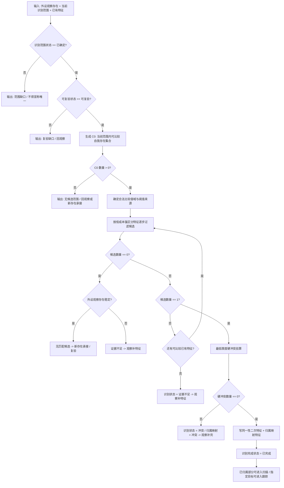

# 识别本能方法唯一性收敛规范 20260607

编号：050006

父级规范：

```text
001 方法动作动态硬规则规范20260512
004 特征值三态比较底层逻辑规范20260518
005 主信息字段与结构新增准入约束规范20260519
011002 二次特征规范20260520
040005 外设观察特征与自我场景认知本能方法分层规范20260525
040007 双目相机外设独占观察线程规范20260527
040008 双目相机外设功能能力与实现途径总结20260527
050 自我所在场景认知工作区规范20260525
050004 观察像素簇与存在候选分层规范20260527
050005 当前场景特征值明确标准规范20260602
```

若本文与父级规范冲突，以上级规范为准。本文只定义 `自我_识别外设观察材料` 类识别本能方法的唯一性收敛原则，不改变外设线程、任务管理线程、提交入口和安全 / 服务评估边界。

## 1. 核心原则

识别的目标不是：

```text
把外设观察存在和自我存在的所有特征都比较完。
```

识别的目标是：

```text
在当前识别范围内确定唯一存在。
```

定案句：

```text
识别不是“把特征比全”，而是“用最少的合法特征把候选压成唯一”；
压不唯一就补观察，压成唯一但冲突就复验。
```

只要某一个特征值，或某一组特征值，能够把候选集合收敛到当前识别范围内唯一一个自我存在，并且最低限度反证检查没有硬冲突，就可以认为识别完成。

## 2. 识别定义

识别定义为：

```text
识别 =
    用外设观察存在的已有特征值，
    在当前识别范围内的自我存在集合中筛选候选，
    当候选数量收敛为 1 且无硬冲突时，
    建立外设观察存在到自我存在的归属映射。
```

识别输出是：

```text
同一性二次特征
归属映射特征
识别状态动态
```

示例：

```text
外设观察存在A_自我存在B.同一性状态 == 同一
外设观察存在A_自我存在B.同一性评分 > 最低同一性评分
外设观察存在A.自我归属状态 == 已归属
外设观察存在A.归属目标 == 自我存在B
外设观察存在A.识别完成状态 == 已完成
```

识别不得直接写：

```text
自我存在B.颜色特征值 = 新颜色
自我存在B.空间坐标 = 新坐标
自我存在B.平面轮廓 = 新轮廓
自我存在B.深度 = 新深度
```

如果识别需要这些新特征，必须回到观察或补观察路径，由合法观察 / 扫描 / 跟踪 / 提交入口生成一阶特征值、事实或动态。识别本身只能读取已有特征并生成同一性、归属和识别状态。

## 3. 当前识别范围

唯一性必须限定范围：

```text
当前识别范围内唯一
```

不得写成：

```text
全世界唯一
```

识别前必须满足：

```text
识别范围状态 == 已确定
```

识别范围可以是：

```text
自我所在场景
当前观察材料集可见范围
当前观察帧 ROI
某个服务目标区域
某个跟踪窗口
某个安全关注区域
```

识别范围必须携带可回查范围句柄或等价引用：

```text
识别范围.来源场景
识别范围.来源观察材料集
识别范围.ROI / 掩码 / AABB / 跟踪窗口，可选
识别范围.有效期
识别范围.候选自我存在集合生成规则
```

没有明确范围时，不得写：

```text
外设观察存在.唯一性状态 == 唯一
外设观察存在.识别完成状态 == 已完成
外设观察存在.归属映射状态 == 已建立
```

## 4. 输入与禁止输入

识别输入只能是已有特征和已确定范围：

```text
外设观察存在
当前识别范围
当前识别范围内自我存在集合
外设观察存在已有特征集合
候选自我存在已有特征集合
同一性比较值域
外设观察存在可复验状态
```

识别不得为了完成识别而即时伪造或补写新的一阶特征。缺特征时，只能输出结构化缺口：

```text
外设观察存在.关键特征补全需求状态 == 待补全
外设观察存在.识别状态 == 证据不足
外设观察存在.补观察原因 == 缺平面轮廓 / 缺掩码 / 缺稳定帧 / 缺候选自我存在特征 / 缺空间范围
```

`补观察原因` 若进入机器决策，应使用枚举、掩码或二次特征值，不得只靠说明性文字。

## 5. 候选集合与唯一性公式

识别必须写成集合过滤，不得写成：

```text
看起来像
```

候选集合定义：

```text
C0 =
    当前识别范围内所有可比较自我存在

对某个特征 f：
    Cf = { e ∈ C0 | 外设观察存在.f 与 e.f 在比较值域内 }

对特征组 F：
    C = C0 ∩ C_f1 ∩ C_f2 ∩ ... ∩ C_fn

若 |C| == 1
    且 硬冲突数量 == 0
则：
    唯一性状态 == 唯一
```

三比较表达：

```text
外设观察存在.唯一候选数量 == 1
外设观察存在.硬冲突数量 == 0
外设观察存在.用于唯一识别特征数量 > 0
```

只有满足上述条件后，才允许写：

```text
外设观察存在.识别完成状态 == 已完成
```

## 6. 单特征唯一与多特征组合唯一

### 6.1 单特征唯一

如果一个合法特征就能在当前识别范围内筛出唯一候选，识别可以完成。

示例：

```text
外设观察存在A.平面轮廓
```

在当前识别范围内只与一个自我存在的平面轮廓值域匹配：

```text
候选数量 == 1
硬冲突数量 == 0
```

则可进入识别完成。

如果平面轮廓已经能唯一，不需要继续比较颜色、空间极值轮廓或局部三维模型。空间范围 / AABB 可作为辅助验算；只有当平面轮廓不唯一、任务需要空间操作，或出现空间硬冲突风险时，才升级为空间主证据。

再例如：

```text
外设观察存在A.特定标记ID == 某值
```

当前识别范围内只有一个自我存在拥有该标记值，也可唯一。

### 6.2 多特征组合唯一

如果一个特征不足以唯一，可以组合多个已有特征。

示例：

```text
平面轮廓相近候选数量 = 2
子轮廓相近候选数量 = 2
空间坐标摘要相近候选数量 = 1
平面轮廓 + 子轮廓 + 空间坐标摘要 的交集候选数量 = 1
硬冲突数量 = 0
```

则识别完成。

可生成二次特征或归属证据：

```text
外设观察存在.最小唯一特征组状态 == 已生成
```

该特征组至少记录：

```text
用于唯一识别的特征类型集合
每个特征的比较结果
候选集合收敛过程
最终唯一候选
硬冲突验算结果
比较值域来源
```

该特征组是识别证据，不是给目标自我存在补写一阶特征值。

## 7. 比较值域与阈值来源

识别使用的比较值域不得凭空产生。来源可以是：

```text
1. 特征类型默认比较值域
2. 当前自我存在的历史稳定值域
3. 当前外设测量不确定度
4. 当前任务容差
5. 外设学习模块给出的稳定获取误差
6. 安全 / 服务需求给出的严格度
```

建议统一由方法或规则生成：

```text
自我_确定识别比较值域
```

输入：

```text
目标特征类型
外设观察存在特征值
候选自我存在历史特征值域
外设测量不确定度
当前任务容差
安全 / 服务约束
```

输出：

```text
特征比较最大允许误差
特征比较最小相似度
特征比较值域来源
特征比较值域可信状态
```

识别方法只能使用这些已经合法产生并可追溯的阈值。

## 8. 候选召回顺序

候选召回应优先使用低成本、强区分的已有特征。推荐顺序：

```text
1. 目标ID / 标记类特征，若存在
2. 平面轮廓
3. 掩码重合
4. 子轮廓
5. 深度摘要 / 空间坐标摘要
6. 颜色特征
7. 空间极值轮廓 / 局部三维模型
```

该顺序不是固定硬编码，可以由历史区分度、计算成本、外设质量和当前任务严格度调整。但调整结果必须留下可解释的选择依据，不能让识别退化为无来源的黑箱匹配。

## 9. 唯一后验算

唯一后不需要把所有特征都比完，但必须做最低限度反证检查。验算不是重新观察，不生成新特征值；验算只使用已有特征判断是否有硬冲突。

最低验算项：

```text
1. 平面轮廓是否严重失配
2. 掩码重合率是否低于硬阈值
3. 平面轮廓点平均误差 / 最大误差是否超过硬阈值
4. 关键类别特征是否互斥
5. 目标自我存在是否同时被另一个外设观察存在强匹配
6. 同一个外设观察存在是否同时强匹配多个自我存在
```

无硬冲突时：

```text
识别完成状态 == 已完成
归属映射状态 == 已建立
```

有硬冲突时：

```text
识别完成状态 == 冲突
归属映射状态 == 冲突
外设观察存在.关键特征补全需求状态 == 待补全
```

然后回到观察补完或复验。

## 10. 冲突类型

至少定义以下冲突：

```text
空间冲突：
    空间中心误差 > 最大允许空间误差
    或 空间范围重合率 < 最低空间范围重合率

掩码冲突：
    掩码重合率 < 最低硬掩码重合率

平面轮廓冲突：
    平面轮廓点平均误差 > 最大允许平均误差
    或 平面轮廓点最大误差 > 最大允许最大误差
    或 综合轮廓匹配评分 < 最低硬轮廓匹配评分

身份冲突：
    一个外设观察存在强匹配多个自我存在
    或 一个自我存在被多个互斥外设观察存在强匹配

值域冲突：
    当前特征值超出目标存在该特征的合法值域
```

输出：

```text
外设观察存在.识别冲突类型 == 平面轮廓冲突 / 空间冲突 / 掩码冲突 / 身份冲突 / 值域冲突
外设观察存在.硬冲突数量 > 0
```

这些状态值必须由量化特征、二次特征或冲突掩码推出，不能只靠文字说明。

## 11. 识别状态分支

候选数量为 0：

```text
外设观察存在.识别状态 == 无匹配候选
```

若外设观察存在稳定且可复验，可进入：

```text
新存在承接 / 观察复验
```

候选数量为 1：

```text
进入硬冲突验算。
```

候选数量大于 1：

```text
继续加入下一类可比较已有特征。
```

没有更多可比较特征且候选数量大于 1：

```text
外设观察存在.识别状态 == 证据不足
外设观察存在.关键特征补全需求状态 == 待补全
```

候选唯一但硬冲突数量大于 0：

```text
外设观察存在.识别状态 == 冲突
外设观察存在.关键特征补全需求状态 == 待补全
```

## 12. 识别完成条件

`识别完成状态 == 已完成` 当且仅当：

```text
识别范围状态 == 已确定
外设观察存在.可复验状态 == 可复验
外设观察存在.候选召回状态 == 已完成
外设观察存在.唯一候选数量 == 1
外设观察存在.硬冲突数量 == 0
外设观察存在.用于唯一识别特征数量 > 0
外设观察存在.归属映射状态 == 已建立
```

可选加强条件：

```text
外设观察存在.同一性评分 > 最低同一性评分
外设观察存在.同一性证据帧数 > 最小证据帧数
```

若某个特征本身强唯一，例如标记ID或空间范围强绑定，可以不要求所有特征多帧齐全，但仍必须满足范围明确、可复验、唯一候选和无硬冲突。

## 13. 对扫描和跟踪的影响

### 13.1 扫描

扫描前置必须是：

```text
外设观察存在.归属映射状态 == 已建立
```

或读取到等价的：

```text
当前观察范围可观测单位到存在映射表状态 == 已建立
```

如果扫描范围内发现：

```text
未归属外设观察存在数量 > 0
```

扫描不得直接生成变化动态。未归属部分必须回识别或补观察；已归属部分可以按范围继续扫描，但结果不得扩大为全范围闭合。

### 13.2 跟踪

跟踪目标必须是：

```text
已唯一识别 / 已归属的存在
```

或至少满足：

```text
跟踪种子.可复验状态 == 可复验
```

如果跟踪过程中候选不再唯一：

```text
目标存在.跟踪状态 == 冲突
目标存在.归属复验状态 == 待复验
```

然后进入识别或补观察。跟踪不能用目标局部稳定替代全场景识别完成。

## 14. 识别因果链

```text
外设观察存在.已有特征集合
    + 当前识别范围内自我存在集合
    + 同一性比较值域
        -> 候选召回集合

某一个或多个特征值筛选候选集合
        -> 候选集合数量

候选集合数量 == 1
    + 硬冲突数量 == 0
        -> 唯一性状态 == 唯一
        -> 同一性状态 == 同一
        -> 归属映射状态 == 已建立

候选集合数量 > 1
        -> 继续使用其它已有特征比较

无更多可用特征
    + 候选数量 > 1
        -> 识别状态 == 证据不足
        -> 进入观察补完

候选数量 == 0
    + 外设观察存在稳定
        -> 无匹配候选
        -> 进入新存在承接 / 复验

候选数量 == 1
    + 硬冲突数量 > 0
        -> 识别状态 == 冲突
        -> 进入观察补完
```

## 15. 识别流程图



## 16. 禁止规则

```text
1. 不得把识别写成全特征比对完成。
2. 不得在识别范围未确定时宣称唯一。
3. 不得把当前范围唯一扩大成全世界唯一。
4. 不得由识别方法直接补写颜色、空间坐标、轮廓、深度等一阶特征值。
5. 不得把候选唯一但硬冲突的结果写成已归属。
6. 不得把候选不唯一写成弱归属或默认归属。
7. 不得把外设报告、ROI、掩码、点集或材料页直接当成自我世界存在真值。
8. 不得把识别完成状态反推成扫描完成、跟踪完成、全场景明确、安全明确、需求满足或安全 / 服务值可结算。
9. 不得只用说明性文字表达冲突、证据不足、阈值来源或候选收敛过程。
10. 不得让控制面板显示结果反写识别结论。
```

## 17. 最终定案

```text
识别以唯一性为核心。
识别不要求比较所有特征；
只要一个特征值或一组特征值能够在当前识别范围内把候选集合收敛为唯一存在，并且验算没有硬冲突，就可以认为识别完成。

如果候选不唯一，则继续使用已有特征缩小候选；
如果已有特征不足以唯一，则进入观察补完；
如果唯一但出现硬冲突，也进入观察补完。
```

一句话：

```text
识别不是“把特征比全”，而是“在确定范围内用合法特征建立唯一归属映射”。
```
