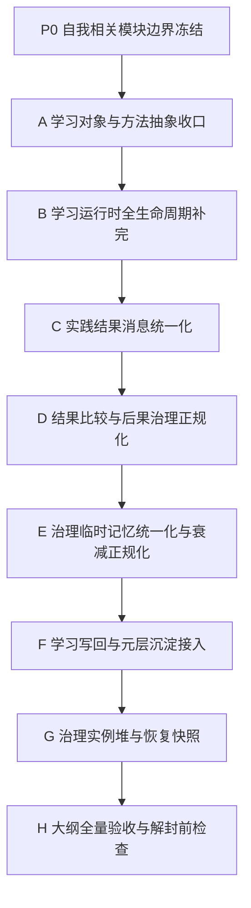

# 20260404 自我最小循环全量落地总计划

## 1. 目标

本计划用于从当前工程基线继续推进，直到 [20260403_自我最小循环实现大纲](D:/鱼巢/计划/20260403_自我最小循环实现大纲.md) 中定义的全部内容都已落到代码、日志和验收口径上。

这份计划不复用旧阶段编号，也不回头重排已经完成的部分；它只回答三件事：

- 从当前状态出发，还剩哪些工作包
- 每个工作包应落在哪个模块
- 何时才算“大纲已全量实现”

自我侧模块边界与细分规则，统一补充按 [20260404_自我相关模块细分与实施收口计划.md](D:/鱼巢/计划/20260404_自我相关模块细分与实施收口计划.md) 执行。

## 2. 计划边界

### 2.1 计划只覆盖什么

- `自我内部循环建设阶段` 内的全部剩余工作
- 与大纲第 `6-16` 节直接相关的承载面、治理链、学习链、结果链、恢复链和验收链
- 当前已明确允许进入主施工面的模块：
  - 自我相关模块（当前以 [自我类.ixx](D:/鱼巢/自我类.ixx) 为总控入口，新增实现统一以 `自我_` 开头）
  - [学习类.ixx](D:/鱼巢/学习类.ixx)
  - [任务类.ixx](D:/鱼巢/任务类.ixx)
  - [任务执行类.ixx](D:/鱼巢/任务执行类.ixx)
  - [方法类.ixx](D:/鱼巢/方法类.ixx)
  - [学习写回模块_v0.ixx](D:/鱼巢/学习写回模块_v0.ixx)
  - [元层核心模块.ixx](D:/鱼巢/元层核心模块.ixx)

### 2.2 计划明确不覆盖什么

- 现在就开放外部输入
- 把前端文本直接送进自我闭环
- UI/宿主交互增强
- 非最小循环所必需的外围扩展

## 3. 当前基线判断

按当前代码与规范对齐，已经具备：

- 主循环骨架
- 根需求、根任务、治理任务锚点
- 一步治理最小返回面
- 执行链挂任务头、步骤、结果与记账
- 学习任务表、就绪队列、等待表的最小运行时
- 学习回流最小链
- 多特征结算与后果回写的最小版
- 学习回流治理临时记忆的短窗口版

按当前规范更新后，必须同时承认以下新收口：

- 正式学习对象直接收口为 `方法`
- `稳定任务路径 / 稳定任务子树 / 因果信息 / 成功执行片段` 都只是 `方法原料`
- 这些原料必须先抽象成 `待学习方法骨架`，再进入学习主链
- `I64` 走值域试探
- `VecIU64` 走相似度比较
- `指针` 不直接学习，必须先转成二次特征

因此，当前并不是“缺一个总计划”，而是需要把剩余工作重新收成一条从当前基线通到大纲终态的连续施工链。

## 4. 全量落地完成定义

只有当以下条件同时满足时，才允许判定“大纲已全量实现”：

1. 大纲第 `6` 节的稳定承载面都已有正式代码落点，而不是只有临时字段。
2. 大纲第 `8` 节的统一主循环顺序已经真实成立，不再靠局部兼容分支撑住。
3. 大纲第 `9` 节的各层职责已能分清，学习、执行、结果、治理不再混层。
4. 大纲第 `10` 节的最小合法去向都能在日志里稳定被证明。
5. 大纲第 `11` 节的学习分流口径已真实落到学习对象、学习调度和学习回流。
6. 大纲第 `12` 节的模块落点已基本收边界，不再继续漂移。
7. 大纲第 `15-16` 节的验收标准与日志验收项全部能被命中。
8. 在上述全部满足前，外部输入仍保持封禁。

## 5. 总体实施原则

### 5.1 先补主链，再补沉淀

顺序固定为：

`学习对象收口 -> 学习运行时补全 -> 结果/后果正规化 -> 治理记忆统一化 -> 学习写回 -> 恢复快照 -> 全量验收`

### 5.2 先收边界，再做增强

优先做：

- 谁负责什么
- 哪些字段是正式承载面
- 哪条消息链是唯一正式入口

后做：

- 更细的优化
- 更丰富的统计
- 更复杂的策略

### 5.3 验证只看日志

当前阶段所有工作包都继续用：

- 编译通过
- 运行日志命中
- 启动后持续存活

作为验收方式，不以交互输入作为前提。

## 6. 剩余工作包总表

后续全部工作收成 `P0 + A-H` 9 个连续工位：

0. `工作包 P0：自我相关模块边界冻结`
1. `工作包 A：学习对象与方法抽象收口`
2. `工作包 B：学习运行时全生命周期补完`
3. `工作包 C：实践结果消息统一化`
4. `工作包 D：结果比较与后果治理正规化`
5. `工作包 E：治理临时记忆统一化与衰减正规化`
6. `工作包 F：学习写回与元层沉淀接入`
7. `工作包 G：治理实例堆与恢复快照`
8. `工作包 H：大纲全量验收与解封前检查`

其中 `A-H` 的业务顺序保持不变，`P0` 只负责冻结模块边界，不引入新的业务逻辑。

这 9 个工位必须按顺序推进；允许局部预埋接口，但不允许跳过前置工作直接推进后置总整合。

## 6.1 工作包 P0：自我相关模块边界冻结

### 6.1.1 目标

在不改动业务主链顺序的前提下，先冻结自我侧模块边界，避免后续新增实现继续默认堆回 [自我类.ixx](D:/鱼巢/自我类.ixx)。

### 6.1.2 模块落点

- [自我类.ixx](D:/鱼巢/自我类.ixx)
  - 只保留主循环总控、线程拥有权、最终去向与自我侧真值拥有权
- 自我相关模块
  - 后续新增实现统一以 `自我_` 开头
  - 细分按 [20260404_自我相关模块细分与实施收口计划.md](D:/鱼巢/计划/20260404_自我相关模块细分与实施收口计划.md) 执行

### 6.1.3 交付物

- `自我类.ixx` 的保留职责表
- `自我_*.ixx` 的新增命名口径
- `A-H` 各包的自我侧主落点表

## 7. 工作包 A：学习对象与方法抽象收口

### 7.1 目标

把当前“学习对象还带有方法原料残留”的状态，收口成：

- 正式学习对象 = `方法`
- 非方法对象 = `方法原料`
- 所有原料必须先走 `方法抽象适配`

### 7.2 对应大纲

- 第 `11` 节 学习分流的最小正式口径
- 第 `12.2 / 12.5` 节 模块落点

### 7.3 模块落点

- [学习类.ixx](D:/鱼巢/学习类.ixx)
  - 收口 `学习目标 -> 直接学习对象 / 方法原料`
  - 禁止原料直接进入学习执行链
- [方法类.ixx](D:/鱼巢/方法类.ixx)
  - 新增 `稳定任务路径 / 稳定任务子树 -> 待学习方法骨架`
  - 为方法条件试探准备统一入口
- `自我_学习承接模块.ixx`
  - 只负责装配学习输入、调用学习结果并做外层承接

### 7.4 交付物

- 方法原料分类入口
- 方法抽象适配入口
- `I64 / VecIU64 / 指针` 三类学习条件口径
- 学习对象不再出现“稳定任务路径/子树直接执行”

### 7.5 日志验收

至少出现：

- `学习对象判定=方法`
- `方法原料抽象开始`
- `待学习方法骨架生成`

## 8. 工作包 B：学习运行时全生命周期补完

### 8.1 目标

把当前“已能入表、已能等待、已能最小桥接”的学习运行时，推进成完整生命周期：

`创建 -> 就绪 -> 排队 -> 执行 -> 等待 -> 唤醒 -> 完成/失败 -> 回流`

### 8.2 对应大纲

- 第 `6.5` 节 学习调度运行时
- 第 `9.5` 节 学习层
- 第 `10` 节 最小合法去向

### 8.3 模块落点

- [学习类.ixx](D:/鱼巢/学习类.ixx)
  - 状态流转规则
  - 唤醒条件
  - 回流消息建议
- `自我_学习承接模块.ixx`
  - 只负责消费学习回流
  - 不再扩写学习业务细则
- [任务类.ixx](D:/鱼巢/任务类.ixx)
  - 继续补稳定事实镜像字段

### 8.4 交付物

- 学习对象缺失时的正式补位
- `等待下一轮调度窗口` 的稳定唤醒链
- 学习执行成功/失败的统一状态归并
- 学习回流消息正式字段齐备

### 8.5 日志验收

至少出现：

- `学习任务入表`
- `学习调度选中`
- `学习执行中`
- `学习等待唤醒`
- `学习完成`
- `学习失败`
- `学习回流结果`

## 9. 工作包 C：实践结果消息统一化

### 9.1 目标

把执行结果、学习结果、回流摘要从分散结构收成统一的最小正式消息面，避免后续结果比较、后果治理和写回各自解释。

### 9.2 对应大纲

- 第 `9.6` 节 结果层
- 第 `6.4` 节 任务事实面

### 9.3 模块落点

- [任务类.ixx](D:/鱼巢/任务类.ixx)
  - 继续承接事实镜像
- [任务执行类.ixx](D:/鱼巢/任务执行类.ixx)
  - 执行器侧统一结果消息
- [学习类.ixx](D:/鱼巢/学习类.ixx)
  - 学习回流统一结果消息
- `自我_结果治理模块.ixx`
  - 统一消费，不直接拼散字符串

### 9.4 交付物

- 最小实践结果消息结构
- 执行结果消息与学习结果消息的共用字段
- 主循环统一消费入口

### 9.5 日志验收

至少出现：

- `实践结果消息`
- `执行结果消息`
- `学习结果消息`
- `主循环统一消费结果消息`

## 10. 工作包 D：结果比较与后果治理正规化

### 10.1 目标

把当前最小版多特征结算正式升级为：

- `逐特征比较`
- `否决项先裁`
- `普通项加权综合`
- `零增量 / 经验项后果 / 禁止项后果` 严格分层

### 10.2 对应大纲

- 第 `9.6` 节 结果层
- 第 `15` 节 最小验收标准

### 10.3 模块落点

- `自我_结果治理模块.ixx`
  - 结果比较
  - 双值结算
  - 后果生成
- `自我_主循环治理模块.ixx`
  - 承接结果比较后的最终治理去向输入
- [任务类.ixx](D:/鱼巢/任务类.ixx)
  - 只补事实镜像

### 10.4 交付物

- 多特征裁决明细
- 否决项命中面
- 普通项综合得分面
- 零增量与后果分层面
- 后果回写面正式化

### 10.5 日志验收

至少出现：

- `多特征裁决明细`
- `否决项命中`
- `零增量`
- `经验项后果`
- `禁止项后果`
- `双值结算摘要`

## 11. 工作包 E：治理临时记忆统一化与衰减正规化

### 11.1 目标

把当前只覆盖“学习回流短窗口”的治理记忆，扩成一套统一治理面临时记忆：

- 最近连续失败
- 最近禁止命中
- 最近学习压力
- 最近重试压力
- 最近风险记忆
- 最近正向推进
- 最近方法谨慎度候选
- 最近普通执行冻结候选
- 最近边界处理优先建议

### 11.2 对应大纲

- 第 `6.3` 节 治理中间态
- 第 `9.3` 节 治理层
- 第 `15-16` 节 验收

### 11.3 模块落点

- `自我_治理记忆模块.ixx`
  - 治理记忆主承载面
  - 衰减与清空规则
- [任务类.ixx](D:/鱼巢/任务类.ixx)
  - 稳定镜像字段

### 11.4 交付物

- 统一治理记忆结构
- 时间衰减规则
- 条件变化后的解除规则
- 治理记忆对下一轮主需求竞争和去向判定的统一影响

### 11.5 日志验收

至少出现：

- `治理记忆更新`
- `治理记忆衰减`
- `治理记忆清理`
- `禁止命中记忆`
- `学习压力更新`
- `风险记忆更新`

## 12. 工作包 F：学习写回与元层沉淀接入

### 12.1 目标

把学习链从“运行时尝试过了”升级成“产生正式写回与沉淀结果”，并仍然回到外层再裁决。

### 12.2 对应大纲

- 第 `9.5` 节 学习层
- 第 `12.6` 节 模块落点

### 12.3 模块落点

- [学习写回模块_v0.ixx](D:/鱼巢/学习写回模块_v0.ixx)
  - 负责写回事务
- [元层核心模块.ixx](D:/鱼巢/元层核心模块.ixx)
  - 负责沉淀承接
- `自我_学习承接模块.ixx`
  - 负责回写桥接、重试与写回后的外层再裁决入口

### 12.4 交付物

- 最小学习写回顺序
- 写回失败摘要与可重试口径
- 写回后回到主循环的正式入口
- 自我侧桥接、重试与元层沉淀日志对齐

### 12.5 日志验收

至少出现：

- `学习写回开始`
- `学习写回成功`
- `学习写回失败摘要`
- `元层沉淀记录`
- `写回后外层重判`

## 13. 工作包 G：治理实例堆与恢复快照

### 13.1 目标

把当前仅能承载当轮的治理上下文，升级为可恢复的最小治理实例面。

### 13.2 对应大纲

- 第 `6.3` 节 治理中间态
- 第 `6.4` 节 任务事实面
- 第 `15` 节 最小验收标准

### 13.3 模块落点

- `自我_恢复快照模块.ixx`
  - 当前治理实例
  - 最近治理实例堆
- [任务类.ixx](D:/鱼巢/任务类.ixx)
  - 恢复所需最小事实镜像
- 宿主侧启动恢复点
  - 只恢复最小治理面，不恢复整个世界

### 13.4 交付物

- 治理实例最小结构
- 历史实例堆
- 启动快照生成与加载
- 重启后最小治理恢复

### 13.5 日志验收

至少出现：

- `治理实例生成`
- `治理实例入堆`
- `恢复快照生成`
- `恢复快照加载`
- `恢复后的治理摘要`

## 14. 工作包 H：大纲全量验收与解封前检查

### 14.1 目标

不是开放外部输入，而是完成“大纲全量实现”的最终核对，并判断是否具备未来讨论解封的资格。

### 14.2 对应大纲

- 第 `4` 节 硬边界
- 第 `13-17` 节 当前阶段、对齐、验收与收口结论

### 14.3 必须核对的项目

1. 稳定承载面是否齐备
2. 主循环统一顺序是否真实成立
3. 学习对象是否已完全收口为方法
4. 学习是否已从正式分流进入、再经正式回流返回
5. 结果与后果是否已严格分层
6. 治理记忆是否可解释、可衰减、可解除
7. 写回与快照是否已接通
8. 日志验收项是否全部命中

### 14.4 当前阶段仍然必须保持

- 外部输入封禁
- 前端输入只记日志
- 不绕过治理中轴

### 14.5 最终验收输出

最终必须形成一份明确结论：

- 哪些大纲章节已经完全落实
- 哪些只是最小版
- 哪些仍是债务
- 是否达到“可讨论解封外部输入”的前置条件

## 15. 工作包之间的依赖关系

## 16. 模块级施工顺序

后续代码施工顺序固定为：

1. [学习类.ixx](D:/鱼巢/学习类.ixx)
2. [方法类.ixx](D:/鱼巢/方法类.ixx)
3. `自我_学习承接模块.ixx`
4. `自我_结果治理模块.ixx`
5. `自我_治理记忆模块.ixx`
6. [任务类.ixx](D:/鱼巢/任务类.ixx)
7. [任务执行类.ixx](D:/鱼巢/任务执行类.ixx)
8. [学习写回模块_v0.ixx](D:/鱼巢/学习写回模块_v0.ixx)
9. [元层核心模块.ixx](D:/鱼巢/元层核心模块.ixx)
10. `自我_恢复快照模块.ixx`
11. [自我类.ixx](D:/鱼巢/自我类.ixx)

原因是：

- 先把学习规则层和方法抽象层收正
- 再把自我侧学习承接、结果治理和治理记忆拆出
- 再让主循环消费这些正式结果
- 最后接沉淀、恢复和总控收口

## 17. 统一删改边界

### 可以继续删或整体替换的内容

- 仍把方法原料直接当学习对象的旧逻辑
- 只服务临时兜底、但阻碍正式学习状态流转的旧桥接
- 分散在局部、未统一进结果消息或治理记忆的旧摘要拼接逻辑

### 当前必须保留并优先复用的内容

- 任务头/步骤/结果节点与执行记账
- 学习任务表/就绪队列/等待表
- 本能函数首次运行建方法首节点的现有能力
- 学习回流最小桥接链
- 当前已存在的根层重判与一步治理返回面
- `自我类.ixx` 作为总控入口和真值拥有权入口

## 18. 每个工作包的最小完成判据

每完成一个工作包，都必须同时满足：

1. 编译通过
2. 运行日志命中该包新增的核心日志族
3. 该包新增能力已能解释“它落在哪个模块、为什么属于这个模块”
4. 未破坏“外部输入封禁”的当前边界

## 19. 最终收口结论

后续全部实现统一按下面这句话收口：

`先把学习、执行、结果、后果、写回、恢复都收成统一治理闭环，再讨论是否让外部输入进入；在这之前，一切工作都服务于把自我最小循环按大纲完整落地。`
