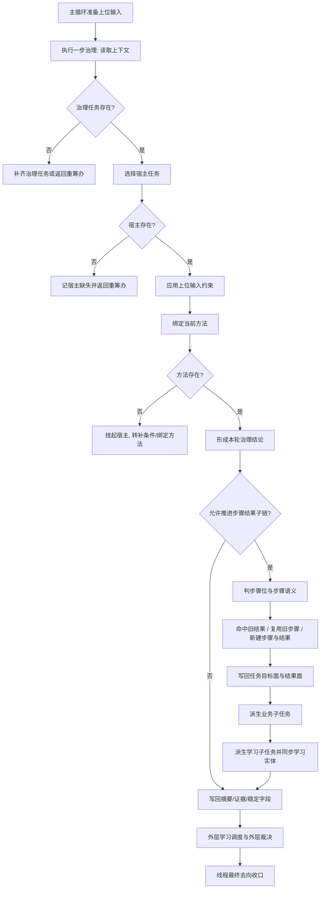

# 任务执行步骤与流程梳理

本文只聚焦用户提到的“执行这一步”。

在当前工程里，`执行` 不是一个单独孤立的黑箱函数，而是下面这条链中的中段承接：

`自我线程主循环 -> 写入上位输入镜像 -> 任务管理任务模块::执行一步治理 -> 步骤/结果子链推进 -> 业务/学习派生与回写 -> 外层再判`

因此，若要理解“执行这一步”，必须同时看：

- 外层在什么前提下放行到执行
- 执行一步治理内部到底做了什么
- 执行之后结果怎样被外层消费

## 1. 当前工程里“执行”的准确定位

当前运行态里，真正持续被调用的不是一个独立的通用 `任务执行器`，而是：

- 外层由 `自我线程类::执行主循环一轮_` 负责根层维护、门控、放行、学习收口
- 中层由 `任务管理任务模块::执行一步治理` 负责当前宿主任务的一步治理推进
- 内层由“步骤节点 / 结果节点 / 业务子任务 / 学习子任务”共同形成当前这一轮的实际执行承接面

所以这里的“执行一步”，更准确地说是：

`针对当前宿主任务，完成一次受上位约束的治理推进，并把推进结果落成步骤链、结果链、子任务链和学习链。`

## 2. 执行入口

当前实际入口在：

- `D:\鱼巢\自我线程类.cpp` 的 `自我线程类::执行主循环一轮_`
- `D:\鱼巢\任务管理任务模块.cpp` 的 `任务管理任务模块::执行一步治理`

执行入口关系可以压成一句话：

`主循环负责决定“这一轮允不允许执行”，任务管理负责决定“这一轮具体执行成什么”。`

## 3. 执行前置流程

在进入 `执行一步治理` 之前，外层主循环先完成以下内容：

1. 补齐初始化与主链回填  
   保证 `自我存在 / 当前主需求 / 当前主任务` 基本可用。

2. 先天维护  
   包括服务衰减、安全回升/回落、风险安全回归等基础运行维护。

3. 根层重判  
   形成当前轮的根层方向判断。

4. 执行前门控  
   形成“允许继续 / 只允许等待 / 禁止继续”这类上位门控结果。

5. 上层反馈摘要生成  
   把本轮上位裁决压缩成可被任务管理消费的摘要文本。

6. 写入上位输入镜像  
   把 `最近根层重判结果 / 最近执行前门控结果 / 最近上层反馈摘要` 写进任务管理可读镜像。

到这里，外层并没有真的“执行任务”，只是完成了：

`把这轮允许执行的边界条件准备好。`

## 4. 执行一步治理的内部流程

`任务管理任务模块::执行一步治理` 是当前工程里最核心的执行承接函数。  
它可以拆成 11 段固定含义。

### 4.1 读取任务管理上下文

首先读取本轮上下文，主要包括：

- 当前主需求
- 当前管理任务
- 当前宿主任务
- 当前方法
- 当前步骤
- 最近结果
- 最近根层重判结果
- 最近执行前门控结果
- 最近上层反馈摘要

这一步的意义是：

`把本轮执行需要消费的旧状态一次性读出来。`

### 4.2 补齐治理任务

如果当前还没有 `任务管理任务`，则先触发自我初始化补齐治理任务。  
如果补齐后仍然没有，就直接返回“治理任务缺失，回到重筹办”。

这里说明：

- 没有治理任务时，本轮不会继续推进业务执行
- 只会落治理证据和稳定字段，作为一次失败受理

### 4.3 选择宿主任务

治理任务存在后，进入宿主选择。

当前代码里的宿主选择总体遵循：

- 优先沿当前宿主任务继续
- 若存在待回接的已完成业务子任务，则优先回接
- 若当前宿主失效，再按锚点规则重选

如果最终没有选出宿主任务，则本轮结论是：

- 功能域：`筹办`
- 缺口：`宿主任务缺失`
- 去向：`回到重筹办`

### 4.4 应用上位输入约束

若上位镜像已经给出强约束，则先消费约束，不再自由扩张。

这一步的本质是：

- 上位允许继续时，才进入普通治理
- 上位要求等待、收束、禁止继续时，本轮执行必须被压缩到受控范围

因此，执行一步治理并不拥有无限自主权，它始终受上一层裁决约束。

### 4.5 绑定当前方法

若未被上位约束截断，则尝试给宿主任务绑定执行方法。

当前路径是：

- 优先复用上下文当前方法
- 否则尝试绑定宿主任务的方法挂点
- 若宿主任务上已有执行方法指针，则同步回上下文
- 若拿到方法，再同步到 `当前主方法`

如果最终没有方法，则不会进入普通执行，而是：

- 把宿主任务推进到 `挂起`
- 当前缺口记为 `方法挂点缺失`
- 下一步去向记为 `绑定方法`

这说明当前工程里“没有方法”并不等于立即失败，而是进入补条件/补方法路径。

### 4.6 形成本轮治理结论

方法、宿主、上位约束都对齐后，本轮开始形成治理结论。

当前主要按宿主任务状态分流：

- 宿主已终结 -> 进入收束
- 宿主运行中且业务子任务已完成 -> 收束
- 宿主运行中且存在待回接业务子任务 -> 保持运行并准备回接
- 宿主运行中且当前应等待 -> 保持等待
- 宿主运行中且仍可继续 -> 保持运行
- 宿主挂起 -> 迁移到运行中
- 宿主未启动/未定义 -> 迁移到运行中

这一段会形成一组关键结论：

- 当前功能域
- 当前缺口类型
- 当前下一步去向
- 当前治理状态迁移
- 当前总控结果
- 当前反馈类型
- 最近反馈摘要

可以理解为：

`先决定这一轮是补、等、回接、推进还是收束。`

### 4.7 推进步骤结果子链

若本轮不是“直接进入收束”，或者虽然要收束但当前属于等待域，则继续推进步骤/结果子链。

这是当前“执行这一步”最像执行器的地方。

它内部又分五个动作。

#### 4.7.1 判当前步骤位

步骤位由 `私有_推导步骤位类型` 决定，当前固定为四类：

- `等待位`
- `补条件位`
- `回接位`
- `执行位`

判定依据是：

- 等待域或去向为保持等待 -> `等待位`
- 方法挂点缺失或去向为绑定方法 -> `补条件位`
- 可从最近结果回接 -> `回接位`
- 其他正常推进 -> `执行位`

#### 4.7.2 判当前步骤语义

步骤语义由 `私有_推导步骤语义类型` 决定，当前固定为：

- `等待维持步骤`
- `回接派生步骤`
- `补条件步骤`
- `业务推进步骤`
- `治理步骤`

其中：

- `执行位` 如果宿主目标结果仍待推进，则记为 `业务推进步骤`
- 否则只记为 `治理步骤`

这说明当前工程把“位”和“语义”拆开了：

- 位决定当前站在链路的什么位置
- 语义决定这一步到底是在等、补、回接，还是做业务推进

#### 4.7.3 处理补条件子任务

在推进步骤结果子链之前，系统会先尝试：

- 创建补条件子任务头
- 或复用已有补条件子任务头

也就是把“当前不能直接干”的缺口，提前结构化为一个子任务分支。

#### 4.7.4 优先命中最近结果或复用当前步骤

当前执行并不是每轮都盲目新建节点，而是优先：

1. 若最近结果节点与本轮治理完全匹配，则直接命中最近结果  
   这表示“本轮只是回接或确认旧结果，不再重复造链”。

2. 若当前步骤节点为空子链且仍归属当前宿主，则复用当前步骤  
   这表示“当前步骤框架还可承接新结果，不必再造新步骤”。

只有在前两者都不成立时，才进入真正的“新建”。

#### 4.7.5 创建治理步骤节点与治理结果节点

如果不能命中旧结果，也不能复用旧步骤，则：

- 创建新的治理步骤节点
- 再在其下创建治理结果节点

因此，当前最小执行建链单元是：

`一个步骤节点 + 一个结果节点`

而不是直接把“执行成功/失败”写成一句摘要。

### 4.8 写回任务目标面、结果面与摘要

步骤/结果链推进后，系统会继续写回：

- 任务目标状态
- 任务结果状态
- 任务双面摘要

如果当前是“待回接业务子任务”场景，还会根据目标差额重新调整治理结论：

- 父任务结果已对齐 -> 进入等待
- 父任务仍有差额 -> 保持运行并继续派生下一段业务

这一步的意义是：

`把链上的结构推进，转成任务层面的状态与结果语义。`

### 4.9 派生业务子任务

当父任务仍有目标差额待推进时，当前治理会尝试：

- 创建业务子任务头
- 或复用已有业务子任务头

这一步说明当前工程的执行不是“一次把宿主做完”，而是允许：

`父任务 -> 派生更细一层业务子任务 -> 回接父任务继续推进`

### 4.10 派生学习子任务并同步学习实体

在业务治理之后，当前执行链还会顺手把学习承接补齐：

- 创建或复用学习子任务头
- 写回学习方法骨架
- 同步学习任务实体
- 写回待学习方法数量、待学习摘要等字段

也就是说，当前执行一步不仅推进业务，还同时生成：

`对这一步怎么学、之后学什么` 的候选材料。

### 4.11 写回稳定字段、治理证据与缓存

在函数尾部，还会继续落以下内容：

- 治理稳定字段
- 治理证据
- 最近治理结果缓存
- 本轮摘要

因此 `执行一步治理` 的最终产物不是单一返回值，而是一整套：

- 结构节点变化
- 状态变化
- 证据变化
- 摘要变化
- 缓存变化

同时它的布尔返回值也不是“任务是否完成”，而是：

`这一轮是否实际发生了有意义的治理推进或写回。`

## 5. “执行这一步”之后，外层还会做什么

任务管理返回后，外层主循环不会立刻把它当作终局结果，而是继续做三件事。

### 5.1 学习调度

外层先读取学习调度快照，统计：

- 学习任务总数
- 就绪数
- 等待数
- 执行中数

如果有可执行学习任务，就挑一条执行一步学习任务。

### 5.2 学习外层裁决

对于已经提交但仍待外层裁决的学习结果，外层还会按：

- 根层重判结果
- 执行前门控结果
- 综合分
- 当前影响面

决定：

- 挂起观察
- 驳回退回
- 正式消费

### 5.3 最终去向收口

外层最后根据本轮治理结果与学习结果，决定线程最终去向，例如：

- 继续提交
- 进入等待
- 回到重筹办
- 转入学习
- 停止退出

所以当前系统里“执行完一步”并不代表线程就结束，而只是：

`完成了一次可被外层再次重判的中间推进。`

## 6. 当前“执行一步”的最小流程图

## 7. 当前执行链的四个关键认识

### 7.1 当前执行不是“直接动作调用”

它首先是治理推进，其次才是业务动作承接。  
当前代码最先推进的是结构链和状态面，而不是某个单独动作函数。

### 7.2 当前执行是“受上位约束的局部执行”

执行一步治理不会绕开根层门控，它只能在外层已经放行的边界内推进。

### 7.3 当前执行天然带有“补条件、回接、等待”三种非直接动作路径

所以“执行”不等于“立刻做动作”。  
在很多轮里，执行真正做的是：

- 补方法
- 建等待位
- 回接父任务结果
- 生成补条件子任务

### 7.4 当前执行已经和学习链耦合

这一步结束时，不仅有业务推进结果，还有学习子任务和学习方法骨架的同步结果。  
因此后续如果要重构执行器，必须把学习承接从“顺手写回”升级为显式阶段。

## 8. 后续详细设计建议

如果后面继续细化，“执行这一步”建议再拆成三个独立设计面：

1. `执行前放行面`  
   只管上位输入、门控、宿主锚点。

2. `执行中建链面`  
   只管步骤位、步骤语义、结果位、复用/新建规则。

3. `执行后收口面`  
   只管目标差额回写、业务派生、学习派生、证据与缓存。

这样后续无论是接真正的通用执行器，还是把学习链独立出去，都更容易稳定收口。

## 9. 一句话总结

当前工程里的“执行这一步”，本质上不是“调一次方法”，而是：

`在上位允许的前提下，为当前宿主任务完成一次治理判定、步骤建链、结果落点、子任务派生和学习承接。`
