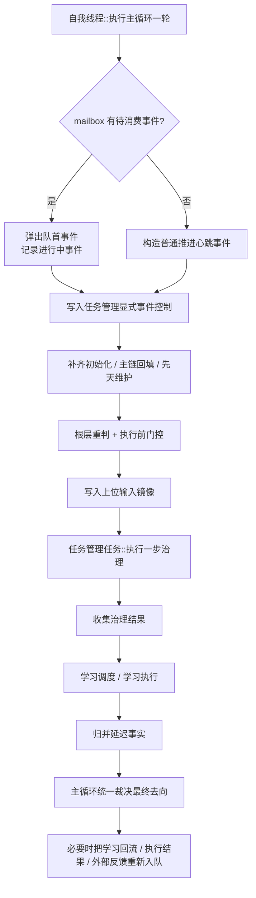
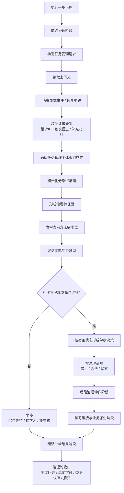
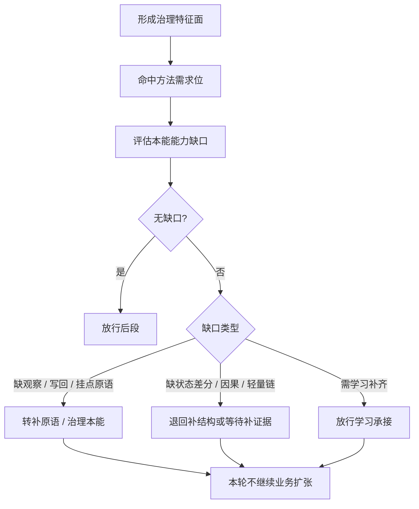
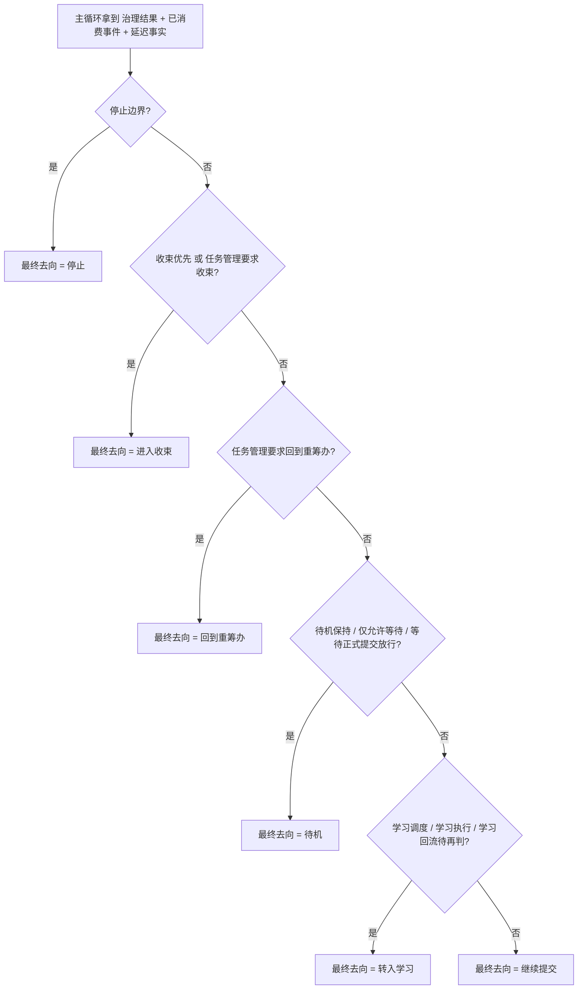

# 任务管理任务流程图

本文按当前代码实现，整理 `任务管理任务` 在主循环中的实际执行流程，作为 [`任务管理任务详细设计.md`](./任务管理任务详细设计.md) 的配套流程图文档。

代码对应入口：

- [`D:\鱼巢\自我线程类.cpp`](D:/鱼巢/自我线程类.cpp)
- [`D:\鱼巢\任务管理任务模块.cpp`](D:/鱼巢/任务管理任务模块.cpp)
- [`D:\鱼巢\任务管理任务模块.h`](D:/鱼巢/任务管理任务模块.h)

## 1. 主循环到任务管理任务

关键入口：

- `自我线程类::执行主循环一轮_`
- `任务管理任务模块::执行一步治理`

说明：

- `mailbox` 为空时，不会停机，而是退化为一次 `普通推进` 心跳。
- 即使是 `恢复重建`，也先回到主循环，再进入 `任务管理任务` 的单步治理。
- `最终去向` 不在 `任务管理任务` 内部拍板，而在主循环里统一裁决。

## 2. 任务管理任务一步治理

关键入口：

- `任务管理任务模块::执行一步治理`
- `私有_M9_执行前段治理阶段`
- `私有_M9_执行后段治理动作阶段`
- `私有_M9_执行学习承接与业务派生阶段`
- `私有_M2_组装一步结果阶段`

说明：

- `任务管理任务` 每轮只围绕一个宿主推进一步。
- 桥接补层不允许继续时，本轮会早停，但仍然会进入统一收口。
- 收口阶段会同步：`一步结果`、`稳定字段`、`主体回并摘要`、`恢复快照`。

## 3. 桥接补层

关键入口：

- `私有_形成治理特征面`
- `私有_命中方法需求位`
- `私有_评估本能能力缺口`
- `私有_桥接补层裁决`

说明：

- 当前最小原语固定为 6 个，桥接层消费的是：
  - `方法需求位`
  - `本能能力缺口`
  - `最小原语位图`
  - `主观察特征`
- 桥接字段是治理证据和承接锚点，不等于最终裁决真值。

## 4. 主循环最终去向裁决

关键入口：

- `私有_裁决主循环最终去向`

说明：

- `任务管理任务` 可以给出 `当前下一步去向`，但不能直接替代主循环拍板。
- `延迟事实` 与 `显式事件` 会一起进入最终去向裁决。
- `等待正式提交放行` 会直接把最终去向压到 `待机`。

## 5. 当前代码分层

按当前实现，可以把任务管理相关流程分成 4 层：

1. `事件入口层`
   mailbox、恢复重建、普通心跳
2. `一步治理层`
   请求、单步决策、写回结果、一步结果
3. `桥接裁决层`
   方法需求位、本能能力缺口、最小原语、桥接补层裁决
4. `主循环裁决层`
   延迟事实归并、最终去向统一裁决

## 6. 当前收口结论

当前代码已经形成下面这条稳定主链：

`mailbox/恢复重建/普通心跳`
-> `主循环重判`
-> `任务管理任务单步治理`
-> `学习与回流`
-> `延迟事实归并`
-> `主循环统一裁决最终去向`

这意味着：

- `任务管理任务` 已经不是单纯的大函数，而是显式阶段链。
- `mailbox` 已经成为真实事件入口，而不是纯摘要概念。
- `最终去向` 仍然保持在主循环统一裁决，没有下沉到任务管理内部。
