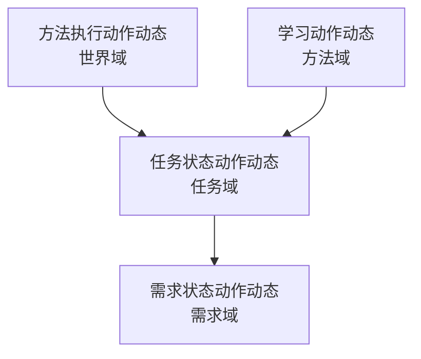

# 动作动态统一因果账本详细设计 20260512

对应规范：`规范/动作动态即因果账本规范20260512.md`

## 1. 设计目标

把“因果信息”统一收口到现有动作动态体系：

```text
不新增任务完成因果记录。
不新增需求满足因果记录。
不新增世界事实因果记录。
真实提交变化的域生成自己的动作动态。
动作动态之间用来源特征串成因果链。
```

本设计只定义落点、函数边界和实施顺序；具体代码实现必须按本文件执行。

## 2. 现有代码基线

### 2.1 世界域标准样式

现有标准入口：

```cpp
自我动作实现模块.ixx
inline 动态节点类* 输出动作动态(...)
```

该函数以：

```text
场景
特征
来源方法
动作名
成功 / 失败
动作相位
输入参数场景
输出结果场景
```

调用：

```cpp
世界树.动态().创建方法动作动态(...)
```

这是世界域动作动态的标准样式，后续任务域 / 需求域 / 方法域应尽量复用同一创建通道。

### 2.2 任务域真实提交点

现有真实任务状态提交点：

```cpp
任务模块.管理界面线程.impl.cpp
私有_应用工作结果到任务壳(...)
```

它当前负责：

```text
读取工作结果治理状态；
调用 任务类::应用任务状态；
同步任务运行镜像；
同步当前方法和候选方法。
```

因此任务状态动作动态必须在这里生成。

### 2.3 需求域真实提交点

自我线程中需求回写和治理变化落账相关入口包括：

```cpp
自我线程模块.impl.cpp
私有_按成功结果满足来源需求并唤醒父任务_任务管理新链(...)
私有_落单个治理变化到自我内部世界(...)
私有_创建治理摘要动态(...)
```

后续应把 `私有_创建治理摘要动态` 的语义收口为：

```text
输出自我治理动作动态
```

不再作为“因果摘要”或“观测摘要”解释。

## 3. 总体结构



动作动态链字段：

```text
来源动作动态
上游动作动态
满足证据动态
触发任务
来源需求
来源运行存在
来源输出结果场景
```

这些是特征入口，不是新结构。

## 4. 任务域详细设计

### 4.1 新增函数

```cpp
动态节点类* 输出任务状态动作动态(
    任务节点* 任务,
    枚举_任务状态 旧状态,
    枚举_任务状态 新状态,
    const 任务管理线程协议::结构_任务工作结果& 工作结果,
    场景节点类* 请求场景,
    时间戳 now) noexcept;
```

函数级注释必须说明：

```text
1. 本函数属于任务域。
2. 只在任务管理界面线程提交任务状态后调用。
3. 只记录任务状态变化动作动态。
4. 不写需求树，不写世界事实，不写方法虚拟存在。
5. 来源动作动态优先来自工作结果中的当前方法运行存在 / 输出结果场景。
```

### 4.2 任务状态动作动态生成流程

在 `私有_应用工作结果到任务壳(...)` 中：

```cpp
const auto 旧状态 = 任务类::读取任务状态(任务);

任务类::应用任务状态(任务, 新状态, now);

const auto 新状态 = 任务类::读取任务状态(任务);

if (旧状态 != 新状态) {
    auto* 动态 = 输出任务状态动作动态(
        任务,
        旧状态,
        新状态,
        工作结果,
        请求场景,
        now);

    写入任务最近动作动态(任务, 动态, now);
}
```

### 4.3 任务域动态主体和特征

```text
动态主体 = 任务信息节点或任务虚拟存在
动态特征 = 任务状态
来源动作 = 任务状态提交方法 / 治理动作方法
输入场景 = 请求场景或工作包输入场景
输出场景 = 任务状态提交结果场景
```

第一版允许使用任务信息节点作为动态主体；若动态系统要求基础信息节点，应使用任务虚拟存在作为主体。

### 4.4 任务状态提交方法

推荐新增或确保一个方法头：

```text
自我_任务状态提交
```

它不是任务执行方法，而是任务管理界面线程提交任务状态的治理动作身份。

若当前本能方法枚举暂不宜新增，第一版可以复用“任务管理状态提交”语素入口创建方法头，但不得新增独立因果结构。

## 5. 需求域详细设计

### 5.1 新增函数

```cpp
动态节点类* 输出需求状态动作动态(
    需求节点* 来源需求,
    状态节点类* 旧当前状态,
    状态节点类* 新当前状态,
    const 结构_任务管理结果状态消息& 结果消息,
    动态节点类* 来源任务状态动态,
    场景节点类* 自我内部世界,
    时间戳 now) noexcept;
```

函数级注释必须说明：

```text
1. 本函数属于需求域。
2. 只在自我线程真实回写需求状态 / 当前状态后调用。
3. 不写任务状态，不写世界事实。
4. 动作动态记录需求的被需求当前状态变化。
5. 来源动作动态指向任务状态动作动态或世界事实动作动态。
```

### 5.2 需求满足回写流程

在需求回写函数中：

```cpp
auto* 旧当前状态 = 来源需求->主信息.被需求当前状态.指针;

来源需求->主信息.被需求当前状态 = 来源需求->主信息.需求状态;

auto* 新当前状态 = 来源需求->主信息.被需求当前状态.指针;

if (旧当前状态 != 新当前状态) {
    输出需求状态动作动态(...);
}
```

### 5.3 需求域动态主体和特征

```text
动态主体 = 需求节点
动态特征 = 被需求当前状态
来源动作 = 需求回写 / 需求满足提交方法
输入场景 = 任务结果回执镜像场景
输出场景 = 需求回写结果场景
```

## 6. 世界域详细设计

世界域保持现有执行方法生成动作动态的口径：

```cpp
自我动作实现模块.ixx
输出动作动态(...)
输出变化执行(...)
```

世界域动作动态不由任务管理界面线程补写。

任务管理界面线程只可以读取世界域动作动态作为：

```text
任务状态动作动态.来源动作动态
```

## 7. 方法域详细设计

方法学习或方法管理提交以下变化时生成方法域动作动态：

```text
方法状态变化
条件结果对新增 / 更新
候选动作节点新增
候选实参表更新
方法运行账状态更新
```

建议新增函数：

```cpp
动态节点类* 输出方法状态动作动态(
    方法类::节点类* 方法首节点,
    存在节点类* 方法虚拟存在,
    const 语素入口节点类* 方法状态特征,
    I64 旧值,
    I64 新值,
    场景节点类* 输入参数场景,
    场景节点类* 输出结果场景,
    时间戳 now) noexcept;
```

函数级注释必须说明：

```text
1. 本函数属于方法域。
2. 只记录方法虚拟存在或方法结构变化。
3. 不写任务状态，不写需求树。
4. 来源动作动态来自学习方法运行存在。
```

## 8. 特征入口

第一版新增或确保以下抽象特征：

```text
动作动态
来源动作动态
上游动作动态
满足证据动态
触发任务
来源需求
来源运行存在
来源输出结果场景
最近动作动态
任务状态动作动态
需求状态动作动态
方法状态动作动态
世界事实动作动态
```

这些均为特征入口；值为存在或基础信息节点时，使用 `特征值::指针句柄`。

## 9. 上行消息扩展

任务管理线程上行消息建议补充：

```text
任务状态动作动态指针
任务状态动作动态主键
世界事实动作动态指针
世界事实动作动态主键
当前方法运行存在指针
输出结果场景指针
来源需求主键
```

如果协议暂不扩展，则第一版可先把动作动态写入任务虚拟存在，供自我线程按任务主键反查。

## 10. 实施注意

```text
1. 不能新增“因果记录”结构。
2. 不能把任务状态写入输出结果场景。
3. 不能由工作线程生成已提交任务状态动作动态。
4. 每个新增 / 修改函数都要有函数级注释。
5. 动作动态创建失败应记录日志；任务 / 需求状态提交不因动态记录失败自动回滚。
```

## 11. 验收

静态验收：

```powershell
rg -n "因果记录|任务完成因果|需求满足因果|世界事实因果" -g"*.cpp" -g"*.ixx" -g"*.h"
```

不应出现新增实现。

构建验收：

```powershell
msbuild "D:\鱼巢\鱼巢.vcxproj" /p:Configuration=Debug /p:Platform=x64 /p:LinkIncremental=false /m
```

行为验收：

```text
1. 世界特征变化生成世界域动作动态。
2. 任务状态变化生成任务域动作动态。
3. 需求当前状态回写生成需求域动作动态。
4. 动作动态之间能通过来源动作动态串链。
5. 无任何新增因果记录结构。
```
