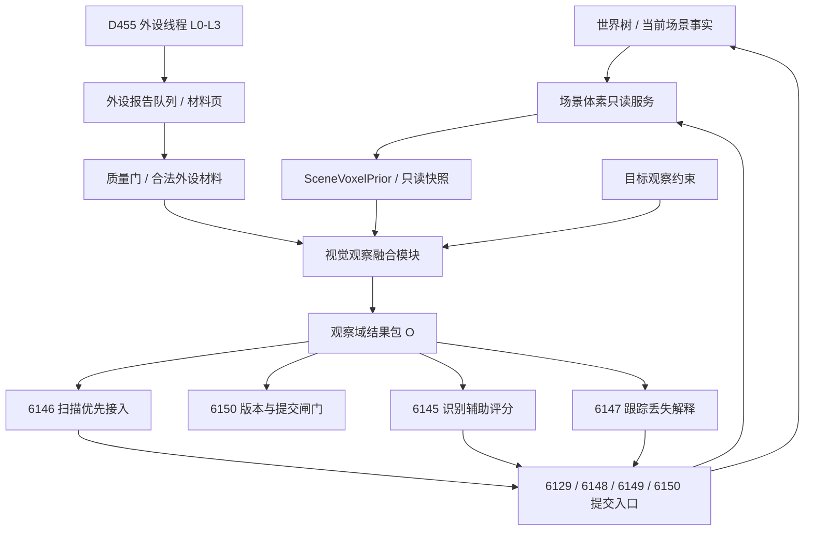

# 视觉系统鱼巢实现方案

文档状态：可行性已核验；可进入规范准入和小切片计划；尚未进入代码实施

生成日期：2026-06-25

核验日期：2026-06-25

## 0. 可行性核验结论

结论：

```text
方案可行，但必须按“先规范准入、再同步只读服务、再合法材料融合、最后业务链接入”的顺序执行。
当前不能直接线程化，也不能直接让 6145 / 6146 / 6147 / 6150 把场景体素先验当事实来源。
```

可行依据：

```text
1. 外设侧已有 D455 采集、外设观察报告队列、目标观察约束、逐簇识别 / 扫描变化 / 跟踪三类报告。
2. 自我侧已有 6145 识别、6146 扫描、6147 跟踪、6129 / 6148 / 6149 / 6150 等提交入口。
3. 扫描链已有 `结构_已合法外设数据项`、`结构_扫描关注集合`、质量门、缺口记录和项目结构写入痕迹。
4. 场景 / 存在 / 特征类已有只读基础：枚举场景子存在、读取存在场景绝对坐标、读取三维体素特征值、局部体素与体素链只读比较。
5. 上级规范允许外设内部使用工程视觉技术，也允许自我侧把观察材料组织成候选、缺口、状态和提交事实。
```

硬约束：

```text
1. 场景体素服务只能发布只读先验，不写世界树事实、不写需求满足、不生成方法动作动态。
2. 视觉融合层只能生成观察域候选、评分、遮挡 / 视野外 / 深度缺失 / 自由空间冲突解释和信息缺口。
3. 先验只能帮助看，不能替代看；先验匹配高不得直接合并存在，先验未命中不得直接判定消失。
4. 6145 / 6146 / 6147 的正式输入必须经过现有外设材料质量门和合法材料承接，不能绕过为“直接消费原始报告”。
5. 机器判断字段必须使用 I64、枚举、VecU 句柄、指针句柄和项目特征结构；字符串只允许作材料句柄、主键、日志或显示文本。
6. 当前工作区 `鱼巢.vcxproj`、filters 和若干 P13b 文件存在未归属脏改；第一轮计划不得强行修改这些文件。
```

可行性分级：

| 项 | 结论 | 边界 |
| --- | --- | --- |
| 规范可行性 | 可行 | 需要新增或修订“场景体素服务与视觉先验融合”口径，并挂入规范目录或明确从属既有规范。 |
| 技术可行性 | 可行 | 第一版复用已有 VecU / VecIU64 体素链和只读比较，不引入 SLAM / TSDF / OctoMap 等新技术主链。 |
| 接入可行性 | 有条件可行 | 先接 6146 扫描解释，再接提交入口版本闸门，最后扩展 6145 / 6147。 |
| 验证可行性 | 有条件可行 | 编译可先验证；业务通过必须等真实 D455 / 自然任务链材料，不能用模拟入口或伪造样本证明。 |

## 1. 目标

本文根据当前已形成的视觉系统口径，并对照 `D:\鱼巢` 当前代码现状，制定一份面向鱼巢工程落地的实施方案。

目标不是另起一套视觉系统，而是在鱼巢现有链路上补齐：

```text
当前场景事实 / 已确认存在
    -> 场景体素只读服务维护当前空间心像
    -> 发布 SceneVoxelPrior / 视野投影解释包
    -> 观察方法承接后的合法外设材料进入视觉融合层
    -> 融合层生成观察候选、遮挡候选、冲突候选和信息缺口
    -> 自我侧 6145 / 6146 / 6147 读取融合证据
    -> 6129 / 6148 / 6149 / 6150 等提交入口裁决
    -> 更新当前场景存在信息
    -> 触发下一轮场景体素只读快照更新
```

本文只制定方案，不修改 `D:\鱼巢` 代码。进入实现前，仍需按鱼巢工程流转补齐规范、详细设计、计划、实施记录和回归证据。

## 2. 当前鱼巢代码现状

### 2.1 已具备的能力

| 代码路径 | 当前能力 | 对本方案的意义 |
| --- | --- | --- |
| `D455相机类.ixx`、`D455相机类.cpp` | D455 RealSense 采集、配置、深度和彩色帧、轮廓提取 | 已有 L0/L1 原始帧和基础分割入口，不需要从驱动层重写 |
| `外设线程_D455深度相机.ixx` | 独立 D455 外设线程，发布逐簇识别报告、稳定子集报告、扫描变化报告、跟踪报告 | 已有 L0-L3 外设侧稳定供料线程，应保留外设边界 |
| `外设观察报告队列.ixx` | 三类外设观察报告、等待项、目标观察约束、质量判定、D455短期材料页 | 可作为视觉融合层的材料来源索引，但报告本身不是正式世界事实 |
| `自我动作实现.外设模块.ixx` | 6145、6147、6129、6148、6149、6150 等自我侧承接与提交入口 | 融合结果应接入这些方法和提交入口，不得绕过 |
| `自我动作实现.扫描.ixx` | 6146 扫描已有扫描关注集合、已合法外设数据项、未覆盖解释和缺口写入 | 场景体素先验可优先增强扫描关注集合和未覆盖解释 |
| `任务模块.筹办.ixx`、`任务模块.执行.ixx` | 本能方法候选召回、执行桥、方法调用后动作动态创建 | 新增可调用方法必须走任务链；服务线程不能冒充动作动态来源 |
| `特征类.h/.cpp` | VecU / VecIU64 体素链、三维体素融合、局部体素与稳定体素链只读比较 | 场景体素第一版可复用现有稳定存在体素表示和只读比较函数 |
| `场景类.h/.cpp` | 枚举场景子存在、按深度或彩图轮廓查找存在 | 场景体素服务可从当前场景子存在抽取输入 |
| `存在类.h/.cpp` | 读取存在场景绝对坐标、最近观测缓存、内部世界绑定 | 场景体素可用已确认存在坐标生成空间先验 |
| `动态类.*`、`因果类.*` | 动态读取、因果生成、动作结果因果证据验收 | 融合层裁决结果必须经方法动作动态或提交入口沉淀 |

### 2.2 当前缺口

鱼巢已有外设供料和自我侧裁决链，但还没有完整的“场景体素先验视觉闭环”：

```text
1. 没有独立的场景体素只读服务 / 场景心像缓存。
2. 没有只读场景体素快照、版本号、坐标系版本和快照句柄。
3. 没有正式的 SceneVoxelPrior / 视野投影解释包结构。
4. 没有视觉融合模块把“合法外设材料 + 目标观察约束 + 场景体素先验”合成观察域结果包。
5. 6145 / 6146 / 6147 当前尚未读取场景体素先验；其中 6146 已有最适合先接入的合法外设数据项和扫描关注集合。
6. 6150 等提交入口尚未校验观察域结果包使用的场景体素版本是否仍可接受。
7. 场景体素特征类型、先验版本特征、遮挡解释状态、自由空间冲突状态等还没有统一特征绑定表。
8. D455 坐标系到当前场景坐标系的位姿 / 外参版本关系仍需真实材料核验；不能只凭单帧体素比较宣称对齐已解决。
```

### 2.3 当前工作区风险

读取时 `D:\鱼巢` 已有未归属脏改：

```text
全局共享函数类.ixx
线程生命周期消息模块.ixx
控制面板.html
鱼巢.vcxproj
鱼巢.vcxproj.filters
```

因此，真正实施时不能直接覆盖项目文件和 filters。新增模块接入 `鱼巢.vcxproj` 前，应先确认这些脏改归属，或选择不需要修改项目文件的文档 / 预研切片。

## 3. 权威边界

### 3.1 外设 / 中间层 / 自我侧分工

```text
外设侧：
    采集、稳定化、跨帧关联、生成报告和材料页。

视觉融合层：
    读取合法外设材料和只读先验，生成候选、评分、解释和缺口。

自我方法：
    识别返回已有存在指针或空指针；
    扫描维护已确认存在当前状态和值；
    跟踪返回新空间坐标或空信息。

提交入口：
    裁决是否入世界树、场景、存在、特征和值结构。
```

禁止：

```text
外设线程直接写世界树事实；
视觉融合层直接确认存在；
场景体素先验直接删除或否定存在；
报告、队列项、材料页或控制面板显示直接作为事实主体；
字符串状态、原因摘要或日志文案参与机器判断。
```

### 3.2 合法材料链路

后续实现不得写成：

```text
6145 / 6146 / 6147 直接消费原始 D455 报告。
```

正式链路应写成：

```text
D455 报告 / 材料页
    -> 质量门和可回查检查
    -> 观察方法承接后的合法外设材料 / 已合法外设数据项
    -> 视觉融合层读取合法材料 + SceneVoxelPrior
    -> 运行存在 / 输出结果场景记录 I64、VecU、指针句柄证据
    -> 6145 / 6146 / 6147 / 6150 按各自语义消费
```

## 4. 目标架构



建议新增两个工程模块：

```text
1. 场景体素模块.ixx
   负责场景体素缓存、只读快照、先验包、查询和同步维护服务。

2. 视觉观察融合模块.ixx
   负责读取合法外设材料、目标观察约束和场景体素先验，
   生成观察域结果包、候选评分、遮挡解释、自由空间冲突和信息缺口。
```

第一版不要把融合逻辑塞回 D455 外设线程。D455 外设线程仍按规范只负责外设侧稳定供料，融合层属于自我观察域承接基础设施。

## 5. 项目结构映射表

按 `规范/禁止性规范20260611.md` 和 `规范/主信息字段与结构新增准入约束规范20260519.md`，进入实现前必须明确业务概念如何落到项目结构。

| 业务概念 | 项目承载结构 | 值类型 | 写入方 | 读取方 | 验证方式 |
| --- | --- | --- | --- | --- | --- |
| 场景体素缓存 | 运行期 `场景体素缓存类`，只读快照版本写入运行存在或输出结果场景 | C++结构 + I64版本 + 指针句柄 | 场景体素服务 | 视觉融合模块、扫描、显示 | 快照版本递增；下游不持有可写引用 |
| SceneVoxelPrior | `结构_场景体素先验包`，摘要写为 I64 / VecU / 指针句柄证据 | I64、VecU句柄、指针句柄 | 场景体素服务 | 视觉融合模块 | `只读状态=1`，版本和坐标系版本可读 |
| 当前场景已确认存在集合 | 场景子存在、存在坐标特征、稳定体素特征 | 存在指针、I64坐标、VecU句柄 | 提交入口、存在类、场景类 | 场景体素服务 | 从 `场景类::获取子存在` / `存在类::读取存在场景绝对坐标` 只读取得 |
| 稳定存在体素模型 | 存在子特征上的三维体素特征 | VecU句柄 / VecIU64 | 合法观察 / 提交 / 特征类 | 场景体素服务、匹配函数 | `特征类::读取三维体素特征值` 可读 |
| 合法外设材料 | 观察方法承接后的合法材料；6146 中为 `结构_已合法外设数据项` | I64、枚举、材料句柄、空间 AABB | 外设报告队列 / 观察承接方法 / 扫描展开函数 | 视觉融合模块、6146 | 质量门、TTL、坐标系、可回查和可比较状态成立 |
| 观察域结果包 O | 运行期结构；必要证据写到运行存在 / 输出结果场景子节点 | I64、枚举、VecU、指针句柄 | 视觉融合模块；自我方法负责落项目结构证据 | 6145/6146/6147/6150 | 输出场景中候选数量、版本、来源报告ID、状态可读 |
| 先验匹配评分 | 候选节点或运行存在特征 | I64 Q10000 | 视觉融合模块 / 自我方法证据写入 | 6145/6146/6150 | 命中率、深度一致、重叠率均为 I64 |
| 遮挡 / 视野外 / 深度缺失解释 | 候选节点、扫描未覆盖解释记录或输出场景缺口 | I64枚举 + I64计数 | 视觉融合模块、扫描方法 | 6146、提交入口 | 不直接生成消失事实；解释状态和数量可读 |
| 自由空间冲突 | 冲突候选或输出场景缺口记录 | I64枚举 + I64计数 | 视觉融合模块 | 自我侧复验、扫描、提交入口 | 冲突不直接删除存在，只生成候选和缺口 |
| 新占据候选 | 观察候选存在或输出场景候选记录 | 存在节点 + I64状态 + VecU/材料句柄 | 视觉融合模块 / 6145 / 6129 | 6145、提交入口 | 仍需识别和提交入口裁决 |
| 先验版本可接受状态 | 运行存在 / 输出结果场景特征 | I64枚举 | 视觉融合模块或提交入口 | 6150、扫描、识别 | 过旧时降权、需复验或结构化缺口，不入账 |
| 场景体素更新事件 | 服务内部事件队列；必要时写运行期状态 | I64事件类型、指针句柄 | 提交入口、场景切换、位姿更新 | 场景体素服务 | 事件不会直接写世界树事实 |

## 6. 实施路线

### 阶段 S0：规范和计划准入

本阶段只确定权威口径，不改业务代码。

需要完成：

```text
1. 新增或修订规范：
   优先新增 050 下级“场景体素服务与视觉先验融合规范”，或明确作为 050 / 040011 的下级解释。

2. 更新详细设计：
   本文件作为工程落地详细设计；若新增规范，应回写上级规范、相关计划、相关代码和回归边界。

3. 新增实施计划：
   计划/20260625_场景体素视觉先验融合实现计划_v0.1.md。

4. 更新工程图谱：
   docs/工程图谱/02_外设观察事实图谱.md
   docs/工程图谱/08_事实来源与写入权限图谱.md
   docs/工程图谱/05_规则原子索引.md
```

准入失败条件：

```text
规范目录未挂载的新规范不得直接作为核心代码依据；
计划要求保留兼容路径、fallback、新旧字段双写或用字符串状态承载机器判断时，不得进入代码。
```

### 阶段 S1：场景体素服务同步版

目标：先落同步只读服务，不启线程。

新增：

```text
场景体素模块.ixx
```

第一版只实现：

```text
1. 场景体素缓存类
2. 稀疏 Chunk 或等价稀疏索引
3. 场景点 <-> 体素索引
4. 当前场景子存在 AABB 粗投影
5. 稳定存在体素 VecU 句柄读取
6. 场景边界占据写入到运行期缓存
7. 只读快照发布
8. 点查询 / AABB统计 / 射线查询
9. 生成 SceneVoxelPrior 摘要
```

输入来源优先复用：

```text
场景类::获取子存在
存在类::读取存在场景绝对坐标
特征类::读取三维体素特征值
特征类::比较局部三维体素与三维体素链
```

禁止：

```text
场景体素服务直接写世界树事实；
场景体素服务直接写需求满足；
场景体素服务把先验占据当成确认存在；
通过读取路径隐式创建场景、存在或特征结构。
```

### 阶段 S2：视觉融合结果结构

新增：

```text
视觉观察融合模块.ixx
```

最小输入：

```text
合法外设材料 / 已合法外设数据项
结构_目标观察约束特征组，可选
结构_场景体素先验包
```

最小输出：

```text
结构_视觉观察域结果包
结构_视觉观察候选
结构_视觉先验匹配评分
结构_视觉遮挡候选
结构_视觉自由空间冲突候选
结构_视觉信息缺口
```

第一版不要做复杂图像重分割。先基于已有外设簇、合法外设数据项、场景体素 AABB 和体素命中生成：

```text
1. 候选与已知存在先验重叠率
2. 候选深度与预计深度差
3. 候选是否命中已知空闲区
4. 先验有占据但当前合法材料为空的冲突数量
5. 预计存在未命中但前方有占据的遮挡解释
6. 先验版本 / 坐标系版本 / 新鲜度状态
```

输出状态必须用 I64 枚举和 Q10000 分数，不使用字符串判断。

### 阶段 S3：优先接入 6146 扫描

`自我_扫描当前场景` 已有扫描关注集合、已合法外设数据项、覆盖索引、视野外证据、遮蔽覆盖证据、消失候选数量和信息缺口结构。它是第一条最适合接入先验的业务链。

接入方式：

```text
1. 使用 SceneVoxelPrior 生成本轮应覆盖存在集合的空间过滤。
2. 对未覆盖存在区分：
   视野外
   遮挡
   深度缺失
   自由空间冲突
   证据不足
   消失候选

3. 对已合法外设数据项增加先验匹配评分和先验版本证据。
4. 扫描写入当前状态或状态变化前，校验观察材料版本和先验版本是否仍可接受。
5. 版本过旧时写信息缺口或需复验，不直接入账。
```

优先补齐的特征：

```text
场景体素版本
场景体素坐标系版本
场景体素先验可用状态
先验匹配评分Q10000
先验深度一致评分Q10000
自由空间冲突数量
遮挡解释状态
先验版本可接受状态
```

### 阶段 S4：接入 6150 和提交入口版本闸门

`提交_当前观察范围可观测单位存在对应事实`、`提交_确认观察存在事实`、`提交_观察存在特征值变化事实`、`提交_指定存在跟踪事实` 是鱼巢当前事实入账边界。

新增规则：

```text
1. 提交入口可以读取观察域结果包 O 的先验版本和评分。
2. 提交入口不得读取场景体素快照后直接宣布事实。
3. O 的版本过旧时：
   降权
   需复验
   或写结构化缺口

4. 成功提交当前场景存在信息后，只触发场景体素服务下一轮缓存更新，不反向生成事实。
```

### 阶段 S5：接入 6145 识别

`自我_识别外设观察材料` 当前读取逐簇识别报告、质量门、候选验证状态和当前场景已确认存在集合，并生成候选确认方案。

接入方式：

```text
1. 在 6145 内部读取最新可接受 SceneVoxelPrior。
2. 调用视觉观察融合模块生成 O。
3. 将 O 中的先验匹配评分、冲突数量、遮挡解释写入运行存在和输出结果场景。
4. 构造确认方案时把先验匹配评分作为附加评分，不作为事实归属。
5. 可提交数量仍由观察证据、验证状态和确认方案决定。
```

禁止：

```text
先验匹配高 -> 直接合并为已知存在；
先验显示存在 -> 跳过外设观察材料质量门；
先验冲突 -> 直接删除或否定已确认存在。
```

### 阶段 S6：接入 6147 跟踪

`自我_跟踪指定存在` 当前读取跟踪报告和目标存在，生成目标跟踪状态。

接入方式：

```text
1. 用场景体素先验为目标存在生成预计 ROI / AABB。
2. 将跟踪报告中的当前中心、AABB 与先验投影比较。
3. 对短时丢失区分遮挡、视野外、自由空间冲突和证据不足。
4. 跟踪结果只输出新空间坐标或空信息，不写稳定事实。
5. 提交_指定存在跟踪事实 仍然是正式提交边界。
```

### 阶段 S7：场景体素维护线程

同步服务跑通后，再升级为独立维护线程。

新增：

```text
场景体素维护线程
场景体素更新事件队列
停止标志
低频保底刷新
局部增量刷新
```

触发事件：

```text
当前场景切换
已确认存在新增/移除
存在坐标变化
存在体素模型变化
场景边界变化
外设位姿变化
提交入口成功入账
版本过旧复验请求
```

线程只维护运行期体素缓存和快照，不生成方法动作动态，不写世界树事实。

## 7. 最小可闭合切片

| 切片 | 目标 | 修改范围 | 验收口径 |
| --- | --- | --- | --- |
| S0 | 规范和计划准入 | `规范/`、`详细设计/`、`计划/`、`docs/工程图谱/` | `check_specs.py` 无新增阻断；不改变当前主动队列 |
| S1 | 场景体素同步只读模块 | `场景体素模块.ixx`、必要项目文件 | Debug x64 构建通过；缺真实场景样本时只声明编译和接口可用，不宣称业务通过 |
| S2 | 从当前场景抽取已确认存在 | `场景体素模块.ixx`、只读调用场景 / 存在 / 特征类 | 能枚举场景子存在并读取坐标 / 体素句柄；缺坐标写结构化缺口 |
| S3 | 新增视觉融合模块 | `视觉观察融合模块.ixx` | 输入合法外设材料和先验包，输出 O 摘要；无字符串机器判断 |
| S4 | 6146 扫描使用先验解释未覆盖 | `自我动作实现.扫描.ixx` | 视野外、遮挡、冲突、需复验数量可读；不直接生成消失事实 |
| S5 | 6150 校验观察域结果版本 | `自我动作实现.外设模块.ixx` | 版本过旧写结构化缺口，不入账 |
| S6 | 6145 读取融合结果 | `自我动作实现.外设模块.ixx` | 识别运行存在写入先验匹配状态，但不改变提交边界 |
| S7 | 6147 跟踪使用先验解释丢失 | `自我动作实现.外设模块.ixx` | 跟踪丢失不直接等于消失 |
| S8 | 场景体素线程化 | 新线程模块、启动 / 停止接入 | 快照原子切换，视觉读取只读快照；线程不是动作来源 |

第一轮建议只做 S0-S3。S4 以后再接入业务链，避免新增模块未稳定时影响 6145 / 6146 / 6147 的既有行为。

## 8. 验证方案

### 8.1 文档与规范治理

```powershell
python .\tools\check_specs.py
```

若新增规范进入目录，还需要检查：

```text
1. 规范编号是否挂入 `规范/规范目录.md`。
2. 规则原子是否需要新增或更新。
3. 工程图谱是否仍只作索引，不反向覆盖规范。
```

### 8.2 构建验证

鱼巢常规构建命令：

```powershell
msbuild .\鱼巢.vcxproj /p:Configuration=Debug /p:Platform=x64 /p:LinkIncremental=false /m
```

### 8.3 结构闭环检查

实现后至少检查：

```powershell
rg -n "场景体素|SceneVoxelPrior|先验匹配|自由空间冲突|遮挡解释" -g "*.cpp" -g "*.h" -g "*.ixx"
rg -n "std::string.*状态|std::string.*类型|if \\(.*== \"已|if \\(.*== \"未|JSON|fallback|兼容" -g "*.cpp" -g "*.h" -g "*.ixx"
```

验收不得只看日志。必须给出：

```text
输入入口：合法外设材料、目标观察约束、场景体素快照
核心处理：融合模块评分和候选生成
项目结构承载：运行存在、输出场景、候选存在、I64特征、VecU句柄
输出变化：6145/6146/6147/6150 可读取的状态
调用路径：任务筹办 -> 任务执行 -> 自我方法 -> 提交入口
验证证据：构建日志、真实 D455 报告或可回查材料页
```

禁止使用：

```text
模拟样本
夹具入口
伪造外设报告
伪造动作动态
旧 `--*-check` 回归入口
```

### 8.4 真实外设验证

在有 D455 真实样本时验证三类场景：

```text
1. 已知存在仍在场景中：
   先验匹配高，当前观察证据达标，候选可进入提交入口裁决。

2. 已知存在未观察到但被遮挡：
   不生成消失事实，输出遮挡候选或需复验。

3. 已知空闲区出现新占据：
   生成新存在候选或自由空间冲突候选，不直接入账。
```

## 9. 风险与处理

| 风险 | 处理 |
| --- | --- |
| 先验绑架观察 | 所有先验字段只作为评分、ROI、遮挡和冲突证据，不能替代当前观察证据 |
| 场景体素变成事实源 | 只读快照只能供视觉和扫描读取，提交入口仍按观察证据裁决 |
| 新结构绕开项目通用数据结构 | 所有机器状态落 I64/VecU/指针句柄和特征节点，字符串仅保留为材料句柄或日志 |
| D455线程负担过重 | 融合层不放进 D455线程第一版；D455线程继续只供稳定观察材料 |
| 版本时间错位 | 观察域结果包必须带场景体素版本、坐标系版本、外设帧ID和报告ID |
| 当前鱼巢脏改冲突 | 先避开 `全局共享函数类.ixx`、`鱼巢.vcxproj` 和 filters 的未归属改动，或实施前先确认归属 |
| 过早线程化 | 先同步服务，跑通查询和快照，再独立线程 |
| 坐标系错位 | D455 到场景坐标系版本必须作为验收项；单帧 feed 成功不等于空间对齐正确 |

## 10. 当前结论

鱼巢实现路线应定为：

```text
不重写 D455；
不让视觉中间层写事实；
不把场景体素放进外设线程；
不把场景体素当世界树；

先新增场景体素只读服务；
再新增合法材料融合模块；
再把融合结果优先接入 6146；
再接入 6150 版本闸门；
最后扩展到 6145 / 6147；
线程化放到同步服务跑通以后。
```

最小第一步：

```text
S0：完成规范准入、图谱更新和实现计划登记；
S1：在 `D:\鱼巢` 新增同步版 `场景体素模块.ixx`；
S2：从当前场景已确认存在集合生成只读 SceneVoxelPrior；
S3：新增视觉观察融合模块，先输出观察域结果包摘要；
S4 之后再接入 6146 / 6150 / 6145 / 6147。
```

一句话：

```text
鱼巢现有代码已经有外设供料和自我裁决链；
本轮视觉系统实现的核心，不是替换这条链，
而是在它中间补上“当前场景体素心像”和“先验约束下的合法观察材料融合层”。
```

## 11. 待核验问题

```text
1. 当前场景的权威取得入口是否已有统一函数，还是需要先在场景类补只读 helper。
2. 稳定存在体素特征类型在真实样本中的语素入口是否已统一。
3. D455 到自我、自我到场景、D455 到场景的位姿特征是否已有可读项目结构。
4. 场景边界、地面、墙面、桌面等边界存在当前是否已稳定建模。
5. 观察域结果包 O 是否只作为模块返回结构，还是需要在运行存在 / 输出结果场景中新增固定记录节点类型。
6. `鱼巢.vcxproj` 当前脏改归属未确认，新增模块接入项目文件前必须处理。
7. 先验版本可接受阈值和坐标系版本一致性阈值需要在规范或计划中给出 I64 / Q10000 值域。
```
